# チャネル {#channels}

>[!NOTE]
>
>このページのコンテンツは、情報提供のみを目的として提供されています。 このAPIを使用するには、Adobeの現在のライセンスが必要です。 無断使用は認められません。

TVE ダッシュボードの&#x200B;**チャネル** セクションでは、特定のプログラマーに関連付けられているチャネルの設定を表示および管理できます。 要件に応じて[新しいチャネル &#x200B;](#add-new-channel)を追加することもできます。

左側のパネルの「**チャネル**」タブには、リンクされたチャネルのリストが表示され、次の詳細が表示されます。

* **表示名**：商用目的で使用されるチャネルのブランド名。
* **チャネル ID**：一意のID。リクエスターIDとも呼ばれます。
* **統合**: [MVPD](/help/authentication/integration-guide-programmers/rest-apis/rest-api-v2/rest-api-v2-glossary.md#mvpd)で確立された接続の数。

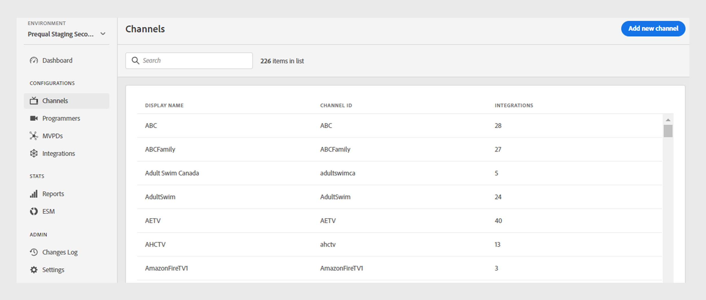

*既存チャネルのリスト*

リストの上にある&#x200B;**検索** バーにチャネルの名前を入力して、チャネルの詳細を確認します。

## チャネル設定の管理 {#manage-channel-conf}

特定のチャネルの様々な設定を管理するには、次の手順に従います。

1. 左側のパネルで「**チャネル**」タブを選択します。

1. 使用可能なリストからチャネルを選択します。

1. 次のいずれかのタブを選択して、選択したチャネルの対応する設定を表示および編集します。

   * [一般設定](#general-settings)
   * [連携](#integrations)
   * [証明書](#certificates)
   * [ドメイン](#domains)
   * [登録済みアプリ](#registered-applications)
   * [カスタムスキーム](#custom-schemes)

   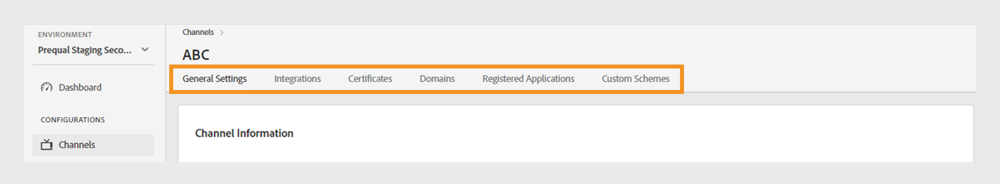

   *チャネル設定*

>[!IMPORTANT]
>
> 設定変更のアクティベートについて詳しくは、[変更内容の確認とプッシュ &#x200B;](/help/authentication/user-guide-tve-dashboard/tve-dashboard-review-push-changes.md)を参照してください。

### 一般設定 {#general-settings}

このタブには、**チャネル情報**&#x200B;と&#x200B;**Analytics設定**&#x200B;が表示されます。

#### チャネル情報 {#channel-information}

この節では、次の詳細を編集できます。

* **表示名**：商用目的で使用されるチャネルのブランド名。

* **既定のリダイレクト URL**：認証とログアウト用のバックアップ リダイレクト URL。

* **エラーレポート**: **はい**&#x200B;を選択すると、Adobe Pass SDKはAnalytics用にエラーレポートをAdobe Pass バックエンドに送信します。

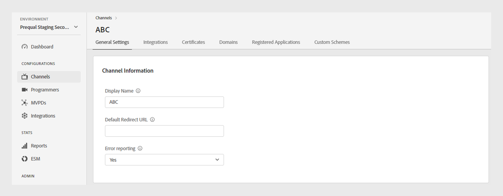

*チャネル情報の編集*

#### Analytics設定 {#analytics-configuration}

このセクションでは、Adobe Pass認証イベントのAdobe Analyticsへの転送を設定できます。

**Analytics設定**&#x200B;を有効にするには、テクニカルアカウントマネージャー（TAM）に連絡して、レポートスイート ID （RSID）の設定の詳細を確認してください。

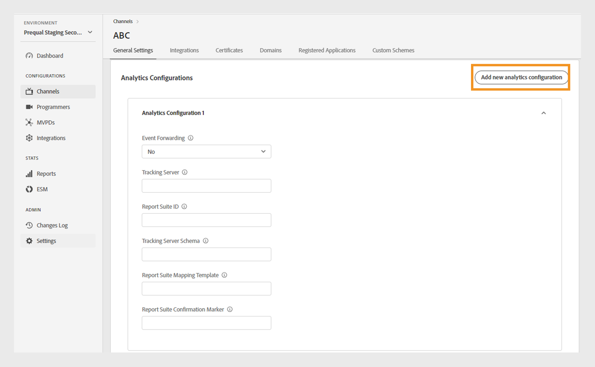

*Analytics設定を有効にする*

**新しい分析設定を追加**&#x200B;を選択して、複数の設定を追加します。

新しい設定変更が作成され、サーバー更新の準備が整いました。 **Analytics設定** セクションの新しいAnalytics設定を使用するには、[変更のレビューとプッシュ &#x200B;](/help/authentication/user-guide-tve-dashboard/tve-dashboard-review-push-changes.md) フローに進みます。

### 連携 {#integrations}

このタブには、現在選択されているチャネルとMVPDの間で使用可能な統合のリストが表示されます。 リストには、各統合が有効かどうかを示すステータスが表示されます。 このリストから特定の統合を選択して、[統合](tve-dashboard-integrations.md) セクションの詳細情報にアクセスします。

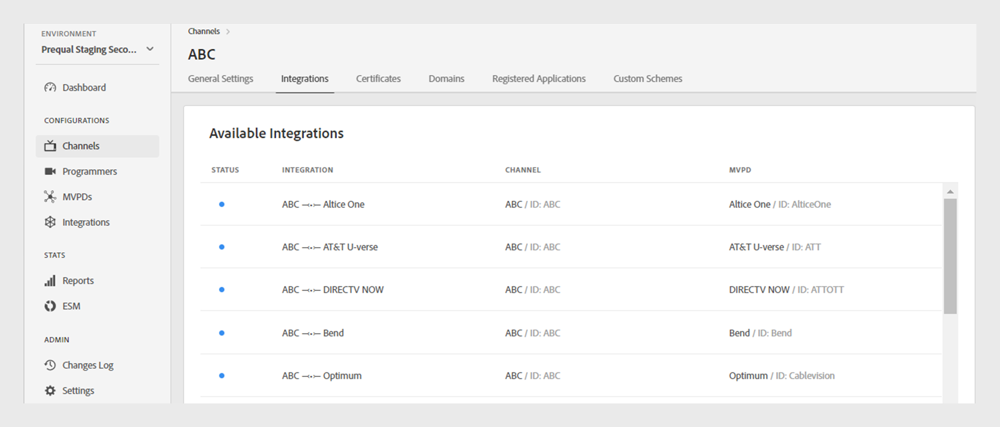

*使用可能な統合のリスト*

### 証明書 {#certificates}

このタブには、ユーザーメタデータ暗号化フローで使用される[利用可能な証明書](#available-certificates)と[継承された利用可能な証明書](#inherited-avail-certificates)のリストが表示されます。 以下を含む各証明書の詳細が表示されます。

* ステータス（**ユーザーのメタデータ暗号化**&#x200B;の使用に対して有効かどうかを問わず）
* シリアル番号
* イシュア組織の名前
* 件名の組織の名前
* 発行日
* 有効期限
* ユーザーメタデータを暗号化するドロップダウンメニュー（**Yes**&#x200B;を選択した場合、証明書は郵便番号の値などの機密性の高いユーザー情報を暗号化します）。

#### 利用可能な証明書 {#available-certificates}

これらの証明書は秘密鍵または公開鍵として機能し、ユーザーメタデータの暗号化に使用されます。
「使用可能な証明書」セクションで次の変更を行うことができます。

* [新しい証明書を追加](#add-new-certificate)
* [証明書を削除](#delete-certificate)

##### 新しい証明書を追加 {#add-new-certificate}

新しい証明書を追加するには、次の手順に従います。

1. 「**利用可能な証明書**」セクションの上部にある「**新しい証明書を追加**」を選択します。

   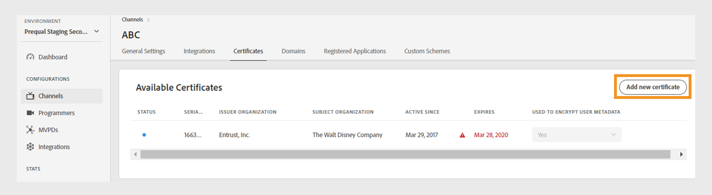

   *新しい証明書を追加*

1. **新しい証明書** ダイアログボックスに、証明書の公開キーを貼り付けます。

1. 「**証明書を追加**」を選択します。

1. **使用可能な証明書**&#x200B;のリストで、新しい証明書を探します。

   >[!IMPORTANT]
   >
   > システムが最新であり、新しい証明書を使用する準備ができていることを確認します。

1. **から「**&#x200B;はい&#x200B;**」を選択します。ユーザーのメタデータを暗号化するために使用します**」ドロップダウンメニューをクリックして、新しい証明書をアクティベートします。

新しい設定変更が作成され、サーバー更新の準備が整いました。 「**使用可能な証明書**」セクションに記載されている新しい証明書を使用するには、[&#x200B; レビューと変更のプッシュ &#x200B;](/help/authentication/user-guide-tve-dashboard/tve-dashboard-review-push-changes.md) フローに進みます。

##### 証明書を削除 {#delete-certificate}

証明書を削除するには、次の手順に従います。

1. **使用可能な証明書**&#x200B;のリストから削除する証明書にカーソルを合わせます。

1. **削除**&#x200B;を選択します。

   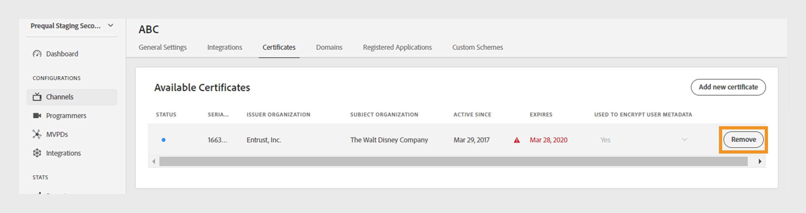

   *選択した証明書を削除*

1. 「**アクティブな証明書を削除**」ダイアログボックスから「**削除**」を選択します。

新しい設定変更が作成され、サーバー更新の準備が整いました。 証明書は、[&#x200B; レビューと変更のプッシュ後](/help/authentication/user-guide-tve-dashboard/tve-dashboard-review-push-changes.md)にのみ、**利用可能な証明書** セクションから削除されます。

#### 継承された使用可能な証明書 {#inherited-avail-certificates}

メディア企業は、独自のレベルでこれらの証明書を定義します。 同じメディア企業に関連付けられたすべてのチャネルは、これらの証明書を使用できます。

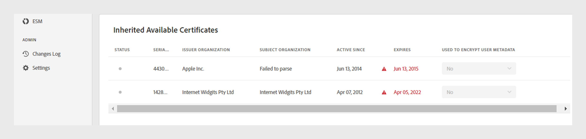

*使用可能な証明書を継承*

### ドメイン {#domains}

このタブには、各チャネルがAdobe Pass Authenticationと通信する使用可能なドメインのリストが表示されます。

ドメインには、次の変更を加えることができます。

* [新しいドメインを追加](#add-domains)
* [ドメインを削除](#delete-domain)

>[!TIP]
>
> より一般的なドメインがリストに存在する場合は、新しいサブドメインを追加しないでください。

#### 新しいドメインを追加 {#add-domains}

ドメインを追加するには、次の手順に従います。

1. 「**使用可能なドメイン**」セクションの右上隅にある「**新しいドメインを追加**」を選択します。

   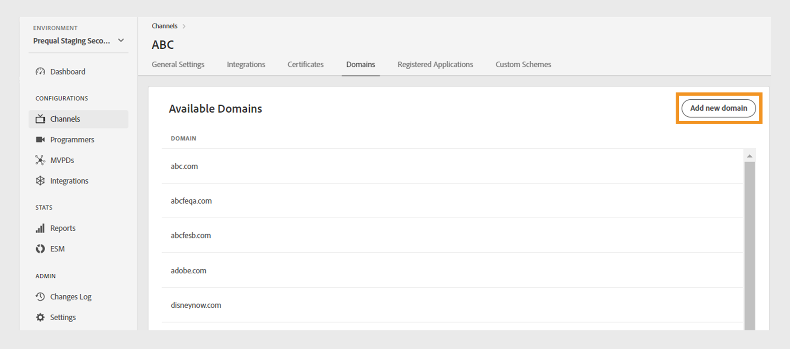

   *新しいドメインを追加*

1. 「**新しいドメイン**」ダイアログボックスにドメイン名を入力します。

1. 選択したチャネルに新しいドメインを追加するには、「**ドメインを追加**」を選択します。

新しい設定変更が作成され、サーバー更新の準備が整いました。 「**利用可能なドメイン**」セクションに記載されている新しいドメインを使用するには、[変更のレビューとプッシュ通知](/help/authentication/user-guide-tve-dashboard/tve-dashboard-review-push-changes.md) フローに進みます。

#### ドメインを削除 {#delete-domain}

ドメインを削除するには、次の手順に従います。

1. **使用可能なドメイン**&#x200B;のリストから削除するドメインにカーソルを合わせます。

1. **削除**&#x200B;を選択します。

   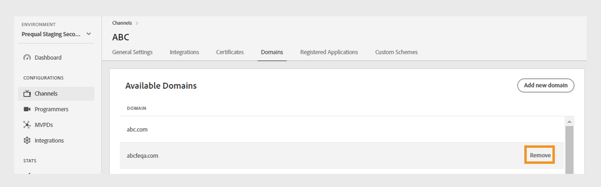

   *選択したドメインを削除*

1. 「**ドメインを削除**」ダイアログボックスで「**削除**」を選択します。

新しい設定変更が作成され、サーバー更新の準備が整いました。 ドメインは、[&#x200B; レビューと変更のプッシュ後](/help/authentication/user-guide-tve-dashboard/tve-dashboard-review-push-changes.md)にのみ、**利用可能なドメイン** セクションから削除されます。

選択したドメインは使用できなくなりました。 その結果、このドメインに関連付けられているアプリケーションは、Adobe Pass認証サービスにアクセスできなくなります。

### 登録済みアプリ {#registered-applications}

このタブには、登録されたアプリケーションのリストが表示されます。 登録アプリケーションの使用状況に関する詳細については、[動的クライアント登録の概要](../integration-guide-programmers/rest-apis/rest-api-dcr/dynamic-client-registration-overview.md) ドキュメントを参照してください。

登録済みアプリケーションでは、次の操作を実行できます。

* [新規登録アプリケーションの追加](#add-registered-applications)
* [ソフトウェアステートメントのダウンロード](#download-software-statement)

#### 新規登録アプリケーションを追加 {#add-registered-applications}

新しい登録アプリケーションを追加するには、次の手順に従います。

1. 「**登録済みアプリケーション**」セクションの右上隅にある「**新しいアプリケーションを追加**」を選択します。

   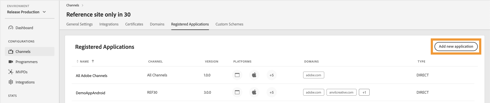

   *新しいアプリケーションを追加*

1. **新規アプリケーション** ダイアログボックスのドロップダウンメニューから&#x200B;**プラットフォーム**&#x200B;を選択します。

   >[!IMPORTANT]
   >
   > セキュリティを強化し、不正アクセスを防止するために、より具体的で制限された権限を持つ登録アプリケーションを作成することをお勧めします。 したがって、登録アプリケーションを作成する場合は、割り当てられた`platforms`に対して絞り込んだオプションを使用することを検討してください。

1. ドロップダウンメニューから「**ドメイン**」を選択します。

   >[!IMPORTANT]
   >
   > クライアント登録プロセスでは、クライアントアプリケーションは、認証フローの最終化にリダイレクト URLを使用することを許可するようにリクエストできます。 クライアントアプリケーションが特定のリダイレクト URLを使用すると、この選択範囲で選択された`domains`に対して検証されます。

1. アプリケーションの&#x200B;**名前**&#x200B;を入力します。

1. アプリケーションの&#x200B;**バージョン**&#x200B;を入力します。

   >[!IMPORTANT]
   >
   > クライアントアプリケーションのライフサイクルと使用状況を管理するために、クライアントアプリケーションのメジャーアップデートごとに新しい登録アプリケーションを作成することをお勧めします。 必要に応じて、[Zendesk](https://adobeprimetime.zendesk.com)でチケットを作成し、特定のクライアントアプリケーションバージョンの機能をブロックするために、登録されたアプリケーションを取り消すようにテクニカルアカウントマネージャー（TAM）に依頼します。

1. ドロップダウンメニューから&#x200B;**Type**&#x200B;値「DIRECT」を選択します。

1. 「**アプリケーションを追加**」を選択します。

新しい設定変更が作成され、サーバー更新の準備が整いました。 **登録済みアプリケーション** セクションに記載されている新しい登録済みアプリケーションを使用するには、[&#x200B; レビューと変更をプッシュ &#x200B;](/help/authentication/user-guide-tve-dashboard/tve-dashboard-review-push-changes.md)のフローに進みます。

#### ソフトウェアステートメントのダウンロード {#download-software-statement}

ソフトウェアステートメントをダウンロードするには、次の手順に従います。

1. 登録アプリケーションにカーソルを合わせると、**登録済みアプリケーション**&#x200B;のリストからソフトウェア ステートメントをダウンロードできます。

1. **ダウンロード**&#x200B;を選択します。

   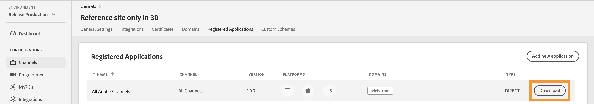

   *ソフトウェアステートメントのダウンロード*

### カスタムスキーム {#custom-schemes}

このタブには、カスタムスキームのリストが表示されます。
カスタムスキームは、AndroidおよびiOS デバイスで使用できます。

カスタムスキームには、次の変更を加えることができます。

* [新しいカスタムスキームの生成](#generate-custom-schemes)

#### 新しいカスタムスキームを生成 {#generate-custom-schemes}

新しいカスタムスキームを生成するには、次の手順に従います。

1. 「**新しいカスタムスキームを生成**」を選択します。

   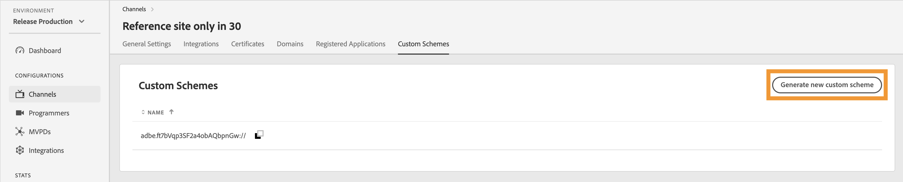

   *新しいカスタムスキームを生成*

新しい設定変更が作成され、サーバー更新の準備が整いました。 「**カスタムスキーム**」セクションに記載されている新しいカスタムスキームを使用するには、[変更のレビューとプッシュ &#x200B;](/help/authentication/user-guide-tve-dashboard/tve-dashboard-review-push-changes.md) フローに進みます。

#### AdobeのTVE ダッシュボードにアクセスできない場合：

<tve-support@adobe.com>へのチケット送信。 チャネル IDを含めてください。サポートチームからカスタムスキームを作成します。

#### ANDROID {#Android}

1. カスタムスキーム - TVE ダッシュボードで作成されたカスタムスキームは、Androidのデバイスアプリケーションに使用できます。

1. アプリケーションのリソース ファイル `strings.xml`に次のコードを追加します。

```XML
       <string name="software_statement">softwarestatement value</string>
       <string name="redirect_uri">adbe.TTIFAaWuR-CmxXv1Di8PlQ://</string>
```

#### iOS {#iOS}

カスタムスキームは、アプリケーションの`info.plist` ファイルで使用できます。 以下の例では、TVE ダッシュボードで生成されたURLを追加する必要があります。

```plist
    <key>CFBundleURLTypes</key>
    <array>
        <dict>
            <key>CFBundleURLSchemes</key>
            <array>
                <string>adbe.u-XFXJeTSDuJiIQs0HVRAg</string> // replace this with your custom scheme
            </array>
        </dict>
    </array>
```

### 継承したカスタムスキーム {#inherited-custom-schemes}

メディア企業は、独自のレベルでカスタムスキームを定義しています。 同じメディア会社に関連付けられたすべてのチャネルでは、これらのカスタムスキームを使用できます。

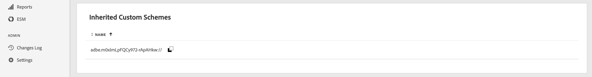

*継承したカスタムスキーム*

## 新しいチャネルを追加 {#add-new-channel}

新しいチャネルを追加するには、次の手順に従います。

1. 左側のパネルで「**チャネル**」タブを選択します。

1. 「**チャネル**」セクションの右上隅にある「**新しいチャネル**&#x200B;を追加」を選択します。

   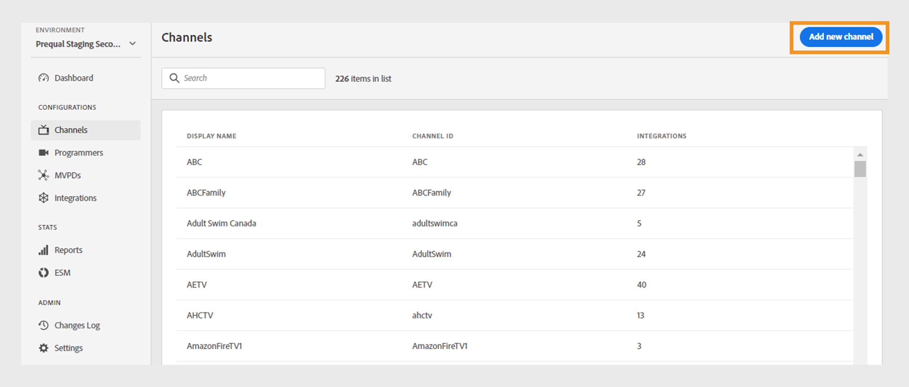

   *新しいチャネルを追加*

1. **新規チャネル** ダイアログボックスのドロップダウンメニューから「**プログラマーID**」を選択します。

1. **チャネル ID**&#x200B;に一意のIDを入力します。

1. 商用目的で使用されるチャネルのブランド名を&#x200B;**表示名**&#x200B;に入力します。

1. 「**チャネルを追加**」を選択します。

新しい設定変更が作成され、サーバー更新の準備が整いました。 「**チャネル**」セクションに記載されている新しいチャネルを使用するには、[変更のレビューとプッシュ &#x200B;](/help/authentication/user-guide-tve-dashboard/tve-dashboard-review-push-changes.md)のフローに進みます。