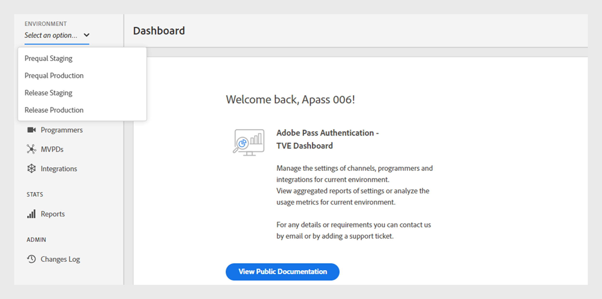

# 環境 {#environments}

>[!NOTE]
>
>このページのコンテンツは、情報提供のみを目的として提供されています。 このAPIを使用するには、Adobeの現在のライセンスが必要です。 無断使用は認められません。

TVE ダッシュボードは、Adobe Pass認証内の特定の目的に合わせてカスタマイズされた様々な環境を提供します。 主な環境は次の2つです。

* **必須条件**：事前検証環境は、実稼動環境にデプロイする前に新しいビルドを準備およびテストするためのテスト環境として機能します。

* **リリース**: リリース環境は、実稼動用に最終的なビルドとテスト済みのビルドをホストします。

各環境内には、次の2つの異なるプロファイルがあります。

* **ステージング**: ステージング プロファイルは、MVPDのステージング サーバーに接続し、本番稼働前に統合のテストと検証を行います。

* **実稼動**：実稼動プロファイルは、実際の実稼動アクティビティのMVPDの実稼動プロファイルに接続されます。

## ユースケース

TVE ダッシュボードの環境は、アプリケーションのライフサイクル全体を通して様々なユースケースに対応します。 これらの環境を使用すると、次のことが可能になります。

### プリカルステージング

* MVPDのステージングエンドポイントを使用して、Adobe Pass認証サーバーの新しい未公開機能を検証します。
* 主に、新しいMVPD統合を追加および検証するために、Adobe Pass Authentication製品チームによって使用されます。

### Prequal Production

* MVPDの実稼動エンドポイントを使用して、Adobe Pass認証サーバーの新しい未公開機能または構成を検証します。
* MVPDの実稼動エンドポイントを使用して、各チャネルの新しいアプリケーションバージョンを検証します。
* 本番環境にプッシュする前に、すべての設定変更を検証します。

### リリースステージング

* MVPDのステージングエンドポイントを使用して、各チャネルの新しいアプリケーションバージョンを検証します。
* この環境内でパフォーマンステストまたはキャパシティテストを実施します。

### リリースプロダクション

* すべてのエンドユーザーが一般に利用できる最新のAdobe Pass リリースビルドで、ライブ環境を表します。
* コードと設定の安定性を維持し、エンドユーザーのアプリケーションの設定変更をすばやく反映します。

## 環境の切り替え {#switch-environments}

Adobe Pass Authentication TVE Dashboard環境を切り替える手順に従います。

1. プログラマーの資格情報でログインします。

1. 左側のパネルの上部にある&#x200B;**環境** ドロップダウンメニューから、必要なステージング環境または実稼動環境を選択します。

   

   *Adobe Pass Authentication TVE Dashboard environment ドロップダウンメニュー*

>[!NOTE]
>
> 設定は、設定によって環境によって異なる場合があります。
