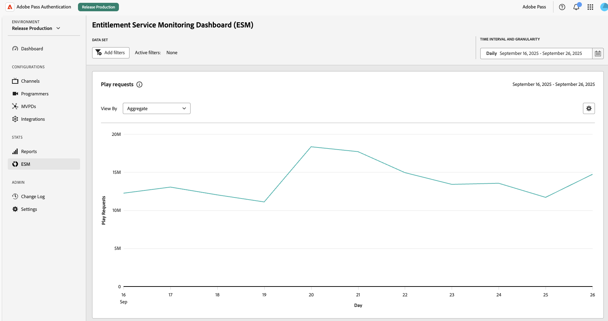
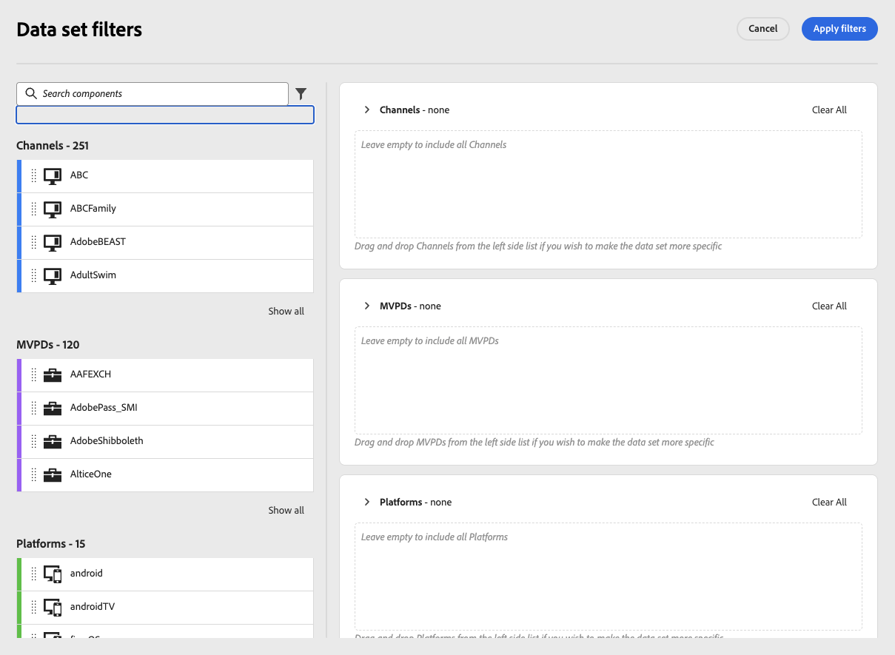
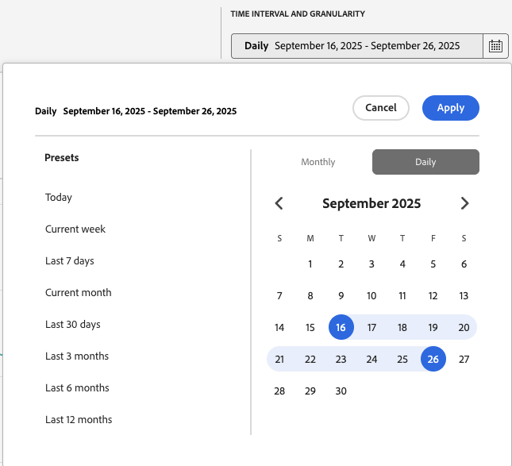

# ESM ダッシュボード {#esm-dashboard}

>[!NOTE]
>
>このページのコンテンツは、情報提供のみを目的として提供されています。 このAPIを使用するには、Adobeの現在のライセンスが必要です。 無断使用は認められません。

ESM ダッシュボードでは、MVPDパートナーをまたいでパフォーマンスを監視し、異常値を特定して、ユーザーアクセスパターンを把握するのに役立つ、資格データとイベントデータの統合ビューを提供します。 このガイドでは、ダッシュボードのフィルターを使用してレポートを解釈し、設定可能な時間間隔で主要な指標を理解する方法について説明します。

## ユースケース {#use-cases}

- プラットフォームやMVPDごとにトレンドを可視化し
- MVPDのパフォーマンスを比較
- アプリケーションごとの顧客の利用状況を把握

ESM データとイベントの詳細については、[使用権限サービス監視の概要](https://experienceleague.adobe.com/en/docs/pass/authentication/integration-guide-programmers/features-premium/esm/entitlement-service-monitoring-overview)を参照してください。

## レポート {#reports}

次のレポートを使用できます。

### 再生リクエスト {#play-requests}

選択した時間間隔の再生リクエスト数を表示します。

**グラフ スタイル** – 行。

### 認証コンバージョン {#authentication-conversion}

成功した認証イベントと認証試行の合計数の比率を表示します。

**グラフスタイル** – 横棒

### 認証の変換 {#authorization-conversion}

成功した認証イベントと認証試行の合計数の比率を表示します。

**グラフスタイル** – 横棒

### 承認待ち時間 {#authorization-latency}

MVPDの応答の平均待ち時間（ミリ秒単位）を示します。

**グラフ スタイル** – 行。

### MVPDの使用状況 {#mvpd-usage}

MVPDごとのユニークユーザー数の比較を表示します。

**グラフスタイル** – 積み重ね領域。

### 認証の成功 {#successful-authentications}

選択した時間間隔で成功した認証の合計数を表示します。

**グラフ スタイル** – 行。

### 承認の成功 {#successful-authorizations}

選択した時間間隔に対する成功した承認（MVPDの「許可」応答）の合計数を表示します。

**グラフ スタイル** – 行。

## アクション {#actions}

### 表示者 {#view-by}

各グラフには「表示方法」ドロップダウンがあり、表示するデータを正確に選択できます。

- **集計** – 全体のデータを表示
- **MVPD / チャネル / プラットフォーム** – 選択した特定のフィルターの概要

### ダウンロード {#download}

生データをダウンロードできます。

- **グラフ データをCSVとしてダウンロード** – 特定のグラフのデータをダウンロードします
- **すべてのデータをCSVとしてダウンロード** – すべてのグラフのすべてのESM データをダウンロードします

## フィルター {#filters}

フィルターを使用してデータセットを絞り込み、分析に集中します。 次のフィルターを使用できます。

- **チャネル**：利用可能なすべてのチャネル（ブランド）が含まれます
- **MVPD**: 1つ以上のプロバイダーに注力する
- **Platform**:web、モバイル、コネクテッド TV、またはデバイスファミリー

新しいフィルターを追加するには、「フィルターを追加」ボタンを選択します。

「データセットフィルター」ページでは、必要なフィルターをドラッグ&amp;ドロップできます。

各セクションについて、フィルターを個別に削除したり、選択全体をクリアしたりできます。

### フィルターのヒント {#filter-tips}

- 複数のフィルターを組み合わせて1つのコホートを分離します（例：モバイルプラットフォームで1つのMVPDを1つのチャネルに対して使用）。
- ドリルインする前に、ズームアウトしてベースラインを設定するフィルターを追加しないでください。

## 時間間隔 {#time-intervals}

分析ウィンドウと精度の制御：

### 日付範囲 {#date-range}

**プリセット**：今日、現在の週、過去7日間、現在の月、過去30日間、過去3か月間、過去6か月間、過去12か月間

**カスタム**：目的の時間間隔を選択

### 精度 {#granularity}

日別/月別
