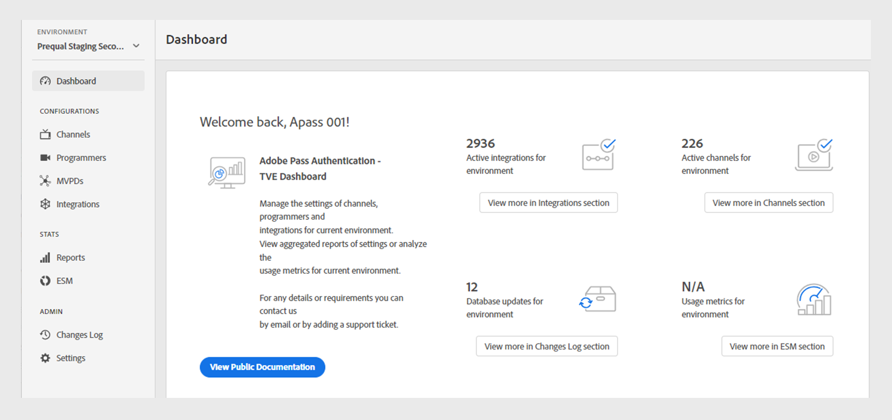
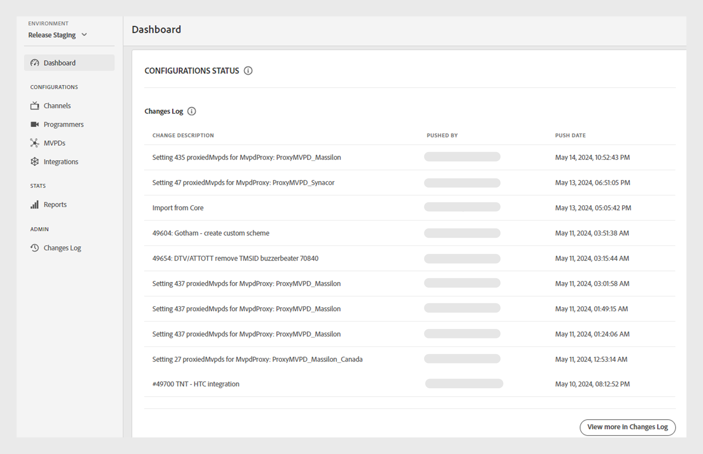

# ダッシュボード {#dashboard}

>[!NOTE]
>
>このページのコンテンツは、情報提供のみを目的として提供されています。 このAPIを使用するには、Adobeの現在のライセンスが必要です。 無断使用は認められません。

左側のパネルの&#x200B;**Dashboard** セクションは、Adobe Pass Authentication TVE ダッシュボードのホームページとして機能します。

ホームページには2つのセクションがあります。

* [ようこそ画面](#welcome-screen)
* [設定ステータス](#configuration-status)

## ようこそ画面 {#welcome}

この節では、ウェルカムメッセージから公開ドキュメントに直接アクセスし、現在の設定のスナップショットを表示できます。

* **アクティブな統合**：現在の環境にあるアクティブな統合の数。 [統合](tve-dashboard-integrations.md) セクションの詳細情報にアクセスするには、**統合セクション**&#x200B;で「詳細を表示」を選択します。
* **アクティブなチャネル**：現在の環境内のアクティブなチャネルの数。 「**チャネルの詳細を表示」セクション**&#x200B;を選択して、[&#x200B; チャネル &#x200B;](tve-dashboard-channels.md) セクションの詳細情報にアクセスします。
* **データベースの更新**：現在の環境に対して行われた構成変更の数。 [変更履歴](tve-dashboard-changes-log.md) セクションの詳細情報にアクセスするには、「変更履歴の詳細を表示」セクション **詳細を選択します**。
* **ESM ダッシュボード**：今後のESM ダッシュボードに注目し、現在の環境でのプロパティの使用状況に関する詳細な指標を提供します。 この機能は、今後のアップデートでアクセスできるようになります。

*ようこそ画面*

## 設定ステータス {#conf-status}

この節では、次の10の最新の設定変更を紹介します。

* **変更内容**: ユーザーが選択した変更の簡単な説明。
* **によってプッシュされました**：変更を担当するアカウント。
* **プッシュ日**：変更が行われた日付。

*変更ログの設定ステータス*

変更の完全なリストを表示するには、右下の変更ログ **で「**&#x200B;詳細を表示」を選択して、[変更ログ &#x200B;](tve-dashboard-changes-log.md) セクションを表示します。
