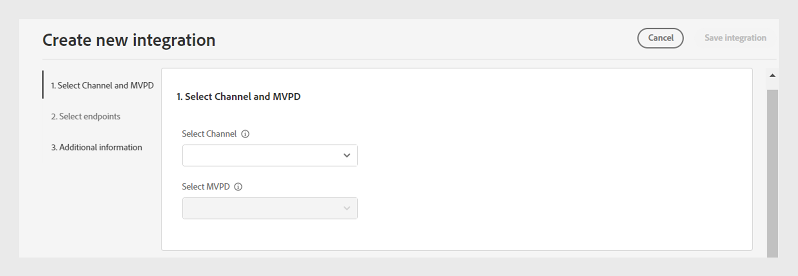

# 統合

>[!NOTE]
>
>このページのコンテンツは情報提供のみを目的としています。 この API を使用するには、Adobeの最新ライセンスが必要です。 無許可の使用は許可されていません。

TVE ダッシュボードの「**統合**」セクションでは、チャネルと MVPD 間の統合の設定を表示および管理できます。 また、必要に応じて [&#x200B; 新しい統合を作成 &#x200B;](#create-new-integration) することもできます。

左側のパネルの **統合** タブには、既存の統合のリストと次の詳細が表示されます。

* 統合が現在アクティブか非アクティブかを示すステータス
* 特定のチャネルと各 MVPD をリンクする統合
* チャネル ID を使用したチャネル名
* MVPDの表示名とMVPD ID

*既存の統合のリスト*

統合について詳しくは、リストの上にある **検索** バーにチャネルまたはMVPDの名前を入力します。

## 統合設定の管理 {#manage-integration-conf}

特定の統合を管理するには、次の手順に従います。

1. 左側のパネルで「**統合**」タブを選択します。
1. 提供されたリストから統合を選択して、次のセクションの様々な設定を表示および編集します。

   * [エンドポイントの選択](#endpoint-selection)
   * [Platform 設定](#platform-settings)
   * [ユーザーメタデータ](#user-metadata)

>[!IMPORTANT]
>
> 設定変更のアクティベートについて詳しくは、[&#x200B; 変更のレビューとプッシュ &#x200B;](/help/authentication/user-guide-tve-dashboard/tve-dashboard-review-push-changes.md) を参照してください。

### エンドポイントの選択 {#endpoint-selection}

このセクションでは、認証、承認およびログアウトのフローに使用されるMVPDのエンドポイントを対応するドロップダウンメニューから選択できます。

*認証、承認およびログアウトのフローのエンドポイント*

>[!NOTE]
>
>MVPD は、各フローに 1 つまたは複数のエンドポイントを提供できます。 新しいチャネルを統合する場合、MVPDは、各フローで優先するエンドポイントを指定する必要があります。

>[!IMPORTANT]
>
>エンドポイントに対する変更は、統合の全体的な動作に影響を与えます。 これらの変更は、MVPDから確認を受けた後にのみ実装してください。

### Platform 設定 {#platform-settings}

このセクションでは、すべての [&#x200B; プラットフォーム &#x200B;](/help/authentication/user-guide-tve-dashboard/tve-dashboard-reports.md#platforms) で統合設定を表示および編集できます。 これらの設定は、個々のプラットフォームに基づいて変更できます。 例えば、別のプラットフォームのデフォルト値を維持しながら、Androidで認証 TTL 時間を調整できます。

Platform Settings の各プロパティは、MVPDで設定されたデフォルト値を継承しますが、必要に応じて調整できます。

>[!IMPORTANT]
>
>プラットフォーム設定で各プロパティに設定される値を判断するには、MVPDとの契約が必要です。

>[!IMPORTANT]
>
> 設定の継承は、MVPD設定（最も一般的）から始まり、MVPD エンドポイント、統合、platform カテゴリおよび platform （最も具体的な値を保持する）までのチェーンに従います。

**Platform 設定** は、継承チェーンの各レベルの設定を上書きするために使用します。 チェーン内の使用可能なレベルは、次のようにグループ化されます。

* **Default for All**：特定のプラットフォームの値が定義されていない場合、プログラマーの実装に関係なく、すべてのプラットフォームにわたってユニバーサルに適用されるプロパティの値を設定します。

* **デスクトップデバイス**：プログラミング方法（JS SDKまたは REST API）に関係なく、すべてのデスクトップコンピューターおよびラップトップコンピューターに適用されるプロパティの値を設定します。

* **モバイルデバイス**: プログラミング方法（SDKまたは REST API）に関係なく、**iOS**、**Android** など、すべてのモバイルデバイスに適用されるプロパティの値を設定します。

* **TV 接続デバイス**：プログラミング方法（SDKまたは REST API）に関係なく、**tvOS**、**Roku**、**FireTV** など、すべての TV 接続デバイスに適用されるプロパティの値を設定します。

* **未識別のデバイス**：現在のメカニズムではプラットフォームを正確に識別できないデバイスすべてに適用できるプロパティの値を設定します。 そのような場合は、MVPDで定義されている最も制限が厳しいルールを適用します。

  

  *プラットフォームの区分及びその装置*

を選択 各プロパティの右側にある  アイコンをクリックして、上記の各継承レベルで使用されるプロパティを確認します。

#### 最もよく使用されるビジネスフロー {#most-used-flows}

「**プラットフォーム設定**」セクションには、様々なビジネスフローで使用される様々なプロパティが用意されています。 実際のプロパティは、特定の統合で選択された MVPD によって異なる場合があります。 最も使用されているフローを次に示します。

**すべてのプラットフォームでの AuthN TTL および AuthZ TTL**

>[!IMPORTANT]
>
>認証（AuthN）の TTL と認証（AuthZ）の TTL の値は、MVPDの設定に合わせる必要があります。

次の手順に従って、特定の統合に関するすべてのプラットフォームで認証および認証 TTL を変更します。

1. 左側のパネルで「**統合**」タブを選択します。

1. AuthN TTL および AuthZ TTL の値を変更する統合を選択します。

1. 「**プラットフォーム設定**」セクションに移動します。

1. **プラットフォーム設定** の下の **すべてに対するデフォルト** タブを選択します。

   >[!NOTE]
   >
   >プラットフォームカテゴリまたは特定のプラットフォームの **AuthN TTL** および **AuthZ TTL** の期間を変更する場合は、それに応じてプラットフォームを選択します。

   

   *すべてのプラットフォームで AuthN TTL AuthZ TTL 期間を変更する*

   **A.** AuthN TTL プロパティ **B.** AuthZ TTL プロパティ

1. 上向き矢印と下向き矢印を選択して、**AuthN TTL** および **AuthZ TTL** プロパティの日数、時間数、分数、秒数の期間を調整します。

すべてのプラットフォームにおける **AuthN TTL** と **AuthZ TTL** のデュレーションは、[&#x200B; レビューおよびプッシュ変更 &#x200B;](/help/authentication/user-guide-tve-dashboard/tve-dashboard-review-push-changes.md) 後にのみ更新されます。

**Platform SSO を有効にする**

>[!IMPORTANT]
>
>**シングルサインオンを有効にする** プロパティは、*iOS、tvOS、Roku、FireTV* プラットフォームでのみサポートされています。 これらのプラットフォームでシングルサインオンをサポートする MVPD との統合にのみ適用されます。

特定の統合およびプラットフォームで SSO を有効化または無効化するには、次の手順に従います。

1. 左側のパネルで「**統合**」タブを選択します。

1. シングルサインオンを有効または無効にする統合を選択します。

1. 「**プラットフォーム設定**」セクションに移動します。

1. シングルサインオンを有効にするプラットフォームまたはプラットフォームのカテゴリを **プラットフォーム設定** で選択します。

   

   *特定のプラットフォームでシングルサインオンを有効にする*

   **A.** シングルサインオンプロパティ **B.** プラットフォーム権限の適用プロパティ

1. **Yes** を選択して有効にするか、**No** を選択して無効にします **Enable Single Sign On** ドロップダウンメニューから選択します。

1. **Yes** を選択して有効にするか、**No** を選択して **プラットフォーム権限の適用** ドロップダウンメニューから無効にします。

   **プラットフォーム権限の適用** プロパティは、ユーザーの TV プロバイダー購読に対するプラットフォーム アクセスを **許可** または **拒否** する決定を尊重するかどうかを制御します。

   例えば、**シングルサインオンを有効にする** と **プラットフォーム権限を適用** の両方が有効になっていて、ユーザーが TV プロバイダーのサブスクリプションへのプラットフォームアクセスを拒否することを選択した場合、それぞれのアプリケーション（チャネル）は、別のアプリケーション（チャネル）によって取得されたAdobe Pass認証トークンを使用できません。

選択したプラットフォームの **シングルサインオン** プロパティは、「レビューとプッシュの変更 [&#x200B; 後にのみ有効または無効になり &#x200B;](/help/authentication/user-guide-tve-dashboard/tve-dashboard-review-push-changes.md) す。

**ホームベースの認証を有効にする**

OAuth2 ベースの MVPD のホームベースの認証を有効または無効にするには、次の手順に従います。

1. 左側のパネルで「**統合**」タブを選択します。

1. ホームベースの認証を有効または無効にする統合を選択します。

1. 「**プラットフォーム設定**」セクションに移動します。

1. **プラットフォーム設定** で、ホームベースの認証を有効にするプラットフォームまたはプラットフォームのカテゴリを選択します。

   

   *特定のプラットフォームに対してホームベースの認証を有効にする*

   **A.** Attempt HBA プロパティ **B.** HBA AuthN TTL プロパティ

1. 「**Yes**」を選択して有効にし、「**No**」を選択して「**Attempt HBA**」ドロップダウン・メニューから無効にします。

>[!IMPORTANT]
>
>**HBA AuthN TTL** プロパティの期間を変更することは避けてください。 承認プロセスで予期しないエラーが発生する可能性があります。

特定のMVPDの **Attempt HBA** プロパティは、「Review and push changes[&#x200B; 後にのみ有効または無効になり &#x200B;](/help/authentication/user-guide-tve-dashboard/tve-dashboard-review-push-changes.md) す。

#### プロパティをさらに追加 {#add-more-properties}

**さらにプロパティを追加** を使用すると、特に頻度の低いフローの統合用に、追加の特定のプロパティを柔軟に含めることができます。

次のプロパティを追加できます。

* すべてのプラットフォームで、左側の **すべてデフォルト** タブを選択します。
* プラットフォームのカテゴリについては、左側の **デスクトップデバイス**、**モバイルデバイス** または **テレビ接続デバイス** タブを選択します。
* 特定のデバイスに対して、左側の **iOS**、**Android**、&lbrace;tvOS **&#x200B;**、**Roku** または **FireTV** タブを選択します。

これらのプロパティを追加することで有効にできる様々なフローの例を次に示します。

**事前承認済みリソースの数の変更**

ほとんどの MVPD は、デフォルトで最大 5 つのリソース ID を使用したプリフライト authZ 呼び出しをサポートしています。
ただし、MVPD がこの上限を引き上げることに同意した場合は、**プロパティをさらに追加** に移動して、オプションメニューから **Preflight Max Resources** を選択できます。

**Preflight Max Resources** によって、MVPDで合意された上限を指定できる新しい属性が追加されます。

*Preflight Max Resources プロパティの追加*

**Preflight 最大リソース数** プロパティは、[&#x200B; レビューおよびプッシュの変更 &#x200B;](/help/authentication/user-guide-tve-dashboard/tve-dashboard-review-push-changes.md) 後にのみ追加されます。

**MVPDの表示名またはロゴ URL の変更**

MVPD ピッカーを作成せず、提供された設定に依存するプログラマーアプリケーションの場合は、**その他のプロパティを追加** に移動し、**表示名** または **ロゴ URL** を選択して、オプションメニューから各MVPDに必要な表示名またはロゴ URL を追加できます。

同じMVPDに対して、これらのプロパティに異なる値を使用できるのは、デバイスのプラットフォームと目的のユーザーエクスペリエンスによって異なります。

*表示名またはロゴ URL プロパティの追加*

**表示名** または **ロゴ URL** プロパティは、[&#x200B; レビューおよびプッシュの変更 &#x200B;](/help/authentication/user-guide-tve-dashboard/tve-dashboard-review-push-changes.md) 後にのみ追加されます。

**アプリ（チャネル）切り替え時の新しい認証フローのリクエスト**

ユーザーがアプリを切り替えるときに新しい認証を強制する場合。 その場合は、「**その他のプロパティを追加**」に移動し、「**アグリゲータごとの認証**」プロパティを選択します。

アグリゲータごとに **認証** を追加すると、それぞれのチャネルに対するシングルサインオンが効果的に解除されます。

*アグリゲータプロパティごとの認証の追加*

**Auth per Aggregator** プロパティは、[&#x200B; レビューおよびプッシュの変更 &#x200B;](/help/authentication/user-guide-tve-dashboard/tve-dashboard-review-push-changes.md) 後にのみ追加されます。

追加したら、「**はい**」を選択し、選択した統合の **アグリゲータごとの認証** プロパティを有効にします。

#### プロパティの削除 {#delete-properties}

を選択 各プロパティの右側にある  アイコンをクリックして、不要になったプロパティを削除します。

>[!NOTE]
>
>特定のプロパティは、選択したMVPDの必須要件なので、削除できません。

プロパティは、「レビューとプッシュの変更 [&#x200B; の後にのみ **Platform 設定** セクションから削除さ &#x200B;](/help/authentication/user-guide-tve-dashboard/tve-dashboard-review-push-changes.md) ます。

### ユーザーメタデータ {#user-metadata}

このセクションでは、MVPDで共有される各ユーザーメタデータパラメーターの設定を更新できます。

>[!NOTE]
>
>各MVPDは、異なるパラメーターを共有する場合があります。 特定のMVPDで共有できるパラメーターについて詳しくは、Adobe担当者にお問い合わせください。

ユーザーメタデータセクションには、次の列が表示されます。

**キー**:API で値の抽出に使用される実際のユーザーメタデータパラメーターを表します。

**説明**：各ユーザーメタデータパラメーターの簡単な説明を提供します。

**暗号化**：この列では、ドロップダウンメニューからそれぞれ **はい** または **いいえ** を選択して、API のパラメーターを有効または無効にできます。 **はい** をオプトインすると、API でパラメーター値が暗号化されます。 暗号化は、**ユーザーメタデータ** スコープで定義された証明書を使用して実行されます。

>[!TIP]
>
>
> **ZIP** パラメーターは必ず暗号化してください。

使用可能な証明書について詳しくは、「[&#x200B; プログラマー &#x200B;](/help/authentication/user-guide-tve-dashboard/tve-dashboard-programmers.md#available-certificates)」および [&#x200B; チャネル &#x200B;](/help/authentication/user-guide-tve-dashboard/tve-dashboard-channels.md#available-certificates) の節を参照してください。

**有効**：この列を使用すると、ドロップダウンメニューからそれぞれ **はい** または **いいえ** を選択して、API のパラメーターを有効または無効にできます。

*ユーザーメタデータに使用できるパラメーター*

## 新しい統合の作成 {#create-new-integration}

現在の設定で新しいMVPDとの新しい統合を作成するには、次の手順に従います。

1. 左側のパネルで「**統合**」タブを選択します。

1. **統合** セクションの右上にある「**新しい統合を作成** を選択します。

   

   *新しい統合の作成*

   次のセクションが表示されます。

   **Channel とMVPDの選択**

   **チャネルを選択** ドロップダウンメニューから **チャネル** を選択して、新しい統合を追加します。 チャンネルを選択したら、選択したチャンネルと統合するために必要な **MVPD** を **MVPDを選択** ドロップダウンメニューから選択します。

   

   *Channel とMVPDの選択*

   **エンドポイントを選択**

   必要なMVPDを選択すると、その特定のMVPD用に設定されたデフォルトのエンドポイントが **エンドポイントを選択** セクションに事前入力されます。

   >[!IMPORTANT]
   >
   >MVPDで特に指定されていない限り、どのフローでもデフォルトのエンドポイントを変更しないでください。

   

   *エンドポイントを選択*

   **追加情報**

   このセクションには、「チャネルとMVPDの選択 **セクションで選択したMVPDに対して設定する必要がある様々なプロパティが含ま** ています。

   >[!NOTE]
   >
   > 実際のプロパティは、「**チャンネルとMVPDを選択** セクションで選択した MVPD によって異なる場合があります。

   例えば、次の図のMVPDのログインページで、ブランド提携を目的として **AuthN TTL** または **パートナー ID** （チャネル ID）を編集できます。

   

   *追加情報の編集*

   **新しい統合を作成** セクションの右上にある **統合を保存** を選択します。

新しい統合は、「レビューとプッシュの変更 [&#x200B; の後にのみ作成さ &#x200B;](/help/authentication/user-guide-tve-dashboard/tve-dashboard-review-push-changes.md) ます。

## 統合を無効にする {#disable-integration}

統合を無効にするには、次の手順に従います。

1. 左側のパネルで「**統合**」タブを選択します。

1. 無効にする統合を選択します。

1. 選択した統合の右上にある切替スイッチを無効にします。

   

   *統合を無効にする*

統合は、「レビューとプッシュの変更 [&#x200B; の後にのみ無効にな &#x200B;](/help/authentication/user-guide-tve-dashboard/tve-dashboard-review-push-changes.md) ます。

統合を無効にすると、エンドユーザーは特定のMVPDを使用して認証または認証できなくなります。
