# 連携

>[!NOTE]
>
>このページのコンテンツは、情報提供のみを目的として提供されています。 このAPIを使用するには、Adobeの現在のライセンスが必要です。 無断使用は認められません。

TVE ダッシュボードの&#x200B;**統合** セクションでは、チャネルとMVPD間の統合の設定を表示および管理できます。 要件に応じて[新しい統合](#create-new-integration)を作成することもできます。

左側のパネルの「**統合**」タブには、既存の統合のリストと次の詳細が表示されます。

* 統合が現在アクティブか非アクティブかを示すステータス
* 特定のチャネルをそれぞれのMVPDにリンクする統合
* チャネル IDを持つチャネル名
* MVPDの表示名とMVPD ID

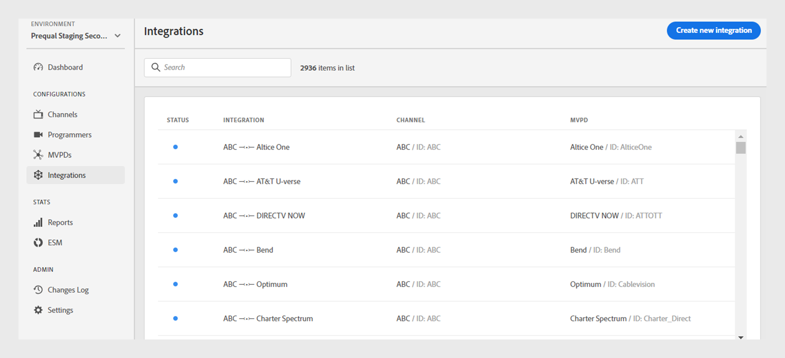

*既存の統合のリスト*

リストの上にある&#x200B;**検索** バーにチャネルまたはMVPDの名前を入力して、統合について詳しく確認します。

## 統合設定の管理 {#manage-integration-conf}

特定の統合を管理するには、次の手順に従います。

1. 左側のパネルで「**統合**」タブを選択します。
1. 提供されたリストから統合を選択して、次のセクションで様々な設定を表示および編集します。

   * [エンドポイントの選択](#endpoint-selection)
   * [プラットフォーム設定](#platform-settings)
   * [ユーザーメタデータ](#user-metadata)

>[!IMPORTANT]
>
> 設定変更のアクティベートについて詳しくは、[変更内容の確認とプッシュ &#x200B;](/help/authentication/user-guide-tve-dashboard/tve-dashboard-review-push-changes.md)を参照してください。

### エンドポイントの選択 {#endpoint-selection}

このセクションでは、認証、認証、ログアウトフローに使用するMVPDのエンドポイントを、それぞれのドロップダウンメニューから選択できます。

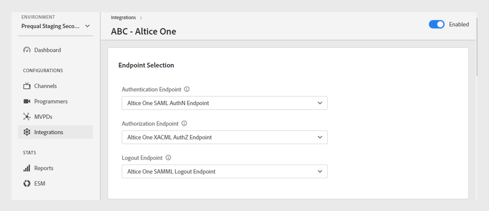

*認証、認証、ログアウトフローのエンドポイント*

>[!NOTE]
>
>MVPDは、各フローに1つまたは複数のエンドポイントを提供できます。 新しいチャネルを統合する場合、MVPDは各フローに優先エンドポイントを指定する必要があります。

>[!IMPORTANT]
>
>エンドポイントに変更を加えると、統合の全体的な動作に影響します。 これらの変更は、MVPDから確認を受けた後にのみ実施する必要があります。

### プラットフォーム設定 {#platform-settings}

このセクションでは、すべての[&#x200B; プラットフォーム &#x200B;](/help/authentication/user-guide-tve-dashboard/tve-dashboard-reports.md#platforms)で統合設定を表示および編集できます。 個々のプラットフォームに基づいて、これらの設定を変更できます。 例えば、別のプラットフォームのデフォルト値を維持しながら、Androidで認証TTL期間を調整できます。

Platform設定の各プロパティは、MVPDで設定されたデフォルト値を継承しますが、必要に応じて調整できます。

>[!IMPORTANT]
>
>プラットフォーム設定の各プロパティに設定された値を判断するには、MVPDとの契約書が必要です。

>[!IMPORTANT]
>
> 設定の継承は、MVPD設定（最も一般的な設定）、MVPD エンドポイント、統合、プラットフォームカテゴリ、およびプラットフォーム（最も具体的な値を保持）から始まるチェーンに従います。

**プラットフォーム設定**&#x200B;は、継承チェーンの各レベルの設定を上書きするために使用されます。 チェーン内で使用可能なレベルは、次のようにグループ化されます。

* **すべてをデフォルト**: プログラマーの実装に関係なく、特定のプラットフォーム値が定義されていない場合に、すべてのプラットフォームで一般的に適用されるプロパティの値を設定します。

* **デスクトップデバイス**: プログラミング方法（JS SDKまたはREST API）に関係なく、すべてのデスクトップおよびラップトップのコンピューターに適用されるプロパティの値を設定します。

* **モバイルデバイス**: プログラミングアプローチ（SDKまたはREST API）に関係なく、**iOS**、**Android**&#x200B;など、すべてのモバイルデバイスに適用されるプロパティの値を設定します。

* **テレビ接続デバイス**: プログラミング方式（SDKまたはREST API）に関係なく、**tvOS**、**Roku**、**FireTV**&#x200B;など、すべてのテレビ接続デバイスに適用されるプロパティの値を設定します。

* **未特定のデバイス**：現在のメカニズムでプラットフォームを正確に識別できない、すべてのデバイスに適用されるプロパティの値を設定します。 そのような場合は、MVPDで定義されている最も制限的なルールを適用します。

  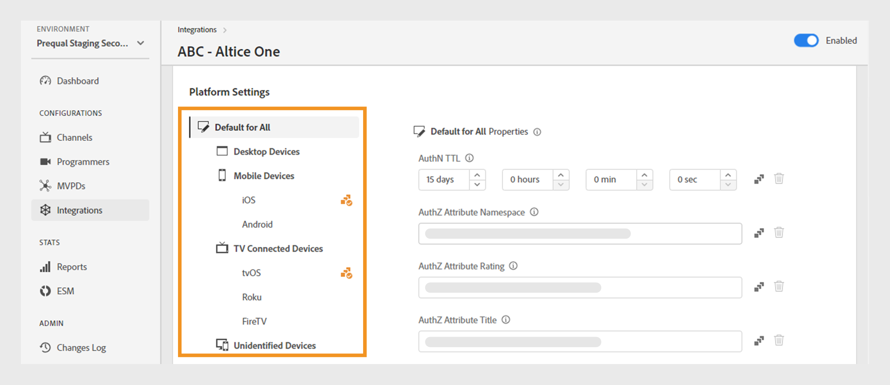

  *プラットフォームとそのデバイスのカテゴリ*

Select 各プロパティの右側にある アイコンをクリックすると、前述の各継承レベルで使用されるプロパティを確認できます。

#### 最もよく使用されるビジネスフロー {#most-used-flows}

「**プラットフォーム設定**」セクションには、様々なビジネスフローで使用される様々なプロパティが用意されています。 実際のプロパティは、特定の統合で選択したMVPDによって異なる場合があります。 以下は、最も使用されるフローです。

**すべてのプラットフォームでのAuthN TTLおよびAuthZ TTL**

>[!IMPORTANT]
>
>Authentication （AuthN） TTLおよびAuthorization （AuthZ） TTL値は、常にMVPDの設定と一致している必要があります。

特定の統合のために、すべてのプラットフォームで認証および認証TTLを変更するには、次の手順に従います。

1. 左側のパネルで「**統合**」タブを選択します。

1. AuthN TTL値とAuthZ TTL値を変更する統合機能を選択します。

1. 「**プラットフォーム設定**」セクションに移動します。

1. 「**プラットフォーム設定**」の「すべて&#x200B;**」タブで「** デフォルト」を選択します。

   >[!NOTE]
   >
   >プラットフォームカテゴリまたは特定のプラットフォームの&#x200B;**AuthN TTL**&#x200B;と&#x200B;**AuthZ TTL**&#x200B;の期間を変更する場合は、それに応じてプラットフォームを選択します。

   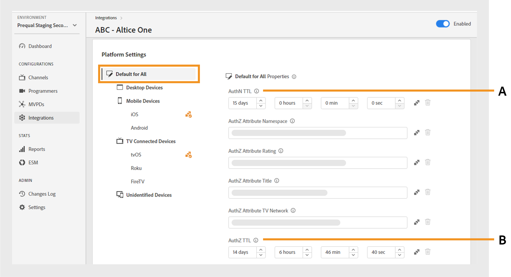

   *すべてのプラットフォームでAuthN TTL AuthZ TTL期間を変更*

   **A.**&#x200B;認証TTL プロパティ **B.**&#x200B;認証TTL プロパティ

1. 上向き矢印と下向き矢印を選択して、**AuthN TTL**&#x200B;および&#x200B;**AuthZ TTL** プロパティの日数、時間、分、秒数を調整します。

すべてのプラットフォームの&#x200B;**AuthN TTL**&#x200B;および&#x200B;**AuthZ TTL**&#x200B;の期間は、[&#x200B; レビューおよびプッシュの変更](/help/authentication/user-guide-tve-dashboard/tve-dashboard-review-push-changes.md)後にのみ更新されます。

**プラットフォーム SSOを有効にする**

>[!IMPORTANT]
>
>**シングルサインオンを有効にする** プロパティは、*iOS、tvOS、Roku、およびFireTV* プラットフォームでのみサポートされています。 これは、これらのプラットフォームのシングルサインオンをサポートするMVPDとの統合にのみ適用されます。

特定の統合およびプラットフォームに対してSSOを有効または無効にするには、次の手順に従います。

1. 左側のパネルで「**統合**」タブを選択します。

1. シングルサインオンを有効または無効にする統合を選択します。

1. 「**プラットフォーム設定**」セクションに移動します。

1. **プラットフォーム設定**&#x200B;でシングルサインオンを有効にする特定のプラットフォームまたはプラットフォームのカテゴリを選択します。

   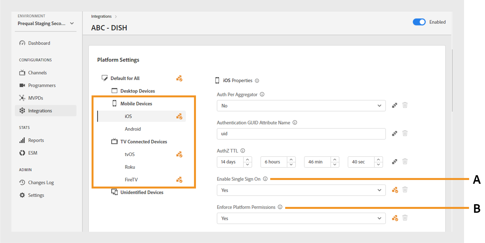

   *特定のプラットフォームのシングルサインオンを有効にする*

   **A.** シングル サインオン プロパティ **B.** プラットフォーム権限の適用プロパティ

1. 「**はい**」を選択して有効にするか、「**シングルサインオンを有効にする**」ドロップダウンメニューから「**いいえ**」を無効にします。

1. 「**はい**」を選択して有効にするか、「**プラットフォーム権限を強制**」ドロップダウンメニューから「**いいえ**」を無効にします。

   **プラットフォーム権限を強制** プロパティは、**許可**&#x200B;または&#x200B;**拒否** プラットフォームによるTV プロバイダーのサブスクリプションへのアクセスをユーザーが許可するかどうかを制御します。

   例えば、**Enable Single Sign On**&#x200B;と&#x200B;**Enforce Platform Permission**&#x200B;の両方が有効になっていて、ユーザーがTV プロバイダーのサブスクリプションへのプラットフォームアクセスを拒否することを選択した場合、それぞれのアプリケーション（channel）は、別のアプリケーション（channel）によって取得されたAdobe Pass Authentication トークンを使用できません。

選択したプラットフォームの&#x200B;**シングルサインオン** プロパティは、[のレビューと変更のプッシュ後にのみ有効または無効になります](/help/authentication/user-guide-tve-dashboard/tve-dashboard-review-push-changes.md)。

**ホームベース認証を有効にする**

OAuth2 ベースのMVPDのホームベース認証を有効または無効にするには、次の手順に従います。

1. 左側のパネルで「**統合**」タブを選択します。

1. ホームベース認証を有効または無効にする統合を選択します。

1. 「**プラットフォーム設定**」セクションに移動します。

1. **プラットフォーム設定**&#x200B;でホームベース認証を有効にする特定のプラットフォームまたはプラットフォームのカテゴリを選択します。

   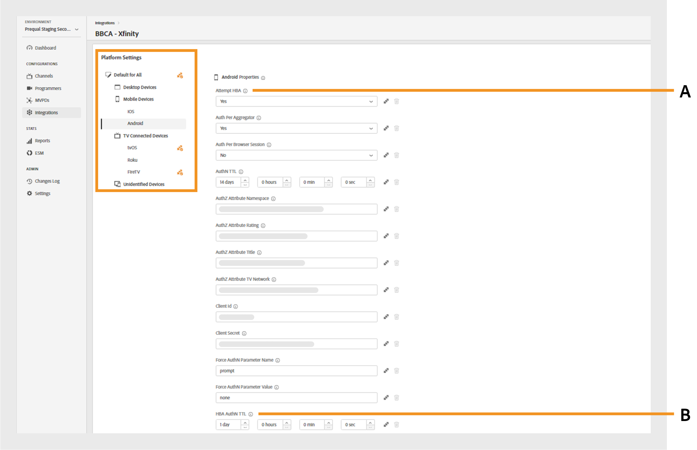

   *特定のプラットフォームに対してホームベース認証を有効にする*

   **A.**&#x200B;試行HBA プロパティ **B.** HBA AuthN TTL プロパティ

1. 「**はい**」を選択して有効にし、「**試行HBA**」ドロップダウンメニューから「**いいえ**」を無効にします。

>[!IMPORTANT]
>
>**HBA AuthN TTL** プロパティの期間を変更することは避けてください。 認証プロセスで予期しないエラーが発生する可能性があります。

特定のMVPDの&#x200B;**試行HBA** プロパティは、[&#x200B; レビューおよびプッシュの変更](/help/authentication/user-guide-tve-dashboard/tve-dashboard-review-push-changes.md)後にのみ有効または無効になります。

#### さらにプロパティを追加 {#add-more-properties}

**さらにプロパティを追加**&#x200B;すると、特に一般的でないフローの場合は、統合のために特定のプロパティを追加できます。

次のプロパティを追加できます。

* すべてのプラットフォームの場合は、左側の「**」タブで「** デフォルト」を選択します。
* プラットフォームのカテゴリについては、左側の「**デスクトップデバイス**、**モバイルデバイス**」または「**テレビ接続デバイス**」タブを選択します。
* 特定のデバイスの場合は、左側の「**iOS**」、「**Android**」、「**tvOS**」、「**Roku**」または「**FireTV**」タブを選択します。

以下に、これらのプロパティを追加して有効にできる様々なフローの例を示します。

**事前承認済みリソースの数を変更**

ほとんどのMVPDは、デフォルトで最大5つのリソース IDを使用するプリフライト認証Z呼び出しをサポートしています。
ただし、MVPDがこの制限を引き上げることに同意する場合は、**さらにプロパティを追加**&#x200B;に移動し、オプションメニューから「**最大リソース数**」を選択できます。

**Preflight Max Resources**&#x200B;は、MVPDで合意された制限を指定できる新しい属性を追加します。

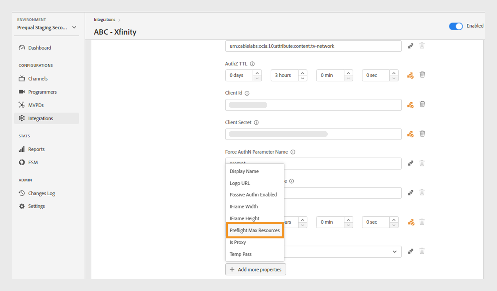

*プリフライトの最大リソース数プロパティを追加*

**Preflight Max Resources** プロパティは、[のレビューと変更のプッシュ後にのみ追加されます](/help/authentication/user-guide-tve-dashboard/tve-dashboard-review-push-changes.md)。

**MVPDの表示名またはロゴ URLを変更**

MVPD ピッカーを構築せず、指定された設定に依存するプログラマーアプリケーションの場合は、**さらにプロパティを追加**&#x200B;に移動し、**表示名**&#x200B;または&#x200B;**ロゴ URL**&#x200B;を選択して、オプションメニューから各MVPDに必要な表示名またはロゴ URLを追加できます。

これらのプロパティの値は、デバイスプラットフォームと目的のユーザーエクスペリエンスに応じて、同じMVPDに異なります。

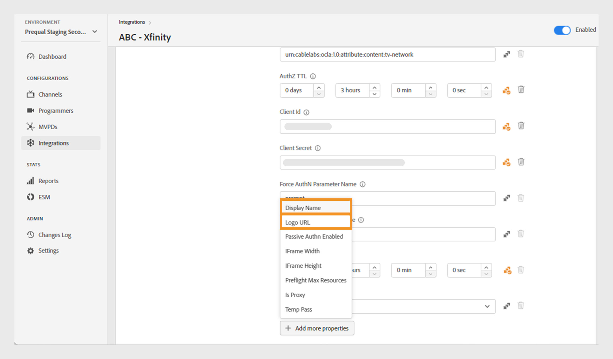

*表示名またはロゴ URL プロパティを追加*

**表示名**&#x200B;または&#x200B;**ロゴ URL** プロパティは、[&#x200B; レビューおよびプッシュの変更](/help/authentication/user-guide-tve-dashboard/tve-dashboard-review-push-changes.md)後にのみ追加されます。

**アプリ（チャネル）の切り替え時に新しい認証フローをリクエスト**

ユーザーがアプリを切り替えるときに新しい認証を強制する場合。 その場合、**さらにプロパティを追加**&#x200B;に移動し、**アグリゲーターごとの認証** プロパティを選択できます。

アグリゲーター&#x200B;**ごとに**&#x200B;認証を追加すると、各チャネルのシングルサインオンが効果的に解除されます。

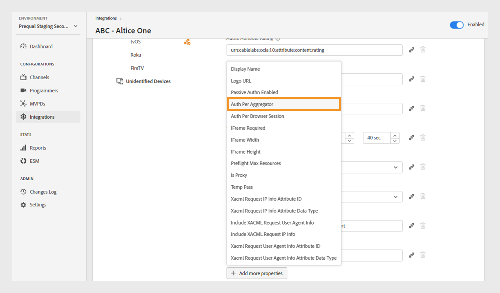

*アグリゲーターごとの認証プロパティを追加*

アグリゲーターごとの&#x200B;**Auth** プロパティは、[&#x200B; レビューおよびプッシュの変更](/help/authentication/user-guide-tve-dashboard/tve-dashboard-review-push-changes.md)後にのみ追加されます。

追加したら、**はい**&#x200B;を選択して、選択した統合に対して&#x200B;**アグリゲーター** プロパティごとに認証を有効にします。

#### プロパティを削除 {#delete-properties}

Select 各プロパティの右側にある アイコンをクリックして、不要になったプロパティを削除します。

>[!NOTE]
>
>特定のプロパティは、選択したMVPDの必須の要件であるため、削除できません。

プロパティは、[のレビューと変更のプッシュ後](/help/authentication/user-guide-tve-dashboard/tve-dashboard-review-push-changes.md)にのみ、**プラットフォーム設定** セクションから削除されます。

### ユーザーメタデータ {#user-metadata}

このセクションでは、MVPDで共有されている各ユーザーメタデータパラメーターの設定を更新できます。

>[!NOTE]
>
>各MVPDは、異なるパラメーターを共有することができます。 特定のMVPDで共有できるパラメーターについて詳しくは、Adobe担当者にお問い合わせください。

「ユーザーのメタデータ」セクションには、次の列が表示されます。

**キー**: APIで値を抽出するために使用する実際のユーザーメタデータパラメーターを表します。

**説明**：各ユーザーメタデータパラメーターの簡単な説明を提供します。

**暗号化**：この列では、ドロップダウンメニューからそれぞれ&#x200B;**はい**&#x200B;または&#x200B;**いいえ**&#x200B;を選択して、APIのパラメーターを有効または無効にできます。 **Yes**&#x200B;を選択すると、パラメーター値がAPIで暗号化されます。 暗号化は、**ユーザーメタデータ** スコープで定義された証明書を使用して実行されます。

>[!TIP]
>
>
> **ZIP** パラメーターが暗号化されていることを常に確認してください。

利用可能な証明書について詳しくは、[&#x200B; プログラマー](/help/authentication/user-guide-tve-dashboard/tve-dashboard-programmers.md#available-certificates)および[&#x200B; チャネル &#x200B;](/help/authentication/user-guide-tve-dashboard/tve-dashboard-channels.md#available-certificates)の節を参照してください。

**有効**：この列では、ドロップダウンメニューからそれぞれ&#x200B;**はい**&#x200B;または&#x200B;**いいえ**&#x200B;を選択して、APIのパラメーターを有効または無効にできます。

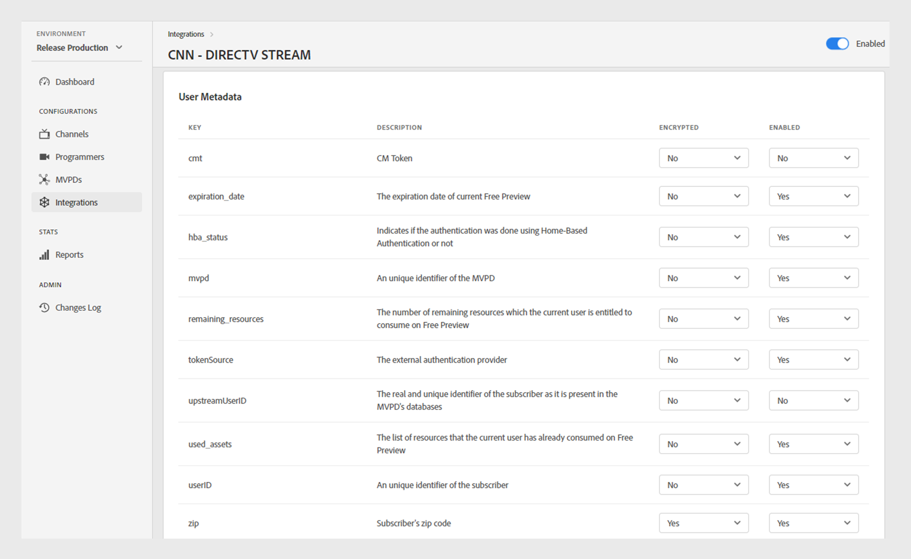

*ユーザーメタデータに使用できるパラメーター*

## 新しい統合を作成 {#create-new-integration}

現在の設定で新しいMVPDとの新しい統合を作成するには、次の手順に従います。

1. 左側のパネルで「**統合**」タブを選択します。

1. 「**統合**」セクションの右上にある「**新しい統合を作成**」を選択します。

   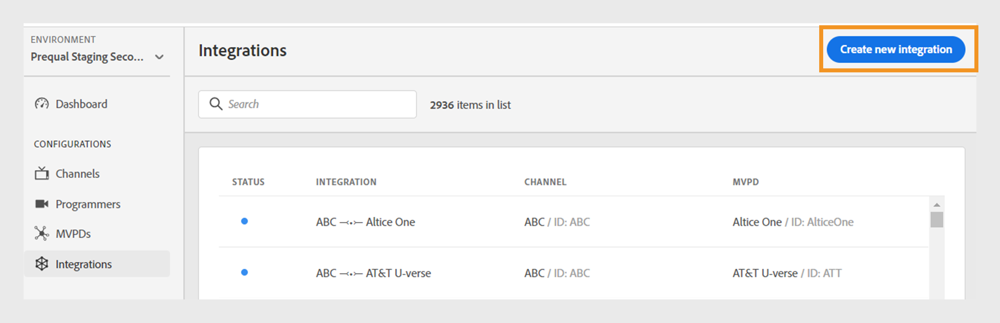

   *新しい統合を作成*

   次のセクションが表示されます。

   **チャネルとMVPDを選択**

   「**チャネルを選択**」ドロップダウンメニューから「**チャネル**」を選択して、新しい統合を追加します。 チャネルを選択したら、**MVPDを選択** ドロップダウンメニューから必要な&#x200B;**MVPD**&#x200B;を選択し、選択したチャネルと統合します。

   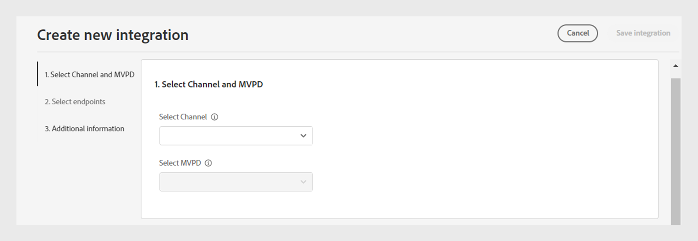

   *チャネルとMVPDを選択*

   **エンドポイントを選択**

   必要なMVPDを選択した後、**Select endpoint** セクションには、特定のMVPD用に設定されたデフォルトのエンドポイントが事前に入力されます。

   >[!IMPORTANT]
   >
   >MVPDで特に指定されていない限り、フローのデフォルトエンドポイントを変更しないでください。

   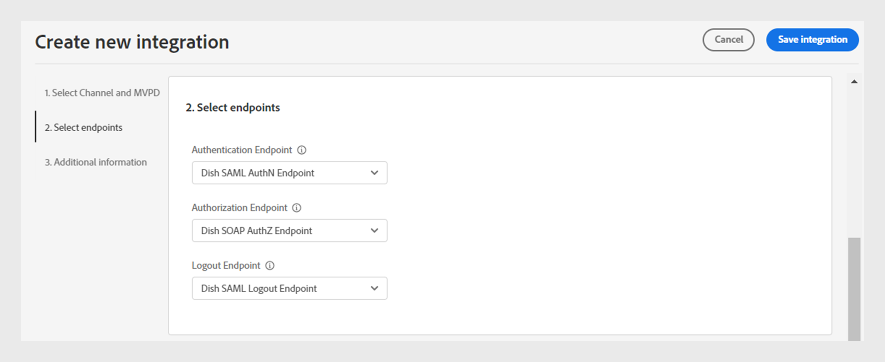

   *エンドポイントを選択*

   **追加情報**

   このセクションには、**チャネルとMVPD**&#x200B;の選択セクションで選択したMVPDに設定する必要がある様々なプロパティが含まれています。

   >[!NOTE]
   >
   > 実際のプロパティは、**チャンネルを選択およびMVPD** セクションで選択したMVPDによって異なる場合があります。

   例えば、次の画像のMVPD ログインページで、**AuthN TTL**&#x200B;または&#x200B;**Partner ID** （Channel ID）を共同ブランディング用に編集できます。

   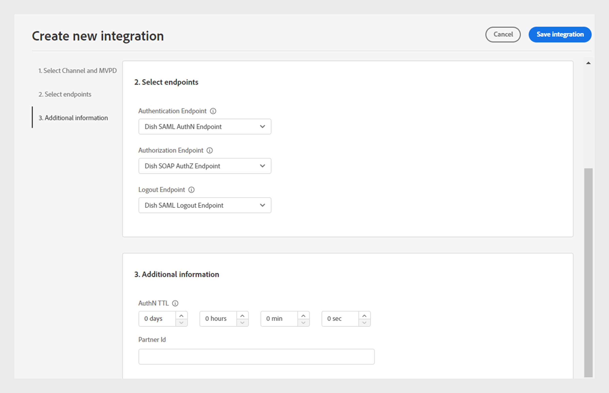

   *追加情報を編集*

   「**新しい統合を作成**」セクションの右上にある「**統合を保存**」を選択します。

新しい統合は、[&#x200B; レビューして変更をプッシュした後にのみ作成されます](/help/authentication/user-guide-tve-dashboard/tve-dashboard-review-push-changes.md)。

## 連携を無効にする {#disable-integration}

統合を無効にするには、次の手順に従います。

1. 左側のパネルで「**統合**」タブを選択します。

1. 無効にする統合を選択します。

1. 選択した統合の右上にある切り替えスイッチを無効にします。

   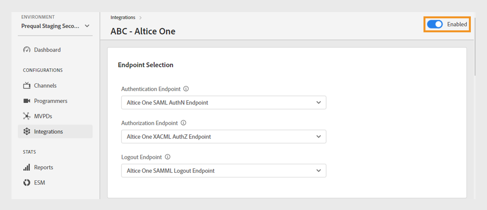

   *統合を無効にする*

統合は、[&#x200B; レビューして変更をプッシュした後にのみ無効になります](/help/authentication/user-guide-tve-dashboard/tve-dashboard-review-push-changes.md)。

統合を無効にすると、エンドユーザーは特定のMVPDを使用して認証または認証できなくなります。
