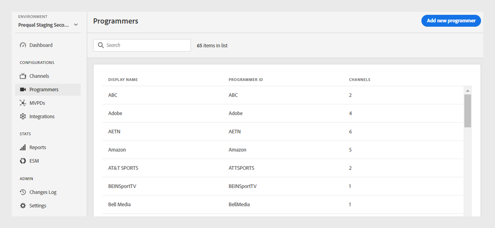
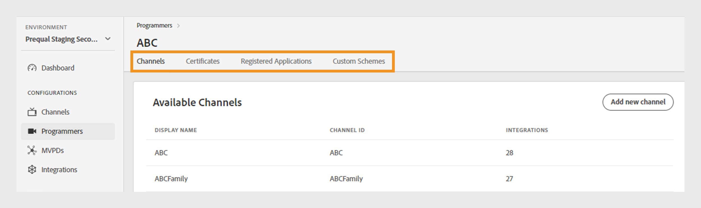
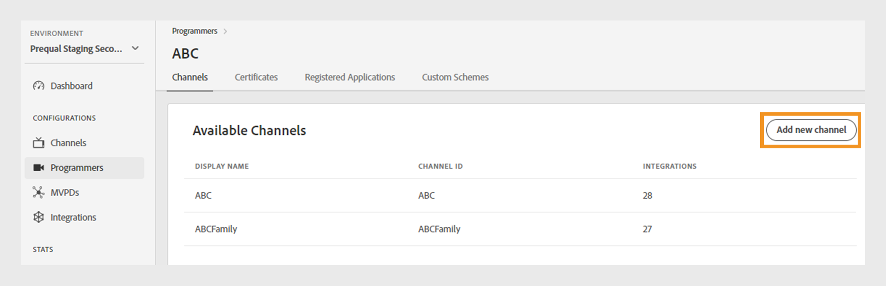
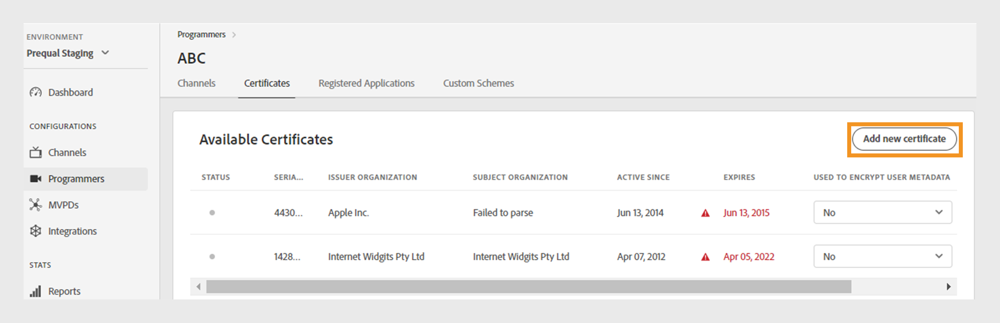
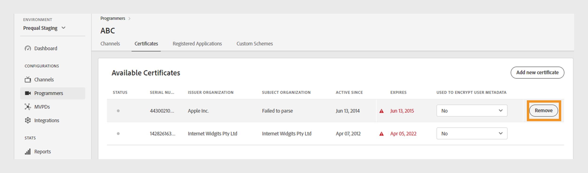
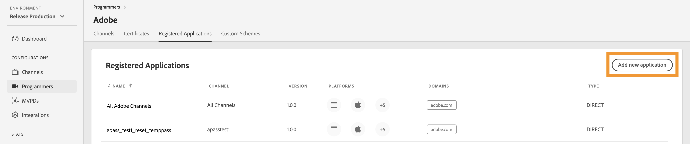
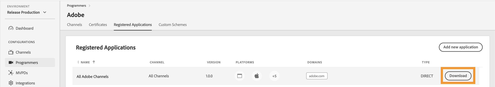
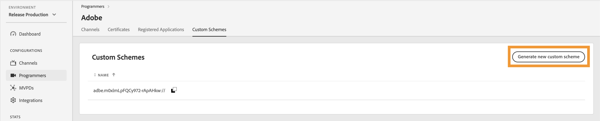
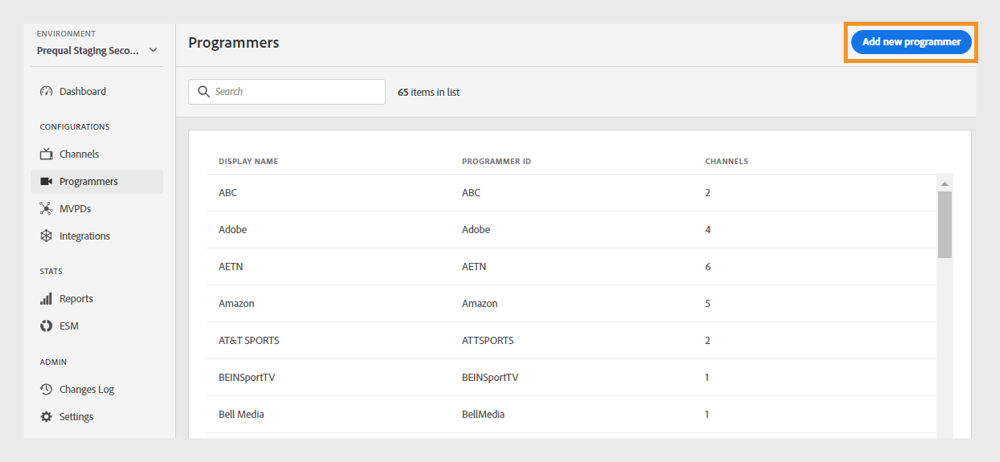

# プログラマー {#programmers}

>[!NOTE]
>
>このページのコンテンツは、情報提供のみを目的として提供されています。 このAPIを使用するには、Adobeの現在のライセンスが必要です。 無断使用は認められません。

TVE ダッシュボードの&#x200B;**プログラマー** セクションでは、アカウントの使用権限にリンクされている[&#x200B; プログラマー](/help/authentication/integration-guide-programmers/rest-apis/rest-api-v2/rest-api-v2-glossary.md#programmer)の設定を表示および管理できます。 必要に応じて[新しいプログラマ &#x200B;](#add-new-programmer)を追加することもできます。

左側のパネルの「**プログラマー**」タブには、既存のプログラマーのリストが表示され、次の詳細が表示されます。

* **プログラマーID**: システム内のメディア企業ID。
* **チャネル**: プログラマーにリンクされている関連チャネルの数。

*既存のプログラマーのリスト*

リストの上にある&#x200B;**検索** バーにプログラマーの名前を入力すると、プログラマーについて詳しく把握できます。

## プログラマー設定の管理 {#manage-programmer-conf}

特定のプログラマーの様々な設定を管理するには、次の手順に従います。

1. 左側のパネルで「**プログラマー**」タブを選択します。
1. リストからプログラマーを選択します。
1. 次のいずれかのタブを選択して、選択したプログラマーの対応する設定を表示および編集します。

   * [チャネル](#channels)
   * [証明書](#certificates)
   * [登録済みアプリ](#registered-applications)
   * [カスタムスキーム](#custom-schemes)

   

   *プログラマー設定*

>[!IMPORTANT]
>
> 設定変更のアクティベートについて詳しくは、[変更内容の確認とプッシュ &#x200B;](/help/authentication/user-guide-tve-dashboard/tve-dashboard-review-push-changes.md)を参照してください。

### チャネル {#channels}

このタブには、現在のプログラマーにリンクされているチャネルのリストが表示されます。 このリストから特定のチャネルを選択して、[&#x200B; チャネル &#x200B;](/help/authentication/user-guide-tve-dashboard/tve-dashboard-channels.md) セクションの詳細情報にアクセスします。

選択したプログラマーに新しいチャネルを追加するには、**利用可能なチャネル** セクションの右上隅にある&#x200B;**新しいチャネル**&#x200B;を追加を選択します。 [新しいチャネルを追加する方法](/help/authentication/user-guide-tve-dashboard/tve-dashboard-channels.md#add-new-channel)について説明します。

*新しいチャネルを追加*

### 証明書 {#certificates}

このタブには、ユーザーメタデータ暗号化フローで使用される[利用可能な証明書](#available-certificates)のリストが表示されます。 以下を含む各証明書の詳細が表示されます。

* ステータス（**ユーザーのメタデータ暗号化**&#x200B;の使用に対して有効かどうかを問わず）
* シリアル番号
* イシュア組織の名前
* 件名の組織の名前
* 発行日
* 有効期限
* ユーザーメタデータを暗号化するドロップダウンメニュー（**Yes**&#x200B;を選択した場合、証明書は郵便番号の値などの機密性の高いユーザー情報を暗号化します）。

#### 利用可能な証明書 {#available-certificates}

これらの証明書は秘密鍵または公開鍵として機能し、ユーザーメタデータの暗号化に使用されます。 同じメディア企業に関連付けられたすべてのチャネルは、これらの証明書を使用できます。

使用可能な証明書に次の変更を加えることができます。

* [新しい証明書を追加](#add-new-certificate)
* [証明書を削除](#delete-certificate)

##### 新しい証明書を追加 {#add-new-certificate}

新しい証明書を追加するには、次の手順に従います。

1. 「**利用可能な証明書**」セクションの右上隅にある「**新しい証明書を追加**」を選択します。

   

   *新しい証明書を追加*

1. **新しい証明書** ダイアログボックスに、証明書の公開キーを貼り付けます。

1. 「**証明書を追加**」を選択します。

1. **使用可能な証明書**&#x200B;のリストで、新しい証明書を探します。

   >[!IMPORTANT]
   >
   > システムが最新であり、新しい証明書を使用する準備ができていることを確認します。

1. **から「**&#x200B;はい&#x200B;**」を選択します。ユーザーのメタデータを暗号化するために使用します**」ドロップダウンメニューをクリックして、新しい証明書をアクティベートします。

新しい設定変更が作成され、サーバー更新の準備が整いました。 「**使用可能な証明書**」セクションに記載されている新しい証明書を使用するには、[&#x200B; レビューと変更のプッシュ &#x200B;](/help/authentication/user-guide-tve-dashboard/tve-dashboard-review-push-changes.md) フローに進みます。

##### 証明書を削除 {#delete-certificate}

証明書を削除するには、次の手順に従います。

1. **使用可能な証明書**&#x200B;のリストから削除する証明書にカーソルを合わせます。

1. **削除**&#x200B;を選択します。

   

   *選択した証明書を削除*

1. 「**証明書を削除**」ダイアログボックスで「**削除**」を選択します。

新しい設定変更が作成され、サーバー更新の準備が整いました。 証明書は、[&#x200B; レビューと変更のプッシュ後](/help/authentication/user-guide-tve-dashboard/tve-dashboard-review-push-changes.md)にのみ、**利用可能な証明書** セクションから削除されます。

### 登録済みアプリ {#registered-applications}

このタブには、登録されたアプリケーションのリストが表示されます。 登録アプリケーションの使用状況に関する詳細については、[動的クライアント登録の概要](../integration-guide-programmers/rest-apis/rest-api-dcr/dynamic-client-registration-overview.md) ドキュメントを参照してください。

登録済みアプリケーションでは、次の操作を実行できます。

* [新規登録アプリケーションの追加](#add-registered-applications)
* [ソフトウェアステートメントのダウンロード](#download-software-statement)

#### 新規登録アプリケーションを追加 {#add-registered-applications}

新しい登録アプリケーションを追加するには、次の手順に従います。

1. 「**登録済みアプリケーション**」セクションの右上隅にある「**新しいアプリケーションを追加**」を選択します。

   

   *新しいアプリケーションを追加*

1. **新規アプリケーション** ダイアログボックスのドロップダウンメニューから「**チャネル**&#x200B;に割り当て」を選択します。

   >[!IMPORTANT]
   >
   > セキュリティを強化し、不正アクセスを防止するために、より具体的で制限された権限を持つ登録アプリケーションを作成することをお勧めします。 したがって、登録アプリケーションを作成する場合は、割り当てられた`channel`に対して絞り込んだオプションを使用することを検討してください。

1. ドロップダウンメニューから「**Platforms**」を選択します。

   >[!IMPORTANT]
   >
   > セキュリティを強化し、不正アクセスを防止するために、より具体的で制限された権限を持つ登録アプリケーションを作成することをお勧めします。 したがって、登録アプリケーションを作成する場合は、割り当てられた`platforms`に対して絞り込んだオプションを使用することを検討してください。

1. ドロップダウンメニューから「**ドメイン**」を選択します。

   >[!IMPORTANT]
   >
   > クライアント登録プロセスでは、クライアントアプリケーションは、認証フローの最終化にリダイレクト URLを使用することを許可するようにリクエストできます。 クライアントアプリケーションが特定のリダイレクト URLを使用すると、この選択範囲で選択された`domains`に対して検証されます。

1. アプリケーションの&#x200B;**名前**&#x200B;を入力します。

1. アプリケーションの&#x200B;**バージョン**&#x200B;を入力します。

   >[!IMPORTANT]
   >
   > クライアントアプリケーションのライフサイクルと使用状況を管理するために、クライアントアプリケーションのメジャーアップデートごとに新しい登録アプリケーションを作成することをお勧めします。 必要に応じて、[Zendesk](https://adobeprimetime.zendesk.com)でチケットを作成し、特定のクライアントアプリケーションバージョンの機能をブロックするために、登録されたアプリケーションを取り消すようにテクニカルアカウントマネージャー（TAM）に依頼します。

1. ドロップダウンメニューから&#x200B;**Type**&#x200B;値「DIRECT」を選択します。

1. 「**アプリケーションを追加**」を選択します。

新しい設定変更が作成され、サーバー更新の準備が整いました。 **登録済みアプリケーション** セクションに記載されている新しい登録済みアプリケーションを使用するには、[&#x200B; レビューと変更をプッシュ &#x200B;](/help/authentication/user-guide-tve-dashboard/tve-dashboard-review-push-changes.md)のフローに進みます。

#### ソフトウェアステートメントのダウンロード {#download-software-statement}

ソフトウェアステートメントをダウンロードするには、次の手順に従います。

1. 登録済みアプリケーションにカーソルを合わせると、**登録済みアプリケーション**&#x200B;のリストからソフトウェア ステートメントをダウンロードできます。

1. **ダウンロード**&#x200B;を選択します。

   

   *ソフトウェアステートメントのダウンロード*

### カスタムスキーム {#custom-schemes}

このタブには、カスタムスキームのリストが表示されます。 カスタムスキームの使用に関する詳細については、[iOS/tvOS アプリケーション登録](/help/authentication/integration-guide-programmers/legacy/sdks/ios-tvos-sdk/iostvos-application-registration.md)を参照してください。

カスタムスキームには、次の変更を加えることができます。

* [新しいカスタムスキームの生成](#generate-custom-schemes)

#### 新しいカスタムスキームを生成 {#generate-custom-schemes}

新しいカスタムスキームを生成するには、次の手順に従います。

1. 「**新しいカスタムスキームを生成**」を選択します。

   

   *新しいカスタムスキームを生成*

新しい設定変更が作成され、サーバー更新の準備が整いました。 「**カスタムスキーム**」セクションに記載されている新しいカスタムスキームを使用するには、[変更のレビューとプッシュ &#x200B;](/help/authentication/user-guide-tve-dashboard/tve-dashboard-review-push-changes.md) フローに進みます。

## 新しいプログラマーを追加 {#add-new-programmer}

新しいプログラマーエンティティを追加するには、次の手順に従います。

1. 左側のパネルで「**プログラマー**」タブを選択します。

1. 「**プログラマー**」セクションの右上隅にある「**新しいプログラマー**&#x200B;を追加」を選択します。

   

   *新しいプログラマーを追加*

1. 「**新規プログラマー**」ダイアログボックスの「**プログラマーID**」にメディア会社の識別子を入力します。

1. コンソールに表示する商用ブランド名を&#x200B;**表示名**&#x200B;の下に入力します。

1. 「**プログラマーを追加**」を選択します。

新しい設定変更が作成され、サーバー更新の準備が整いました。 「**プログラマー**」セクションに記載されている新しいプログラマーを使用するには、[のレビューと変更のプッシュ &#x200B;](/help/authentication/user-guide-tve-dashboard/tve-dashboard-review-push-changes.md) フローに進みます。
