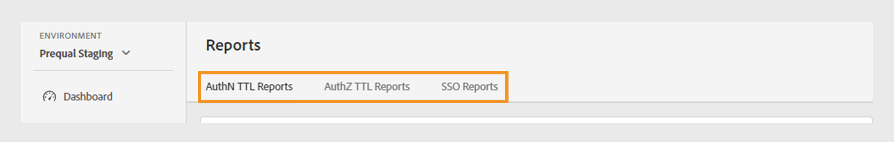
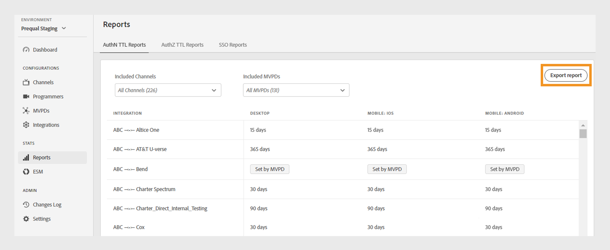
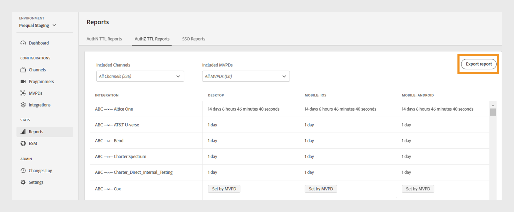
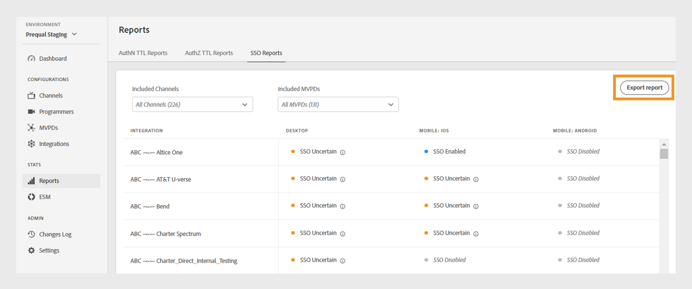
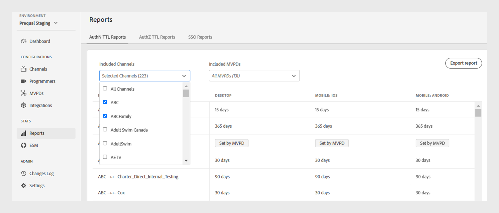
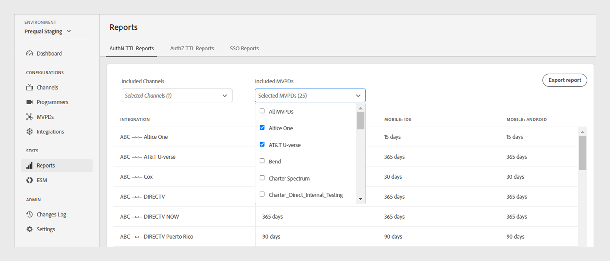

# レポート {#Reports}

>[!NOTE]
>
>このページのコンテンツは、情報提供のみを目的として提供されています。 このAPIを使用するには、Adobeの現在のライセンスが必要です。 無断使用は認められません。

TVE ダッシュボードの&#x200B;**レポート** セクションでは、AuthN TTL、AuthZ TTL、およびSSO レポートの集計データにアクセスできます。 これらのレポートには、すべての[ プラットフォーム ](#platforms)で異なるMVPDとのチャネル統合が含まれます。

レポートを使用すると、[特定のチャネルまたはMVPD](#selecting-specific-channels-mvpds)にわたってデータをフィルタリングし、インサイトを収集できます。 CSV ファイルでレポートをエクスポートして、詳細な分析を行うこともできます。

## レポートを表示 {#view-reports}

特定のレポートを表示するには、次の手順に従います。

1. 左側のパネルで「**レポート**」タブを選択します。
1. 次のいずれかのタブを選択して、含まれているチャネルとMVPDの集約データを表示および書き出します。
   * [AuthN TTL レポート](#authn-ttl-reports)
   * [AuthZ TTL レポート](#authz-ttl-reports)
   * [SSO レポート](#sso-reports)

   

   *レポートの種類*

### AuthN TTL レポート {#authn-ttl-reports}

AuthN TTL レポートは、Authentication Time-To-Live （TTL）とも呼ばれ、すべての[ プラットフォーム ](#platforms)で、様々なMVPDとのチャネル統合に対して認証トークンが設定される期間を表示します。 これらのレポートを使用すると、特定のMVPDおよびプラットフォームに対するユーザーの認証時間を調べることができます。 期間の値は、**日**、**時間**、**分**、**秒**&#x200B;など、ユーザーにとって使いやすい形式で表示されます。 AuthN TTL レポート テーブルは、様々な画面サイズに対応する水平および垂直スクロール機能を備えています。

また、[特定のチャネルまたはMVPD](#selecting-specific-channels-mvpds)のデータを表示およびダウンロードすることもできます。

*認証TTL レポートのエクスポート*

>[!IMPORTANT]
>
> MVPDによって設定された&#x200B;**Set** プレースホルダーは、MVPDがAdobe Pass Authentication設定ではなくAuthN TTL値を適用する場合に使用されます。

**レポートの書き出し**&#x200B;を選択して、データをローカルマシンにCSV ファイルとして保存します。

### AuthZ TTL レポート {#authz-ttl-reports}

AuthZ TTL レポートは、Authorization Time-To-Live （TTL）とも呼ばれ、すべての[ プラットフォーム ](#platforms)で、様々なMVPDとのチャネル統合に設定された認証トークンの期間を表示します。 これらのレポートを使用すると、特定のMVPDおよびプラットフォームのコンテンツを視聴する権限をユーザーが保持している時間を調べることができます。 期間の値は、**日**、**時間**、**分**、**秒**&#x200B;など、ユーザーにとって使いやすい形式で表示されます。 AuthZ TTL レポート テーブルは、様々な画面サイズに対応する水平および垂直スクロール機能を備えています。

また、[特定のチャネルまたはMVPD](#selecting-specific-channels-mvpds)のデータを表示してダウンロードすることもできます。

*AuthZ TTL レポートのエクスポート*

>[!IMPORTANT]
>
> MVPDによって設定された&#x200B;**Setのプレースホルダーは、MVPDがAdobe Pass Authentication設定ではなくAuthZ TTL値を適用する場合に使用されます。**

**レポートの書き出し**&#x200B;を選択して、データをローカルマシンにCSV ファイルとして保存します。

### SSO レポート {#sso-reports}

シングルサインオンとも呼ばれるSSO レポートには、すべての[ プラットフォーム ](#platforms)で、様々なMVPDとのチャネル統合に設定されたシングルサインオンステータスが表示されます。 これらのレポートを使用すると、特定のMVPDおよびプラットフォームの想定されるユーザー認証SSO エクスペリエンスを調べることができます。 値は、**SSO Disabled**、**SSO Enabled**、**SSO Uncertain**&#x200B;など、使いやすい形式で表示されます。 SSO レポート テーブルには、様々な画面サイズに対応する水平および垂直スクロールが用意されています。

また、[特定のチャネルまたはMVPD](#selecting-specific-channels-mvpds)のデータを表示およびダウンロードすることもできます。

*SSO レポートのエクスポート*

>[!IMPORTANT]
>
> **SSO Uncertain** プレースホルダーは、シングルサインオン （SSO）が有効であり、運用できる可能性があることを示します。 ただし、次の例に示すように、次の設定ではSSO認証が禁止される場合があります。
>
> * ユーザープラットフォームの設定：サードパーティ Cookieをブロックするオプション。
> * ユーザーの決定：ユーザーは、TV プロバイダーのサブスクリプションへのプラットフォームアクセスを拒否します。
> * MVPDの設定：MVPDは、各チャネルに対して認証をリクエストします。

**レポートの書き出し**&#x200B;を選択して、データをローカルマシンにCSV ファイルとして保存します。

## Platforms {#platforms}

[AuthN TTL レポート ](#authn-ttl-reports)、[AuthZ TTL レポート ](#authz-ttl-reports)および[SSO レポート ](#sso-reports)は、次のような様々なプラットフォームのデータを示します。

* **デスクトップ**: Adobe Pass Authentication JavaScript SDKを介してプログラマ実装に適用された値を表示します。

* **モバイル**

  **iOS**: Adobe Pass Authentication iOS SDKを使用して適用された値を表示します。

  **Android**: Adobe Pass Authentication Android SDKを通じて適用された値を表示します。

  **その他**: モバイルデバイス用に開発されたAdobe Pass Authentication REST APIを使用して適用された値を表示します。

* **TVCD**

  **Roku**: Adobe Pass Authentication REST APIを介して適用された値を表示し、Rokuをデバイスタイプとして識別します。

  **FireTV**: Adobe Pass Authentication FireTV SDKを通じて適用された値を表示します。

  **AppleTV**: Adobe Pass Authentication tvOS SDKを介して適用された値を表示します。

  **その他**: テレビ接続デバイスに対してAdobe Pass Authentication REST APIを使用して適用された値を表示します。

* **Platform unidentified**: Adobe Pass認証サービスが不明なデバイスタイプを検出したときに、プログラマー実装に適用される値を表示します。

Adobe Pass Authentication REST APIまたはSDKと&#x200B;**Roku**&#x200B;などの目的のデバイスタイプを共有する方法について詳しくは、[ クライアント情報を渡す](/help/authentication/integration-guide-programmers/legacy/client-information/passing-client-information-device-connection-and-application.md)仕組みを参照してください。

>[!IMPORTANT]
>
> 集計されたデータは、各Adobe Pass認証環境の特定の設定に基づいています。 異なるTVE ダッシュボード環境を切り替える場合、レポート間でデータのバリエーションが発生することを想定します。 詳しくは、[Adobe Pass Authentication environments](/help/authentication/user-guide-tve-dashboard/tve-dashboard-environments.md)を参照してください。

## 特定のチャネルとMVPDの選択 {#selecting-specific-channels-mvpds}

[AuthN TTL レポート ](#authn-ttl-reports)、[AuthZ TTL レポート ](#authz-ttl-reports)および[SSO レポート ](#sso-reports)では、デフォルトで&#x200B;**すべてのMVPD**&#x200B;と&#x200B;**すべてのチャネル**&#x200B;統合のデータが表示されます。

>[!NOTE]
>
> それぞれのドロップダウンメニューで&#x200B;**すべてのチャネル**&#x200B;または&#x200B;**すべてのMVPD**&#x200B;の選択を解除すると、メッセージが表示され、有意義なレポートを表示するための選択が行われます。

特定のチャネルに関するレポートを生成するには：

1. 選択したレポートの上部にある「**含まれるチャネル**」ドロップダウンメニューを選択します。

   

   *チャネルを含むドロップダウンメニュー*

1. **すべてのチャネル**&#x200B;の選択を解除します。

1. データを生成する&#x200B;**含まれるチャネル** ドロップダウンメニューから必要なチャネルを選択します。

>[!NOTE]
>
> **含まれるMVPD** ドロップダウンメニューでオプションを使用するには、**含まれるチャネル** ドロップダウンメニューで少なくとも1つのチャネルを選択する必要があります。

特定のMVPDのレポートを生成するには：

1. 選択したレポートの上部にある「**含まれるMVPD**」ドロップダウンメニューを選択します。

   

   *MVPDs ドロップダウンメニューを含む*

1. **すべてのMVPD**&#x200B;の選択を解除します。

1. データを生成する対象となる&#x200B;**含まれるMVPD** ドロップダウンメニューから、必要なMVPDを選択します。
