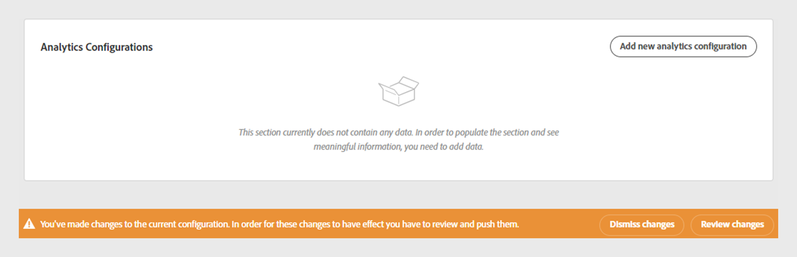
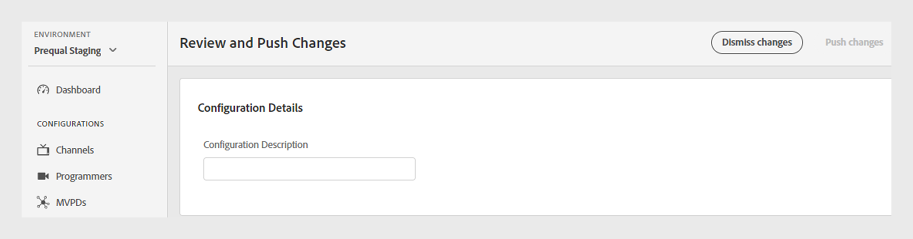
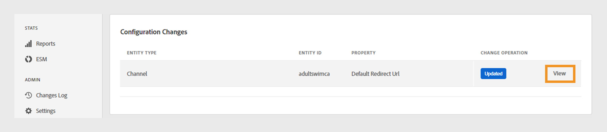
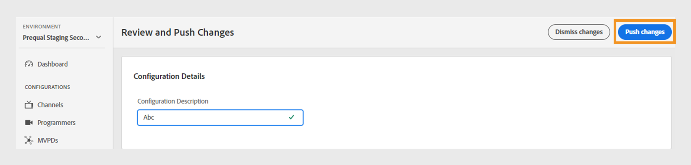

# 変更のレビューとプッシュ

>[!NOTE]
>
>このページのコンテンツは、情報提供のみを目的として提供されています。 このAPIを使用するには、Adobeの現在のライセンスが必要です。 無断使用は認められません。

TVE ダッシュボードを使用すると、現在の設定の変更を確認し、それらをサーバーにデプロイできます。 現在の設定を変更するたびに、画面に通知が表示され、変更を確認してプッシュするよう求められます。

変更をレビューしてプッシュするには、次の手順に従います。

1. 画面の下部にあるレビューとプッシュの変更通知を見つけます。

   

   *変更の確認とプッシュ通知ボックス*

1. **変更のレビューとプッシュ通知** ボックスから&#x200B;**変更のレビュー**&#x200B;を選択します。

1. 各変更の目的を効果的に追跡および理解するために、**設定の説明**&#x200B;に変更の簡単な説明を入力します。

   

   *設定の説明を追加*

1. 「**設定変更**」セクションに移動して、変更の概要を表示します。

1. 確認したい変更点にカーソルを合わせます。

1. **ビュー**&#x200B;を選択して、設定変更に関連付けられた以前の値と新しい値を確認します。

   

   *設定の変更を表示*

1. すべての変更を確認し、すべてが正しく表示されたら、**変更をプッシュ**&#x200B;を選択して、更新された設定をサーバーに適用します。

   >[!NOTE]
   >
   >**プッシュ変更** ボタンは、**構成説明**&#x200B;を追加した後にのみアクティブになります。

   

   *変更をプッシュ*

   また、リストされたすべての設定変更を元に戻す場合は、**変更を閉じる**&#x200B;を選択することもできます。
