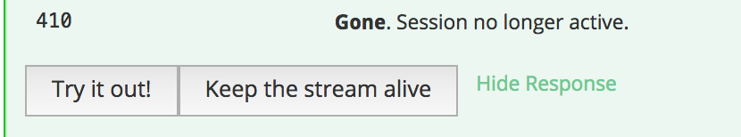
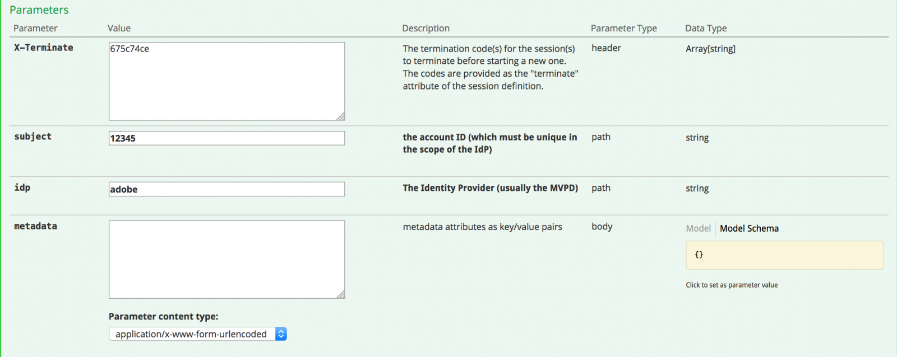
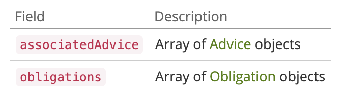
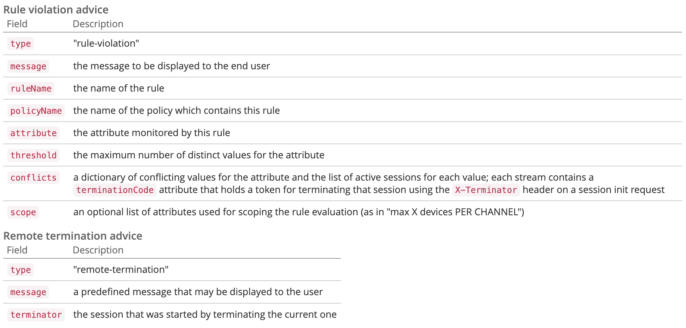
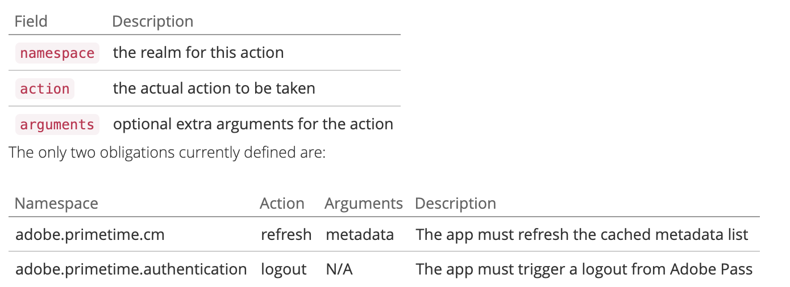

# APIの概要 {#api-overview}

詳しくは、[&#x200B; オンライン API ドキュメント &#x200B;](https://streams-stage.adobeprimetime.com/swagger-ui/index.html)を参照してください。

## 目的と前提条件 {#purpose-prerequisites}

このドキュメントは、同時視聴数モニタリングとの統合を実装する際に、アプリケーション開発者がSwagger API仕様を使用する際に役立ちます。 このガイドラインに従う前に、サービスで定義されている概念を事前に理解しておくことを強くお勧めします。 この理解を得るには、[製品ドキュメント &#x200B;](../cm-home.md)と[Swagger API仕様](https://streams-stage.adobeprimetime.com/swagger-ui/index.html)の概要を確認する必要があります。

## 概要 {#api-overview-intro}

開発プロセス中に、Swagger公開ドキュメントは、API フローの理解とテストにおける参照ガイドラインを表します。 これは、実践的なアプローチを採用し、ユーザーインタラクションのさまざまなシナリオで実際のアプリケーションがどのように動作するかを理解するために開始するのに最適な場所です。

同時視聴数モニタリングに会社とアプリケーションを登録するには、[Zendesk](mailto:tve-support@adobe.com)でチケットを送信してください。 Adobeは、各エンティティにアプリケーション IDを割り当てます。 このガイドでは、テナント Adobeの下にあるID **demo-app**&#x200B;と&#x200B;**demo-app-2**&#x200B;の2つの参照アプリケーションを使用します。

### 最初のアプリケーション {#first-app-use-cases}

ID **demo-app**&#x200B;のアプリケーションは、同時ストリームの数を3に制限する1つのルールを持つポリシーをAdobe チームによって割り当てられました。 ポリシーは、Zendeskで送信されたリクエストに基づいて、特定のアプリケーションに割り当てられます。

#### メタデータの取得中 {#retrieve-metadata-use-case}

セッションの初期化中にフォームデータとして渡す必要があるメタデータ属性のリストを取得するために、最初に行う呼び出しはメタデータリソース用です。 このメタデータは、このアプリケーションに割り当てられたポリシーを評価するために使用されます。

```http
# Request
user = 'demo-app'
pass = ''
curl -i -u ${user}:%{pass} http://streams-stage.adobeprimetime.com/v2/metadata

# Response Code
200
# Response Body
[]
```

応答本文フィールドからわかるように、メタデータ属性のリストは空です。 つまり、デザインで必要な属性は、このアプリケーションに割り当てられた3つのストリームポリシーを評価するのに十分です。 [標準メタデータフィールドのドキュメント &#x200B;](../technical/standard-metadata-attributes.md)も参照してください。 この呼び出しの後、セッション REST リソースで新しいセッションを作成できます。

#### セッションの初期化 {#session-initial}

セッション初期化呼び出しは、実行に必要なすべての情報を取得した後、アプリケーションによって実行されます。

```http
# Request
user = 'demo-app'
pass = ''
curl -i -X POST -u ${user}:%{pass} http://streams-stage.adobeprimetime.com/v2/sessions/adobe/12345
```


最初の呼び出しで終了コードを提供する必要はありません。他のアクティブなストリームはありません。 メタデータの取得呼び出しから返されたものはないため、メタデータ属性も返されません。

**subject**&#x200B;および&#x200B;**idp** パラメーターは必須です。これらはURI パス変数として指定されます。 Adobe Pass Authenticationから&#x200B;**mvpd**&#x200B;および&#x200B;**upstreamUserID** メタデータフィールドの呼び出しを行うことで、**subject**&#x200B;および&#x200B;**idp** パラメーターを取得できます。 メタデータ APIの[概要](https://experienceleague.adobe.com/docs/primetime/authentication/auth-features/user-metadat/user-metadata-feature.html?lang=en#)も参照してください。 この例では、値「12345」を件名として、「adobe」をidpとして指定します。

```
# Response Code
  202
# Response Body
  no content
# Response Headers
  {
    "cache-control": "no-store",
    "content-length": "0",
    "date": "Tue, 01 Jan 2022 12:00:00 GMT",
    "expires": "Tue, 01 Jan 2022 12:01:00 GMT",
    "location": "76378b50-4eb0-43b4-b144-51cb62d85563", 
    "content-type": null
  }
```

必要なデータはすべて応答ヘッダーに含まれています。 **場所** ヘッダーは、新しく作成されたセッションのIDを表し、**日付**&#x200B;および&#x200B;**有効期限** ヘッダーは、セッションを維持するために次のハートビートを作成するようにアプリケーションをスケジュールするために使用される値を表します。

すべての呼び出しでは、アプリケーションの必須メタデータだけでなく、必要なメタデータを送信できます。 メタデータの送信は、次の2つの方法で実行できます。
* **query** **parameters**&#x200B;を使用しています：

  ```sh
  curl -i -XPOST -u "user:pass" "https://streams-stage.adobeprimetime.com/v2/sessions/some_idp/some_user?metadata1=value1&metadata2=value2"
  ```

* **request** **body**&#x200B;を使用しています：

  ```sh
  curl -i -XPOST -u "user:pass" https://streams-stage.adobeprimetime.com/v2/sessions/some_idp/some_user -d "metadata1=value1" -d "metadata2=value2" -H "Content-Type=application/x-www-form-urlencoded"
  ```

#### ハートビート {#heartbeat}

ハートビートコールを行います。 セッション初期化呼び出しで取得した&#x200B;**セッション ID**&#x200B;と、使用した&#x200B;**subject**&#x200B;および&#x200B;**idp** パラメーターを指定します。

```http
# Request
user = 'demo-app'
pass = ''
curl -i -X POST -u ${user}:%{pass} http://streams-stage.adobeprimetime.com/v2/sessions/adobe/12345/76378b50-4eb0-43b4-b144-51cb62d85563
```

ハートビートコールの場合は、セッションの場合と同じ方法でメタデータを送信できます。 いつでも新しいメタデータを追加でき、以前に送信した値を&#x200B;**例外**&#x200B;で更新できます。 設定された次の値は変更できません：**package**、**channel**、**platform**、**assetId**、**idp**、**mvpd**、**hba_status**、**hba**、
**mobileDevice**

セッションがまだ有効な場合（有効期限が切れていないか、手動で削除されている場合）、正常な結果が得られます。

```
# Response Code
  202
# Response Body
  no content
# Response Headers
  {
    "cache-control": "no-store",
    "content-length": "0",
    "date": "Tue, 01 Jan 2022 12:00:00 GMT",
    "expires": "Tue, 01 Jan 2022 12:01:00 GMT",
    "content-type": null
  }
```

最初のケースと同様に、**Date**&#x200B;および&#x200B;**Expires** ヘッダーを使用して、この特定のセッションの別のハートビートをスケジュールします。 セッションが無効になった場合、この呼び出しは410 GONE HTTP Status コードで失敗します。

Swagger UIで利用可能な「ストリームを維持する」オプションを使用して、特定のセッションで自動ハートビートを実行できます。これにより、タイムリーなセッションハートビートを実行するために必要なボイラープレートを心配することなく、ルールをテストできます。 このボタンは、「Swagger ハートビート」タブの「体験版」ボタンの横に配置されます。 作成したすべてのセッションに対して自動ハートビートを設定するには、Web ブラウザータブで個別のSwagger UIを開いて、各セッションをスケジュールする必要があります。



#### セッションの終了 {#session-termination}

例えば、ユーザーがビデオの視聴を停止した場合に、同時視聴数モニタリングで特定のセッションを終了する必要がある場合があります。 これは、Sessions リソースに対してDELETE呼び出しを行うことで実行できます。


```http
# Request
user = 'demo-app'
pass = ''
curl -i -X DELETE -u ${user}:%{pass} http://streams-stage.adobeprimetime.com/v2/sessions/adobe/12345/76378b50-4eb0-43b4-b144-51cb62d85563
```

呼び出しには、セッションのハートビートと同じパラメーターを使用します。 応答のHTTP ステータスコードは次のとおりです。

* 202件の回答が承認されました
* セッションが既に停止されている場合は410が消えました。

#### すべてのランニングストリームを取得 {#get-all-running-streams}

このエンドポイントは、すべてのアプリケーションで特定のテナントに対して現在実行中のすべてのセッションを提供します。 呼び出しに&#x200B;**subject**&#x200B;および&#x200B;**idp** パラメーターを使用します。

```http
# Request
user = 'demo-app'
pass = ''
curl -i -X GET -u ${user}:%{pass} http://streams-stage.adobeprimetime.com/v2/runningStreams/{idp}/{user}
```

呼び出しを行うと、次の応答が返されます。

```http
# Response Code
  200 
# Response Body
  {
    "runningStreams": [
      {
        "sessionId": "76378b50-4eb0-43b4-b144-51cb62d85563",
        "startTime": 1738760521421,
        "applicationId": "demo-app",
        "applicationName": "Demo application",
        "terminationCode": "94c8f7d9",
        "metadata": {
          "package": "premium"  
        },
      }
    ]
  }
# Response Headers
  {
    "cache-control": "no-store",
    "content-type": "application/json;charset=utf-8",
    "date": "Tue, 01 Jan 2022 12:00:00 GMT",
    "expires": "Tue, 01 Jan 2022 12:01:00 GMT",
  }
```

各セッションごとに、**終了コード**&#x200B;と完全なメタデータを取得します。

**Expires** ヘッダーに注意してください。 これは、ハートビートが送信されない限り、最初のセッションが期限切れになる時間です。
メタデータフィールドには、セッションの開始時に送信されたすべてのメタデータが入力されます。 私たちはそれをフィルタリングしません、あなたはあなたが送ったすべてを受け取ります。
応答には、他のテナントのアプリで実行されているすべてのストリームが、アプリが同じポリシーを共有している限り含まれます。
呼び出し時に特定のユーザーに対する実行中のセッションがない場合は、次の応答が返されます。

```http
# Response Code
  200 
# Response Body
  {
    "runningStreams": [],
    "otherStreams": 0
  }
# Response Headers
  {
    "cache-control": "no-store",
    "content-type": "application/json;charset=utf-8",
    "date": "Tue, 01 Jan 2022 12:00:00 GMT",
  }
```

この場合、**Expires** ヘッダーは存在しないことにも注意してください。

セッションが&#x200B;**X-Terminate** ヘッダーを使用して別のセッションを強制終了するために作成された場合、メタデータの下にフィールド **が置き換えられます**。 この値は、現在のセッションの余地を作るために殺されたセッションの指標です。

```http
# Response Code
  200 
# Response Body
  {
    "runningStreams": [
      {
        "sessionId": "76378b50-4eb0-43b4-b144-51cb62d85563",
        "startTime": 1738760521421,
        "applicationId": "demo-app",
        "applicationName": "Demo application",
        "terminationCode": "c424312e",
        "metadata": {
          "superseded": "ab1a9d54",
          "package": "premium"  
        },
      }
    ]
  }
# Response Headers
  {
    "cache-control": "no-store",
    "content-type": "application/json;charset=utf-8",
    "date": "Tue, 01 Jan 2022 12:00:00 GMT",
    "expires": "Tue, 01 Jan 2022 12:01:00 GMT",
  }
```

#### ポリシーの打破 {#breaking-policy-app-first}

アプリケーションに割り当てられた3つのストリームポリシーが壊れた場合のアプリケーションの動作をシミュレートするには、セッションの初期化を3回呼び出す必要があります。 ポリシーを有効にするには、ハートビートの欠如によりセッションの1つが期限切れになる前に呼び出しを行う必要があります。 これらの呼び出しはすべて成功しますが、4番目の呼び出しを実行すると、次のエラーで失敗します。

```http
# Response Code
409 
# Response Body
  {
    "associatedAdvice": [
      {
        "type": "rule-violation",
        "message": "Number of active streams exceeded",
        "policyName": "demo-policy",
        "threshold": 4,
        "ruleName": "3 streams cap",
        "conflicts": {
          "76378b50-4eb0-43b4-b144-51cb62d85563" : [
            { 
              "terminationCode": "51fd351f", 
              "metadata": {
                "package": "premium",
                "show": "Friends" 
              },
              "channel": "Unknown",
              "startedAt": "2024-11-25T09:06:12.951Z",
              "deviceName": "Unknown",
              "applicationName": "Demo application"
            }
          ]
        }
      }
    ]
  }
```

ペイロード内の評価結果オブジェクトと共に409 CONFLICT応答を取得します。 これは、サーバー側のポリシーでは、このセッションの作成や続行が許可されていないことを示します。 応答本文には、ルール違反ごとに説明を含むAdvice オブジェクトのリストである、空でないAssociatedAdviceを持つEvaluationResult オブジェクトが含まれます。

アプリケーションは、各Advice インスタンスによって実行されるエラーメッセージをユーザーにプロンプト表示する必要があります。 また、すべてのアドバイスには、属性、しきい値、ルール名、ポリシー名などのルールの詳細も示されます。 さらに、値ごとにアクティブなセッションのリストに、競合する値も含まれます。

この情報は、高度なエラーメッセージの書式設定と、競合するセッションに関するユーザーのアクションを許可することを目的としています。

競合するすべてのセッションには、**terminycode**&#x200B;が含まれます。このコードは、そのストリームを&#x200B;**キリング**&#x200B;するために使用できます。 この方法により、アプリケーションは、現在のセッションに対するアクセスを取得するために、終了するセッションをユーザーが選択できるようにする場合があります。

アプリケーションは、評価結果の情報を使用して、ビデオを停止する際に特定のメッセージをユーザーに表示し、必要に応じてさらにアクションを実行することができます。 1つのユースケースは、新しいストリームを開始するために他の既存のストリームを停止する場合があります。 これは、特定の競合する属性に対して、**conflicts** フィールドに存在する&#x200B;**terminationCode**&#x200B;値を使用することで行われます。 値は、新しいセッション初期化の呼び出しでX-Terminate HTTP ヘッダーとして提供されます。



セッションの初期化時に1つ以上の終了コードを指定すると、呼び出しが成功し、新しいセッションが生成されます。 次に、リモートで停止されたセッションの1つでハートビートを実行しようとすると、次の例のように、セッションがリモートで終了されたという事実を説明する評価結果ペイロードを含む410 GONE応答が返されます。


```http
# Response Code
  410 
# Response Body
  {
    "associatedAdvice": [
      {
        "type": "remote-termination",
        "message": "This session was terminated by a remote user",
        "terminator": {
          "channel": "Unknown",
          "startedAt": "2024-11-25T09:06:12.951Z",
          "deviceName": "Unknown",
          "applicationName": "Demo application"
        }     
      }
    ],
    "obligations": []
  }
```

410は、現在のセッションが終了した原因に基づいて、本文の有無にかかわらず返すことができます。

応答に本文がない場合、410は、（タイムアウトまたは以前の競合などにより）アクティブでなくなったセッションに対してハートビート（または終了）呼び出しが試行されたことを意味します。 この状態から回復する唯一の方法は、アプリケーションが新しいセッションを開始することです。 本文がないので、ユーザーに気づかれることなく、アプリケーションはこのエラーを処理することになっています。

一方、応答本文が指定された場合、アプリケーションは&#x200B;**associatedAdvice**&#x200B;属性内を検索して、**現在のものを強制終了**&#x200B;するという明示的な意図で開始されたリモートセッションを示す&#x200B;**remote-termination**&#x200B;のアドバイスを見つける必要があります。 この場合、「セッションがデバイスまたはアプリケーションによってキックアウトされました」などのエラーメッセージが表示されます。


### 応答本文 {#response-body}

すべてのセッションライフサイクル API呼び出しについて、応答本文（存在する場合）は、次のフィールドを含むJSON オブジェクトになります。



**アドバイス**
**EvaluationResult**&#x200B;には、**associatedAdvice**&#x200B;の下にAdvice オブジェクトの配列が含まれます。 アドバイスは、アプリケーションがユーザーに対して包括的なエラーメッセージを表示し、ユーザーがアクションを実行できるようにすることを目的としています。

現在、（属性値&#x200B;**type**&#x200B;で指定された） 2種類のアドバイスがあります。**rule-violation**&#x200B;と&#x200B;**remote-termination**。 最初のものは、壊れたルールと、現在のルールと競合しているセッション（そのセッションをリモートで終了するために使用できるterminate属性を含む）に関する詳細を提供します。 2つ目は、現在のセッションがリモートのセッションによって意図的に終了されたと述べているだけなので、ユーザーは制限に達したときに誰がキックアウトしたかを知ることができます。 メタデータに&#x200B;**superseded**&#x200B;が含まれている場合、問題のセッションは&#x200B;**X-Terminate** ヘッダーを使用して作成されました。



**義務**
評価には、この評価の結果としてアプリケーションによってトリガーされる必要がある1つ以上の定義済みアクションも含まれる場合があります。



### 2番目のアプリケーション {#second-application}

使用するもう1つの例アプリケーションは、ID **demo-app-2**&#x200B;を持つアプリケーションです。 これは、チャネルで使用可能なストリームの数を最大2に制限する1つのルールを持つポリシーが割り当てられています。   このポリシーを評価するには、チャネル変数を指定する必要があります。

#### メタデータの取得中 {#retrieving-metadata}

ページの右上隅にある新しいアプリケーション IDを設定し、メタデータリソースを呼び出します。 次の応答が返されます。


```http
# Request
user = 'demo-app-2'
pass = ''
curl -i -u ${user}:%{pass} http://streams-stage.adobeprimetime.com/v2/metadata

# Response Code
200
# Response Body
[
  "channel"
]
```

今回は、最初のアプリケーションの例のように、応答本文が空のリストではなくなりました。 現在、同時視聴数モニタリングサービスは、応答本文に、ポリシーを評価するためにセッションの初期化時に&#x200B;**チャネル** メタデータが必要であると記載しています。

**channel** パラメーターの値を指定せずに呼び出しを行うと、次のような結果が得られます。

* 応答コード - 400 BAD REQUEST
* 応答本文 – 操作を成功させるために、セッション初期化のリクエストで期待される内容を&#x200B;**obligations** フィールドに記述する評価結果ペイロード。


```http
# Response Code
  400 Bad Request
# Response Body
  {
    "associatedAdvice": [],
    "obligations": {
      "namespace": "adobe.primetime.cm",
      "action": "refresh",
      "arguments": [
        "metadata"
      ]   
    }
  }
```

#### セッションの初期化 {#session-init}

必要なメタデータキーの値を割り当て、次に示すように、セッション初期化リクエストでフォームパラメーターとして設定します。

```http
# Request
user = 'demo-app-2'
pass = ''
curl -i -X POST -u ${user}:%{pass} http://streams-stage.adobeprimetime.com/v2/sessions/adobe/12345?channel=channel-1
```

これで、呼び出しが成功し、新しいセッションが生成されます。

#### ポリシーの打破 {#breaking-policy-second-app}

このアプリケーションに割り当てられたポリシーに含まれているルールを解除するには、同じチャネル値を持つ2つの呼び出しを行う必要があります。 最初の例と同様に、生成された最初のセッションがまだ有効な間に、2回目の呼び出しを行う必要があります。


```http
# Response Code
  409 
# Response Body
  {
    "associatedAdvice": [
      {
        "type": "rule-violation",
        "message": "Number of streams per channel exceeded",
        "policyName": "Adobe/demo-policy-2",
        "ruleName": "2 per channel",
        "conflicts": {
          "76378b50-4eb0-43b4-b144-51cb62d85563" : [
            { 
              "terminationCode": "51fd351f", 
              "channel": "Unknown",
              "startedAt": "2024-11-25T09:06:12.951Z",
              "deviceName": "Unknown",
              "applicationName": "Demo application"
            }
          ]
        }
      }
    ]
  }
```

新しいセッションを作成するたびにチャネルメタデータに異なる値を使用すると、しきい値2は各値に個別にスコープされるため、すべての呼び出しが成功します。

最初の例と同様に、終了コードを使用して、競合するストリームをリモートで停止したり、ハートビートが操作されないと仮定して、ストリームの1つが期限切れになるのを待つことができます。
