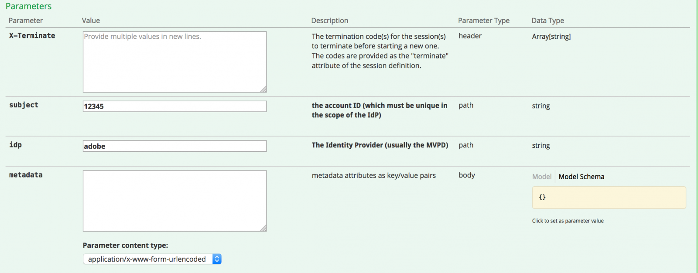
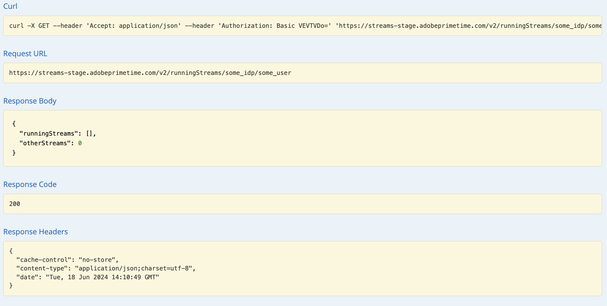
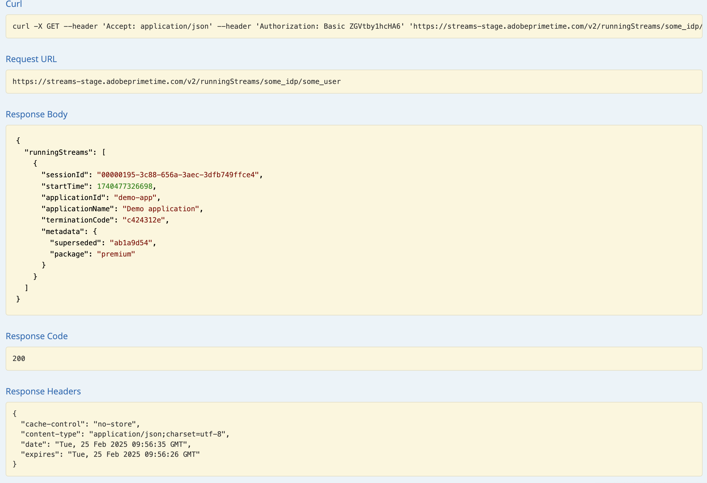

# API の概要 {#api-overview}

詳しくは、[ オンライン API ドキュメント ](http://docs.adobeptime.io/cm-api-v2/) を参照してください。

## 目的と前提条件 {#purpose-prerequisites}

このドキュメントは、アプリケーション開発者が同時実行性モニタリングとの統合を実装する際に、Swagger API 仕様を使用する際に役立ちます。 このガイドラインに従う前に、サービスで定義される概念について事前に理解しておくことを強くお勧めします。 この理解を得るには、[ 製品ドキュメント ](/help/concurrency-monitoring/cm-home.md) および [Swagger API 仕様 ](http://docs.adobeptime.io/cm-api-v2/) の概要を理解する必要があります。


## 概要 {#api-overview-intro}

開発プロセス中の API フローの把握とテストに関するリファレンスガイドラインは、Swagger 公開ドキュメントに記載されています。 これは、実践的なアプローチを採用し、実際のアプリケーションがさまざまなシナリオでユーザーインタラクションでどのように動作するかを把握するために開始するのに最適な場所です。

[Zendesk](mailto:tve-support@adobe.com) でチケットを送信して、同時実行性監視で会社とアプリケーションを登録します。 Adobeは、各エンティティにアプリケーション ID を割り当てます。 このガイドでは、ID が **demo-app** および **demo-app-2** の 2 つのリファレンスアプリケーションを、テナント Adobeの下で使用します。


## ユースケース {#api-use-case}

Swagger を使用してフローをテストする最初の手順は、次のように、ページの右上にアプリケーション ID を入力することです。


この後、「**参照** を押して、REST API に対して行われるすべての呼び出しに対して Authorization ヘッダーで使用される ID を設定します。  すべての API 呼び出しでは、HTTP 基本認証を使用してアプリケーション ID が渡されることを想定しています。 ユーザー名はアプリケーション ID で、パスワードは空です。


### 最初のアプリケーション {#first-app-use-cases}

ID を持つアプリケーション **demo-app** が、Adobe チームによって 1 つのルールを持つポリシーに割り当てられ、同時ストリーム数が 3 に制限されています。 Zendesk で送信されたリクエストに基づいて、特定のアプリケーションにポリシーが割り当てられます。


#### メタデータを取得中 {#retrieve-metadata-use-case}

最初に行う呼び出しは、セッション初期化中にフォームデータとして渡す必要があるメタデータ属性のリストを取得するためのメタデータリソースに対するものです。 このメタデータは、このアプリケーションに割り当てられたポリシーを評価するために使用されます。


「試す」をクリックすると、id **demo-app** のアプリケーションで次の結果が得られます。


応答本文フィールドからわかるように、メタデータ属性のリストは空です。 つまり、設計に必要な属性は、このアプリケーションに割り当てられた 3 つのストリームポリシーを評価するのに十分です。 [ 標準メタデータフィールドのドキュメント ](/help/concurrency-monitoring/standard-metadata-attributes.md) も参照してください。 この呼び出しの後、続行して、セッション REST リソースで新しいセッションを作成できます。


#### セッションの初期化 {#session-initial}

セッション初期化呼び出しは、実行に必要な情報をすべて取得した後、アプリケーションによって実行されます。


他にアクティブなストリームがないため、最初の呼び出しで終了コードを提供する必要はありません。 メタデータ取得呼び出しから返されたものがないので、メタデータ属性はありません。

**subject** パラメーターと **idp** パラメーターは必須で、URI パス変数として指定されます。 **subject** および **idp** パラメーターを取得するには、Adobe Pass Authentication から **mvpd** および **upstreamUserID** メタデータフィールドを呼び出します。 [ メタデータ API の概要 ](https://experienceleague.adobe.com/docs/primetime/authentication/auth-features/user-metadat/user-metadata-feature.html?lang=ja#) も参照してください。 この例では、値「12345」を件名として指定し、「adobe」を idp として指定します。




セッション初期化呼び出しを行います。 次の応答が返されます。


必要なデータはすべて応答ヘッダーに含まれています。 **Location** ヘッダーは、新しく作成したセッションの ID と **Date** ヘッダーおよび **Expires** ヘッダーは、セッションを維持するために次のハートビートを実行するようにアプリケーションをスケジュールするために使用される値を表します。

すべての呼び出しで、アプリケーションの必須メタデータだけでなく、必要なメタデータを送信できます。 メタデータの送信は、次の 2 つの方法で行うことができます。
* **query** **parameters** を使用する場合：

  ```sh
  curl -i -XPOST -u "user:pass" "https://streams-stage.adobeprimetime.com/v2/sessions/some_idp/some_user?metadata1=value1&metadata2=value2"
  ```

* **request** **body** を使用：

  ```sh
  curl -i -XPOST -u "user:pass" https://streams-stage.adobeprimetime.com/v2/sessions/some_idp/some_user -d "metadata1=value1" -d "metadata2=value2" -H "Content-Type=application/x-www-form-urlencoded"
  ```

#### ハートビート {#heartbeat}

ハートビート呼び出しを行います。 セッション初期化呼び出しで取得した **セッション ID** と、使用する **subject** および **idp** パラメーターを指定します。


ハートビート呼び出しの場合は、session init の場合と同じ方法でメタデータを送信できます。 いつでも新しいメタデータを追加でき、以前に送信した値を **例外** で更新できます。 次の値は、一度設定すると変更できません。**package**、**channel**、**platform**、**assetId**、**idp**、**mvpd**、**hba_status**、**hba**、
**mobileDevice**

セッションがまだ有効な場合（有効期限が切れていないか、手動で削除されている場合）、正常な結果が得られます。


最初のケースと同様に、**Date** ヘッダーと **Expires** ヘッダーを使用して、この特定のセッションに別のハートビートをスケジュールします。 セッションが無効になった場合、この呼び出しは失敗し、410 GONE の HTTP ステータスコードが返されます。

Swagger UI で使用可能な「Keep the stream alive」オプションを使用して、特定のセッションで自動ハートビートを実行できます。これにより、タイムリーなセッションハートビートの実行に必要なボイラープレートについて心配することなく、ルールをテストできます。 このボタンは、「Swagger ハートビート」タブの「試す」ボタンの隣に配置されています。 作成されたすべてのセッションの自動ハートビートを設定するには、web ブラウザータブで開かれた個別の Swagger UI で、各セッションをスケジュールする必要があります。


#### セッション終了 {#session-termination}

例えば、ユーザーがビデオの視聴を停止した場合など、会社のビジネスケースでは、特定のセッションを終了するために同時実行性監視が必要になる場合があります。 これを行うには、Sessions リソースでDELETEを呼び出します。


呼び出しには、セッションハートビートと同じパラメーターを使用します。 応答の HTTP ステータスコードは次のとおりです。

* 202 年応答の成功を承諾
* セッションが既に停止されている場合は 410 が終了しています。

#### 実行中のすべてのストリームを取得 {#get-all-running-streams}

このエンドポイントは、そのすべてのアプリケーションで、特定のテナントに対して現在実行中のすべてのセッションを提供します。 呼び出しに **subject** パラメーターと **idp** パラメーターを使用します。


呼び出しを行うと、次の応答が返されます。


セッションごとに、**terminationCode** と完全なメタデータを取得します。

**Expires** ヘッダーに注意してください。 ハートビートが送信されない限り、最初のセッションの有効期限が切れる時間です。
メタデータフィールドには、セッションの開始時に送信されたすべてのメタデータが入力されます。 フィルターは適用しません。送信した情報はすべて受信されます。
アプリが同じポリシーを共有している限り、応答には他のテナントのアプリで実行されているすべてのストリームが含まれます。
呼び出しの実行時に特定のユーザーに対して実行セッションがない場合は、次の応答が返されます。



また、この場合 **Expires** ヘッダーは存在しないことに注意してください。

セッションが作成され、「**X-Terminate**」ヘッダーを使用して別のセッションを強制終了した場合は、メタデータの下に **superseeded** フィールドが表示されます。 この値は、現在のセッションの余地を残すためにセッションが終了したことを示す指標です。



#### ポリシーの違反 {#breaking-policy-app-first}


アプリケーションに割り当てられた 3 つのストリームポリシーが破損した場合のアプリケーションの動作をシミュレートするには、セッションの初期化を 3 回呼び出す必要があります。 ポリシーを有効にするには、ハートビートがないことが原因でセッションの 1 つが期限切れになる前に呼び出しを実行する必要があります。 これらの呼び出しがすべて成功することがわかりますが、4 番目の呼び出しを行うと、次のエラーで失敗します。


ペイロードに評価結果オブジェクトと共に 409 CONFLICT 応答が取得されます。 これは、サーバーサイドポリシーによって、このセッションの作成または続行が許可されていないことを示します。 応答本文には、空ではない AssociatedAdvice を持つ EvaluationResult オブジェクトが含まれます。これは、各ルール違反の説明を含む Advice オブジェクトのリストです。

アプリケーションは、各 Advice インスタンスによって実行されるエラーメッセージをユーザーに表示します。 また、すべてのアドバイスは、属性、しきい値、ルール名、ポリシー名などのルールの詳細も示します。 また、競合する値は、それぞれの値のアクティブ・セッションのリストにも含まれます。

この情報は、詳細なエラーメッセージ形式を設定し、競合するセッションに関してユーザーがアクションを実行できるようにすることを目的としています。

競合するセッションはすべて **terminationCode** を保持し、このストリームを **強制終了** するために使用できます。 これにより、アプリケーションは、現在のセッションにアクセスするために、終了するセッションをユーザーが選択できるようにする場合があります。

アプリケーションは、評価結果からの情報を使用して、ビデオの停止時にユーザに対して特定のメッセージを表示し、必要に応じてさらにアクションを実行することができる。 使用例の 1 つは、新しいストリームを開始するために他の既存のストリームを停止することです。 これは、特定の競合する属性の **conflicts** フィールドに存在する **terminationCode** 値を使用して行われます。 値は、新しいセッション初期化の呼び出しで X-Terminate HTTP ヘッダーとして指定されます。


セッションの初期化時に 1 つ以上の終了コードを指定すると、呼び出しは成功し、新しいセッションが生成されます。 次に、リモートで停止されているセッションの 1 つを使用してハートビートを試みると、410 GONE 応答が返されます。この応答には、セッションがリモートで終了されたことを示す評価結果ペイロードが含まれています。次に例を示します。


410 は、現在のセッションが終了した原因に基づいて、本文の有無に関わらず返すことができます。

応答に本文がない場合、410 は、（タイムアウトや以前の競合などが原因で）アクティブでなくなったセッションに対してハートビート（または終了）呼び出しを試みることを意味します。 この状態から回復する唯一の方法は、アプリケーションが新しいセッションを開始することです。 本文がないため、アプリケーションはユーザーが気付かずにこのエラーを処理することになっています。

一方、応答本文が指定された場合、アプリケーションは **associatedAdvice** 属性内を調べて、現在のセッションを **強制終了** するという明示的な意図で開始されたリモートセッションを示す **remote-termination** アドバイスを見つける必要があります。 その結果、「セッションがデバイス/アプリケーションによってキックアウトされました」というエラーメッセージが表示されます。

### 応答本文 {#response-body}

すべてのセッションライフサイクル API 呼び出しで、応答本文（存在する場合）は、次のフィールドを含む JSON オブジェクトになります。


**助言**
**EvaluationResult** には、**associatedAdvice** 下の Advice オブジェクトの配列が含まれます。 このアドバイスは、アプリケーションがユーザに包括的なエラーメッセージを表示し、（潜在的に）ユーザがアクションを実行することを可能にすることを目的としている。

現在、アドバイスには（**type** 属性値で指定された） **rule-violation** と **remote-termination** の 2 つのタイプがあります。 最初の規則は、破損した規則と、現在の規則と競合するセッションに関する詳細（リモートでそのセッションを終了するために使用できる終了属性を含む）を提供します。 2 つ目は、現在のセッションがリモートセッションによって意図的に終了されたことを述べているので、制限に達したときに誰が彼らを追い出したかをユーザーが知ることができます。 メタデータに **置き換え** が含まれている場合、問題のセッションは **X-Terminate** ヘッダーを使用して作成されました。


**義務**
評価には、この評価の結果としてアプリケーションによってトリガーされる必要がある 1 つ以上の事前定義済みアクションが含まれる場合もあります。


### 2 番目のアプリケーション {#second-application}

使用するもう 1 つのサンプルアプリケーションは、ID が **demo-app-2** のアプリケーションです。 このチャネルには、1 つのルールを持つポリシーが割り当てられています。このルールでは、チャネルに使用できるストリームの数を最大 2 に制限しています。   このポリシーを評価するには、チャネル変数を指定する必要があります。

#### メタデータを取得中 {#retrieving-metadata}

ページの右上隅に新しいアプリケーション ID を設定し、メタデータリソースを呼び出します。 次の応答が返されます。


今回は、最初のアプリケーションの例のように、応答本文は空のリストではなくなりました。 これで、同時実行監視サービスは、ポリシーを評価するためにセッションの初期化時に **channel** メタデータが必要であることを応答本文に表示します。

**channel** パラメーターの値を指定せずに呼び出しを行うと、次のような結果になります。

* 応答コード - 400 無効なリクエスト
* 応答本文 – 評価結果ペイロード。操作を成功させるために、セッション初期化のリクエストで期待される内容を **foldings** フィールドに記述します。


#### セッションの初期化 {#session-init}

次に示すように、必要なメタデータキーの値を割り当て、セッション初期化リクエストのフォームパラメーターとして設定します。


これで、呼び出しが成功し、新しいセッションが生成されます。


#### ポリシーの違反 {#breaking-policy-second-app}

このアプリケーションに割り当てられたポリシーのルールを破るには、同じチャネル値を使用して 2 回の呼び出しを行う必要があります。 最初の例と同様に、生成された最初のセッションが有効である間は、2 回目の呼び出しを実行する必要があります。


新しいセッションを作成するたびにチャネルメタデータに異なる値を使用する場合、しきい値 2 が各値に個別に適用されるので、すべての呼び出しが成功します。

最初の例と同様に、競合するストリームをリモートで停止するために終了コードを使用するか、または、ハートビートが操作されない場合は、ストリームの 1 つが期限切れになるまで待ちます。
