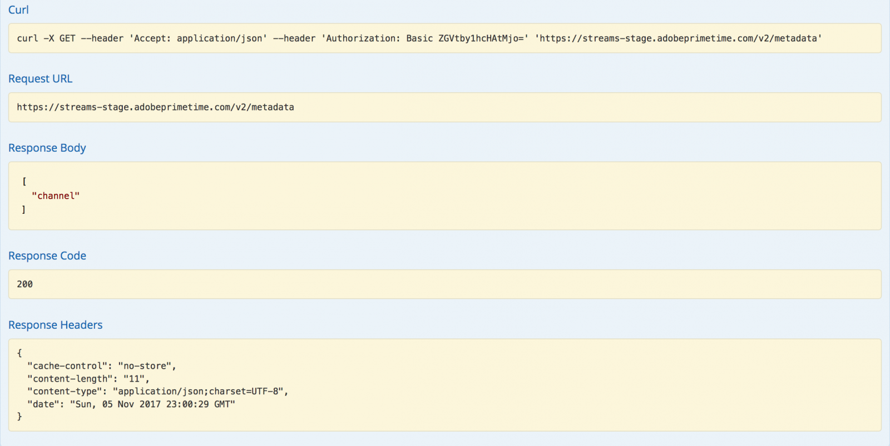

# API の概要 {#api-overview}

を表示する [オンライン API ドキュメント](http://docs.adobeptime.io/cm-api-v2/) を参照してください。

## 目的と前提条件 {#purpose-prerequisites}

このドキュメントは、アプリケーション開発者が同時実行性モニタリングとの統合を実装する際に、Swagger API 仕様を使用する際に役立ちます。 このガイドラインに従う前に、サービスで定義される概念について事前に理解しておくことを強くお勧めします。 この理解を得るためには、 [製品ドキュメント](/help/concurrency-monitoring/cm-home.md) および [Swagger API 仕様](http://docs.adobeptime.io/cm-api-v2/).

## 概要 {#api-overview-intro}

開発プロセス中の API フローの把握とテストに関するリファレンスガイドラインは、Swagger 公開ドキュメントに記載されています。 これは、実践的なアプローチを採用し、実際のアプリケーションがさまざまなシナリオでユーザーインタラクションでどのように動作するかを把握するために開始するのに最適な場所です。

でチケットを送信する [Zendesk](mailto:tve-support@adobe.com) 同時実行性監視に会社とアプリケーションを登録します。 Adobeは、各エンティティにアプリケーション ID を割り当てます。 このガイドでは、ID を持つ 2 つの参照アプリケーションを使用します **demo-app** および **demo-app-2** これは、テナントAdobeの配下になります。

## ユースケース {#api-use-case}

Swagger を使用してフローをテストする最初の手順は、次のように、ページの右上にアプリケーション ID を入力することです。

この後、次を押します **探索** REST API に対して行われたすべての呼び出しに対して、Authorization ヘッダーで使用される ID を設定します。  すべての API 呼び出しでは、HTTP 基本認証を使用してアプリケーション ID が渡されることを想定しています。 ユーザー名はアプリケーション ID で、パスワードは空です。

### 最初のアプリケーション {#first-app-use-cases}

ID を持つアプリケーション **demo-app** は、Adobeチームによってポリシーに割り当てられています。このポリシーには同時ストリーム数を 3 に制限する 1 つのルールがあります。 Zendesk で送信されたリクエストに基づいて、特定のアプリケーションにポリシーが割り当てられます。

#### メタデータを取得中 {#retrieve-metadata-use-case}

最初に行う呼び出しは、セッション初期化中にフォームデータとして渡す必要があるメタデータ属性のリストを取得するためのメタデータリソースに対するものです。 このメタデータは、このアプリケーションに割り当てられたポリシーを評価するために使用されます。

「試す」を押した後、ID のアプリケーション用 **demo-app** 次の結果が得られます。

応答本文フィールドからわかるように、メタデータ属性のリストは空です。 つまり、設計に必要な属性は、このアプリケーションに割り当てられた 3 つのストリームポリシーを評価するのに十分です。 参照： [標準メタデータフィールドに関するドキュメント](/help/concurrency-monitoring/standard-metadata-attributes.md). この呼び出しの後、続行して、セッション REST リソースで新しいセッションを作成できます。

#### セッションの初期化 {#session-initial}

セッション初期化呼び出しは、実行に必要な情報をすべて取得した後、アプリケーションによって実行されます。

他にアクティブなストリームがないため、最初の呼び出しで終了コードを提供する必要はありません。 メタデータ取得呼び出しから返されたものがないので、メタデータ属性はありません。

この **件名** および **idp** パラメーターは必須で、URI パス変数として指定されます。 次を取得できます **件名** および **idp** を呼び出すことにより設定します。 **mvpd** および **upstreamUserID** Adobe Pass認証からのメタデータフィールド。 参照： [メタデータ API の概要](https://experienceleague.adobe.com/docs/primetime/authentication/auth-features/user-metadat/user-metadata-feature.html?lang=en#). この例では、値「12345」を件名として指定し、「adobe」を idp として指定します。

セッション初期化呼び出しを行います。 次の応答が返されます。

必要なデータはすべて応答ヘッダーに含まれています。 この **場所** ヘッダーは、新しく作成されたセッションの id と **日付** および **Expires** ヘッダーは、セッションを維持するために次のハートビートを確立するようにアプリケーションをスケジュールするために使用される値を表します。

#### ハートビート {#heartbeat}

ハートビート呼び出しを行います。 を指定します **セッション id** セッション初期化呼び出しで取得されます。このと **件名** および **idp** 使用されるパラメーター。

セッションがまだ有効な場合（有効期限が切れていないか、手動で削除されている場合）、正常な結果が得られます。

最初のケースと同様に、 **日付** および **Expires** ヘッダー：この特定のセッションに対して別のハートビートをスケジュールします。 セッションが無効になった場合、この呼び出しは失敗し、410 GONE の HTTP ステータスコードが返されます。

Swagger UI で使用可能な「Keep the stream alive」オプションを使用して、特定のセッションで自動ハートビートを実行できます。これにより、タイムリーなセッションハートビートの実行に必要なボイラープレートについて心配することなく、ルールをテストできます。 このボタンは、「Swagger ハートビート」タブの「試す」ボタンの隣に配置されています。 作成されたすべてのセッションの自動ハートビートを設定するには、web ブラウザータブで開かれた個別の Swagger UI で、各セッションをスケジュールする必要があります。

#### セッション終了 {#session-termination}

例えば、ユーザーがビデオの視聴を停止した場合など、会社のビジネスケースでは、特定のセッションを終了するために同時実行性監視が必要になる場合があります。 これは、Sessions リソースに対してDELETE呼び出しを行うことで実行できます。

呼び出しには、セッションハートビートと同じパラメーターを使用します。 応答の HTTP ステータスコードは次のとおりです。

* 202 年応答の成功を承諾
* セッションが既に停止されている場合は 410 が終了しています。

#### 実行中のすべてのストリームを取得 {#get-all-running-streams}

このエンドポイントは、そのすべてのアプリケーションで、特定のテナントに対して現在実行中のすべてのセッションを提供します。 使用方法 **件名** および **idp** 呼び出しのパラメーター：

呼び出しを行うと、次の応答が返されます。

に注意してください **Expires** ヘッダー。 ハートビートが送信されない限り、最初のセッションの有効期限が切れる時間です。 他のテナントのアプリケーションでこのユーザーに対して実行されているストリームが他にないので、OtherStreams の値は 0 です。
メタデータフィールドには、セッションの開始時に送信されたすべてのメタデータが入力されます。 フィルターは適用しません。送信した情報はすべて受信されます。
呼び出しの実行時に特定のユーザーに対して実行セッションがない場合は、次の応答が返されます。

また、この場合、 **Expires** ヘッダーが存在しません。

#### ポリシーの違反 {#breaking-policy-app-first}

アプリケーションに割り当てられた 3 つのストリームポリシーが破損した場合のアプリケーションの動作をシミュレートするには、セッションの初期化を 3 回呼び出す必要があります。 ポリシーを有効にするには、ハートビートがないことが原因でセッションの 1 つが期限切れになる前に呼び出しを実行する必要があります。 これらの呼び出しがすべて成功することがわかりますが、4 番目の呼び出しを行うと、次のエラーで失敗します。

ペイロードに評価結果オブジェクトと共に 409 CONFLICT 応答が取得されます。 の評価結果の完全な説明を読む [Swagger API 仕様](http://docs.adobeptime.io/cm-api-v2/#evaluation-result).

アプリケーションは、評価結果からの情報を使用して、ビデオの停止時にユーザに対して特定のメッセージを表示し、必要に応じてさらにアクションを実行することができる。 使用例の 1 つは、新しいストリームを開始するために他の既存のストリームを停止することです。 これは、 **terminationCode** に存在する値 **競合** 特定の競合する属性のフィールド。 値は、新しいセッション初期化の呼び出しで X-Terminate HTTP ヘッダーとして指定されます。

セッションの初期化時に 1 つ以上の終了コードを指定すると、呼び出しは成功し、新しいセッションが生成されます。 次に、リモートで停止されているセッションの 1 つを使用してハートビートを試みると、410 GONE 応答が返されます。この応答には、セッションがリモートで終了されたことを示す評価結果ペイロードが含まれています。次に例を示します。

### 2 番目のアプリケーション {#second-application}

使用するもう 1 つのサンプルアプリケーションは、ID を持つアプリケーションです **demo-app-2**. このチャネルには、1 つのルールを持つポリシーが割り当てられています。このルールでは、チャネルに使用できるストリームの数を最大 2 に制限しています。   このポリシーを評価するには、チャネル変数を指定する必要があります。

#### メタデータを取得中 {#retrieving-metadata}

ページの右上隅に新しいアプリケーション ID を設定し、メタデータリソースを呼び出します。 次の応答が返されます。

今回は、最初のアプリケーションの例のように、応答本文は空のリストではなくなりました。 これで、同時実行監視サービスにより、応答本文に次のように表示されます **チャネル** ポリシーを評価するには、セッションの初期化時にメタデータが必要です。

の値を指定せずに呼び出しをおこなった場合 **チャネル** パラメーター。次を取得します。

* 応答コード - 400 無効なリクエスト
* 応答本文 – に記述される評価結果ペイロード **債務** 操作を成功させるために、セッション初期化のリクエストで期待されるフィールド。

#### セッションの初期化 {#session-init}

次に示すように、必要なメタデータキーの値を割り当て、セッション初期化リクエストのフォームパラメーターとして設定します。

これで、呼び出しが成功し、新しいセッションが生成されます。

#### ポリシーの違反 {#breaking-policy-second-app}

このアプリケーションに割り当てられたポリシーのルールを破るには、同じチャネル値を使用して 2 回の呼び出しを行う必要があります。 最初の例と同様に、生成された最初のセッションが有効である間は、2 回目の呼び出しを実行する必要があります。

新しいセッションを作成するたびにチャネルメタデータに異なる値を使用する場合、しきい値 2 が各値に個別に適用されるので、すべての呼び出しが成功します。

最初の例と同様に、競合するストリームをリモートで停止するために終了コードを使用するか、または、ハートビートが操作されない場合は、ストリームの 1 つが期限切れになるまで待ちます。
