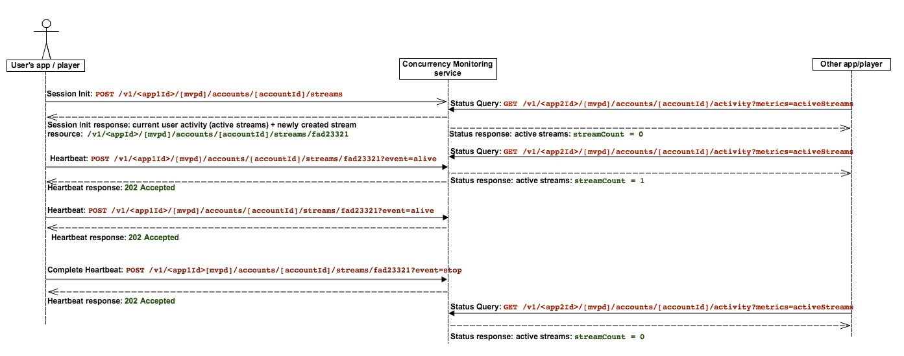

# ポリシー情報ポイント {#pip}

>[!NOTE]
>
>このページは、以前のバージョンの API に適用されるので、非推奨（廃止予定）となりました。このバージョンは、新しい統合では推奨されなくなりました

次の図は、顧客が **ポリシー情報ポイント** を選択した場合のフローを示しています。この場合、CM はアクティビティのクエリにのみ使用され、すべてのアクセスロジックはクライアントアプリケーションに埋め込まれます。

次の図は、2 台のデバイスからコンテンツを監視するユーザーの場合、ストリームカウントがどのように機能するかを示しています。

要約すると、通常のメッセージフローは次のようになります。

1. 最初に、このサービスを使用したことがないユーザーの場合、web ページが読み込まれ（/）、アプリケーションが開きます。このアプリケーションでは、同時実行監視サービスの実装を受けたアプリケーションがセッション初期化呼び出しを行います。
1. 同時実行性モニタリングサービスは、ハートビートの新しいストリームリソースと、現在のユーザーアクティビティを返します。
1. ビデオの再生中、実装されたアプリケーションが同時実行モニタリングサービスに対してハートビート呼び出しを行い、ユーザーが現在ビデオを消費していることを示します。
1. その他の時点で、他のインストルメント化されたアプリケーションは、同時実行性モニタリングサービスに対してステータスクエリ呼び出しを行い、現在のユーザーアクティビティを返すことができます。
1. ビデオ再生が終了すると、インストルメント化されたアプリケーションは「event=stop」でハートビート呼び出しを行い、ビデオが停止したことと、現在のストリームがアクティブなストリームとしてカウントされるべきでないことを示すことができます。
