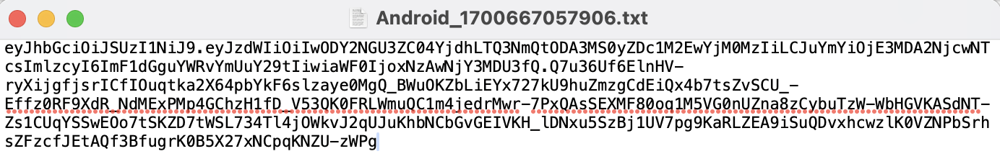
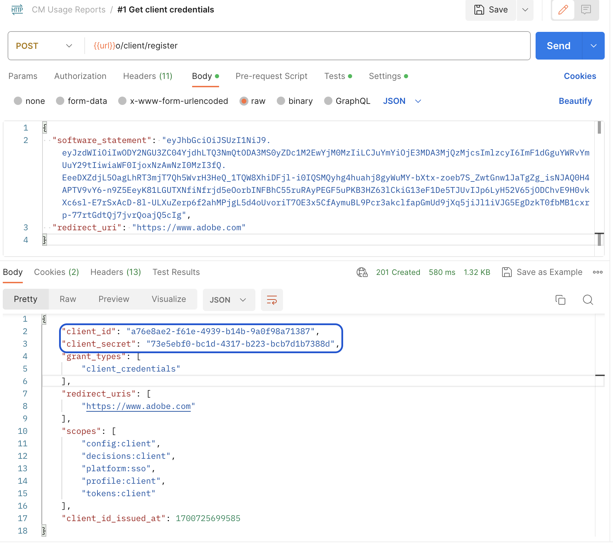
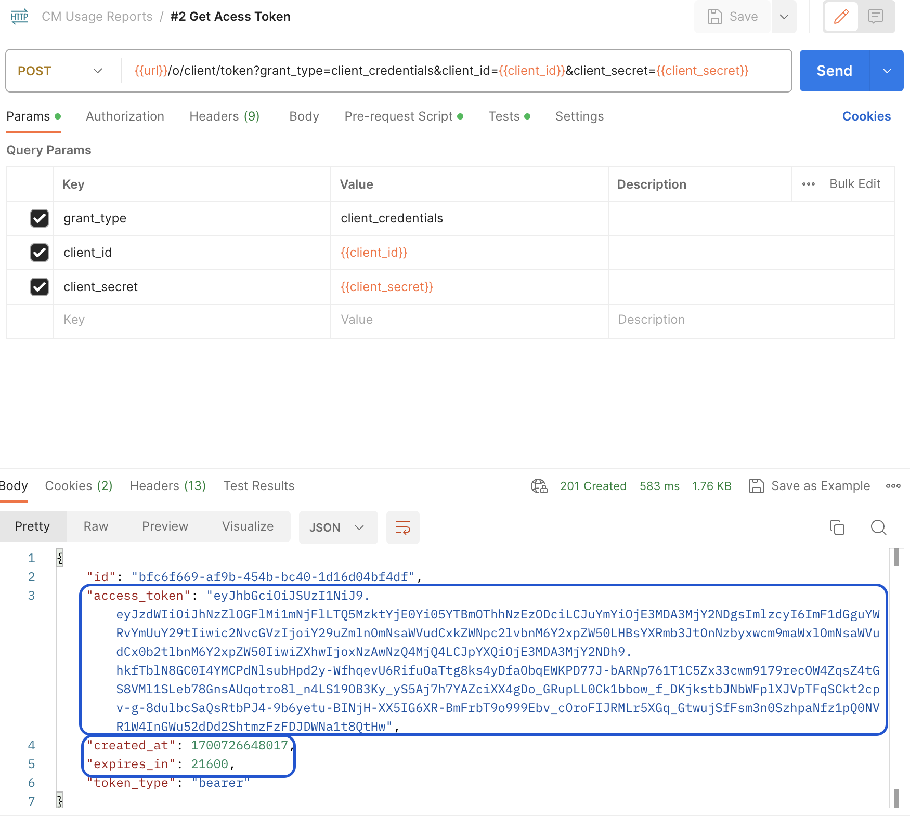
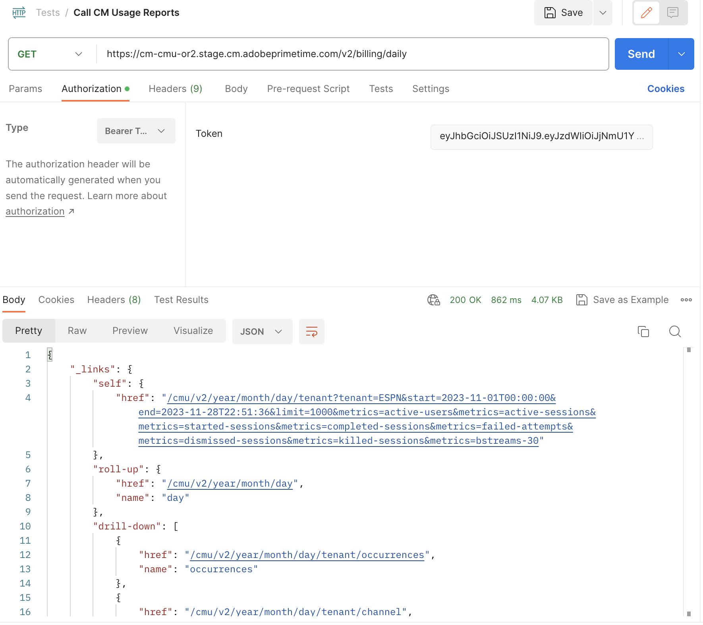

# 同時実行モニタリング使用状況API アクセス {#cmu-api-usage-access}

>[!NOTE]
>
>このページのコンテンツは、情報提供のみを目的として提供されています。 このAPIを使用するには、Adobeの現在のライセンスが必要です。 無断使用は認められません。 ご利用に関するご質問は、Adobeの担当者までお問い合わせください。

## アクセス手順の概要 {#api-access-procedure-overview}

CMU レポートのアクセスを更新して、OAuth 2.0 Dynamic Client Registration Protocolと互換性を持たせました。 同時視聴数モニタリングアプリケーションのニーズに対応するために、カスタム OAuth 2.0認証サーバーがデプロイされます。 \
クライアントアプリケーションがOAuth 2.0認証を利用するには、サーバーは動的に登録して、特定の情報（クライアント資格情報）を取得して操作できるようにする必要があります。 登録プロセスの一環として、クライアントは組み込みメタデータのセットをクライアント登録エンドポイントに提示する必要があります。
このメタデータはソフトウェア文として伝えられ、「software_id」が含まれており、認証サーバーが同じソフトウェア文を使用してアプリケーションの異なるインスタンスを関連付けることができます。
ソフトウェアステートメントは、クライアントソフトウェアに関するメタデータ値をバンドルとしてアサートするJSON Web Token （JWT）です。 クライアント登録要求の一部として認証サーバーに提示する場合、ソフトウェアステートメントはJSON Web Signature （JWS）を使用してデジタル署名またはMAC化する必要があります。 \
ソフトウェアステートメントの概要と仕組みについて、より詳細な説明については、公式ドキュメント <a href="https://datatracker.ietf.org/doc/html/rfc7591" target="_blank">[RFC7591]</a>を参照してください。
以下のセクションの手順に従って、アクセスを取得します。

## アクセス手順の手順 {#access-procedure-steps}

1. Adobe Pass DCR サーバーにアプリケーションを登録します。 この手順については、[ サポートチーム ](mailto:tve-support@adobe.com)にお問い合わせください。

2. ソフトウェアについて詳しく見る
   1. [Adobe Pass TVE ダッシュボード ](https://experience.adobe.com/#/pass/authentication)に移動
   2. プログラマーを選択
   3. 「*登録済みアプリケーション*」タブに移動
   4. アプリケーションを選択
   5. ソフトウェアステートメントを取得する登録済みアプリケーション行で「ダウンロード」をクリックし、ローカルマシンにファイルとして保存します
      <figure>
          
      </figure>

      <figure>
          
      </figure>

3. アクセストークンの取得
   1. 上記で取得したソフトウェアステートメントを使用し、次の呼び出しを実行して、クライアント資格情報を取得します。 この方法では、アクセストークンを取得するために使用できるclient_id - client_secret ペアが取得されます。
      *この手順は毎回実行しないでください。 資格情報の有効期限が切れた場合にのみ、再度実行する必要があります。*
      <figure>
          
       </figure>

   2. 以下の呼び出しを使用してアクセストークンを取得します。 このアクセストークンを使用して、トークンが期限切れになるまで任意のCMU APIを呼び出します。
      *この手順は、最後に生成されたトークンが期限切れになった場合にのみ実行する必要があります。*
      <figure>
          
       </figure>

4. CMU APIを呼び出す – 以下の関連情報を参照してください。
   <figure>
          
       </figure>

## 関連する情報 {#related-information}

* [CMUの概要](/help/concurrency-monitoring/reports/cm-usage-reports.md)
* [CMU API](/help/concurrency-monitoring/reports/cmu-api.md)
