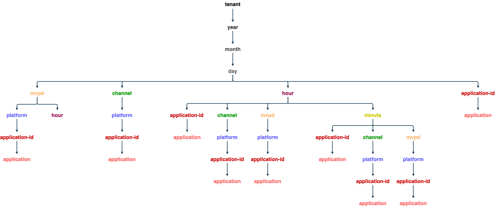

# 同時実行モニタリング使用状況API {#cmu-api-usage}

>[!NOTE]
>
>このページのコンテンツは、情報提供のみを目的として提供されています。 このAPIを使用するには、Adobeの現在のライセンスが必要です。 無断使用は認められません。

## APIの概要 {#api-overview}

同時視聴数モニタリングの使用状況（CMU）は、WOLAP （Web ベースの[ オンライン分析処理](http://en.wikipedia.org/wiki/Online_analytical_processing)）プロジェクトとして実装されます。 CMUは、データウェアハウスに裏打ちされた汎用ビジネスレポート Web APIです。 典型的なOLAP操作をRESTfullyで実行できるようにするHTTP クエリ言語として機能します。


>[!NOTE]
>
>CMU APIは一般には使用できません。 ご利用に関するご質問は、Adobeの担当者までお問い合わせください。

CMU APIは、基になるOLAP キューブの階層ビューを提供します。 ディメンション階層の各リソース （[ ディメンション ](/help/concurrency-monitoring/reports/cm-usage-reports.md#dimensions-2-filter-metrics)、URL パスセグメントとしてマッピング）は、現在の選択範囲に対して（集約）指標[を含むレポートを生成します。 ](/help/concurrency-monitoring/reports/cm-usage-reports.md#monitor-metrics)各リソースは、親リソース（ロールアップの場合）とサブリソース（ドリルダウンの場合）を指します。 スライスとダイシングは、特定の値または範囲にディメンションをピン留めするクエリ文字列パラメーターを使用して実現されます。

REST APIは、ディメンションのパス、提供されたフィルター、選択された指標に従って、リクエストで指定された時間間隔で利用可能なデータを提供します（指定されていない場合はデフォルト値にフォールバックします）。 時間範囲は、時間ディメンション（年、月、日、時間、分、秒）を含まないレポートには適用されません。

エンドポイント URL ルートパスは、利用可能なドリルダウンオプションへのリンクとともに、単一レコード内の全体的な集計指標を返します。 API バージョンは、エンドポイント URI パスの末尾セグメントとしてマッピングされます。 例えば、https://mgmt.auth.adobe.com/cmu/*v2*&#x200B;は、クライアントがWOLAP バージョン 2にアクセスすることを意味します。

使用可能なURL パスは、応答に含まれるリンクを介して検索できます。 有効なURL パスは、（事前に）集計された指標を保持する基になるドリルダウンツリー内のパスをマッピングするために保持されます。 /dimension1/dimension2/dimension3というフォームのパスは、これら3つのディメンションの事前集計を反映します（SQL句GROUP BY dimension1、dimension2、dimension3と同等）。 このような事前集計が存在せず、システムがその場で計算できない場合、APIは404 Not Found応答を返します。

### ツリーをドリルダウン {#drill-down-tree}

次のドリルダウンツリーは、CMU 2.0で使用可能なディメンション（リソース）を示しています。

**CM テナントで使用できるディメンション**



`https://mgmt.auth.adobe.com/cmu/v2` API エンドポイントへの`GET`は、次を含む表現を返します。

* 使用可能なルートドリルダウンパスへのリンク：

  ```html
  <link rel="drill-down" href="/cmu/v2/dimensionA"/>
  <link rel="drill-down" href="/cmu/v2/dimensionB"/>
  ```

* すべての指標の概要（集計値）（デフォルトの間隔では、クエリ文字列パラメーターが指定されていないため、以下を参照）。

ドリルダウンパスに従って（ステップバイステップ）:/dimensionA/year/month/day/dimensionXは次の応答を取得します。

* 「dimensionY」および「dimensionZ」ドリルダウン・オプションへのリンク
* dimensionXの各値の日別集計を含むレポート

### **フィルター**

日付/時刻ディメンションを除き、現在の投影（ディメンションパス）で使用できるディメンションは、名前をクエリ文字列パラメーターとして使用してフィルタリングできます。

次のフィルターオプションを使用できます。

* **等しい** フィルターは、ディメンション名をクエリ文字列内の特定の値に設定することによって提供されます。
* **IN** フィルターは、異なる値を持つ同じディメンション名パラメーターを複数回追加することで指定できます：dimension=value1&amp;dimension=value2
* **次と等しくない**&#x200B;個のフィルターでは、&#39;!=&#39; &quot;operator&quot;: dimension!=valueになるディメンション名の後に&#39;!&#39;記号を使用する必要があります
* **NOT IN** フィルターでは、「!=」演算子を複数回使用する必要があります。これは、セット内の各値に対して1回ずつ使用します：dimension!=value1&amp;dimension!=value2&amp;...


また、クエリ文字列のディメンション名には特別な用途があります。ディメンション名が値のないクエリ文字列パラメーターとして使用されている場合、APIに対して、レポートにそのディメンションを含む投影を返すように指示します。

CMU クエリの例：

| URL | SQL当量 |
|:---|:---|
| /dimension1/dimension2/dimension3?dimension1=value1 | SELECT * from projection WHERE dimension1 = &#39;value1&#39; GROUP BY dimension1, dimension2, dimension3 |
| /dimension1/dimension2/dimension3?dimension1=value1&amp;dimension1=value2 | SELECT * from projection WHERE dimension1 IN （&#39;value1&#39;, &#39;value2&#39;） GROUP BY dimension1, dimension2, dimension3 |
| /dimension1/dimension2/dimension3?dimension1!=value1 | SELECT * from projection WHERE dimension1 &lt;> &#39;value1&#39; GROUP BY dimension1, dimension2, dimension3 |
| /dimension1/dimension2/dimension3?dimension1!=value1&amp;dimension2!=value2 | SELECT * from projection WHERE dimension1 NOT IN （&#39;value1&#39;, &#39;value2&#39;） GROUP BY dimension1, dimension2, dimension3 |
| 直接パス /dimension1/dimension3はないが、/dimension1/dimension2/dimension3 </br></br> /dimension1?dimension3がある場合 | SELECT * from projection GROUP BY dimension1,dimension3 |

>[!NOTE]
>
>これらのフィルタリング手法は、日付/時間ディメンションでは機能しません。 日付/時間ディメンションをフィルタリングする唯一の方法は、開始および終了クエリ文字列パラメーター（以下で説明）を必要な値に設定することです。

次のクエリ文字列パラメーターは、APIの予約済み意味を持ちます（したがって、ディメンション名として使用することはできません。そうでない場合、そのようなディメンションでフィルタリングは不可能です）。

CMU API予約済みクエリ文字列パラメーター：

| パラメーター | オプション | 説明 | デフォルト値 | 例 |
|:--------------|:--------|:---------------------------------------------------------------------------------------------------------------------------------------------------------------------------------------------------------------------------------------------------------------------------------------------------|:-------------------------------------------------------------------------------------------------------------------------------|:------------------------------------------|
| access_token | はい | IMS OAuth保護が有効になっている場合、IMS トークンは、標準の認証ベアラートークンまたはクエリ文字列パラメーターとして渡すことができます。 | なし | access_token=XXXXXX |
| dimension-name | はい | 任意のディメンション名 – 現在のURL パスまたは有効なサブパスに含まれるディメンション名。値は等しいフィルターとして扱われます。 値を指定しない場合、指定したディメンションが含まれていないか、現在のパスに隣接していなくても、指定したディメンションが出力に強制的に含まれます | なし | someDimension=someValue&amp;someOtherDimension |
| 終了 | はい | レポートの終了時間（ミリ単位） | サーバーの現在の時刻 | 終了= 2012-07-30 |
| フォーマット | はい | コンテンツのネゴシエーションに使用されます（同じ効果がありますが、パス「拡張機能」よりも優先順位が低い – 以下を参照）。 | なし：コンテンツネゴシエーションは他の戦略を試します | format=json |
| 制限 | はい | 返される最大行数 | リクエストで制限が指定されていない場合、セルフリンクでサーバーが報告するデフォルト値 | limit=1500 |
| 指標 | はい | 返される指標名のコンマ区切りリスト。これは、使用可能な指標のサブセットをフィルタリングする（ペイロードサイズを小さくする）場合と、APIに対して要求された指標を含む投影を返す（デフォルトの最適な投影ではなく）場合の両方に使用する必要があります。 | このパラメーターが指定されていない場合、現在の投影で使用可能なすべての指標が返されます。 | metrics=m1,m2 |
| 開始 | はい | レポートの開始時間はISO8601です。接頭辞のみが指定されている場合、サーバーは残りの部分を入力します。例：start=2012はstart=2012-01-01:00:00:00になります | セルフリンクでサーバーから報告されます。サーバーは、選択した時間の精度に基づいて合理的なデフォルトを提供しようとします | start=2012-07-15 |


現在利用可能なHTTP メソッドはGETだけです。 OPTIONS / HEAD メソッドのサポートは、将来のバージョンで提供される可能性があります。


## CMU API ステータスコード {#cmu-api-status-codes}

| ステータスコード | 理由フレーズ | 説明 |
|:-----------|:---------------------|:------------------------------------------------------------------------------------------------------------------------------------------------------------------------------------------------------------------------------------------------------------------------------------------------------------------------------------------------------------------------------------------------------------------------------------------------------------------------------------------------------------|
| 200 | OK | 応答には、「ロールアップ」リンクと「ドリルダウン」リンク（該当する場合）が含まれます。 レポートは、リソースの属性としてレンダリングされます。ネストされた「レポート」要素/プロパティです。 |
| 400 | 不正なリクエスト | 応答の本文には、リクエストの何が問題なのかを説明するテキストメッセージが含まれます。  400 Bad Request ステータスには、応答の本文（プレーン/テキストメディアタイプ）に説明テキストが添付されており、クライアントエラーに関する有益な情報を提供します。 無効な日付形式や、既存でないディメンションに適用されたフィルターなどの面倒なシナリオに加えて、システムは、大量のデータを返したり、即座に集計したりする必要があるクエリへの対応も拒否します。 |
| 401 | 未承認 | ユーザーを認証するために適切なOAuth ヘッダーを含まない要求が原因で発生する |
| 403 | 禁止 | 現在のセキュリティ コンテキストでリクエストが許可されていないことを示します。これは、ユーザーが認証されたが、リクエストされた情報へのアクセスが許可されていない場合に発生します |
| 404 | 見つかりません | リクエストに無効なURL パスが指定された場合に発生します。 クライアントが200個の応答で提供される「ドリルダウン」/「ロールアップ」リンクに従っている場合、この問題は発生しません |
| 405 | メソッドは許可されていません | サポートされていないメソッドがリクエストで使用されたことを示します。 現在はGET メソッドのみがサポートされていますが、将来のバージョンではHEADまたはOPTIONSが許可される場合があります |
| 406 | 受け入れられません | サポートされていないメディアタイプがクライアントから要求されたことを示すシグナル |
| 500 | 内部サーバーエラー | 「こんなことは決して起こりえない」 |
| 503 | サービスを利用できません | アプリケーションまたはその依存関係のエラーを示します |

## データ形式 {#data-formats}

データは次の形式で使用できます。

* JSON （デフォルト）
* XML
* CSV
* HTML （デモ用）


次のコンテンツネゴシエーション戦略をクライアントが使用できます（優先順位はリスト内の位置によって与えられます。最初に最初に行われます）。

1. URL パスの最後のセグメントに追加された「ファイル拡張子」（例：/cmu/v2/tenant/year/month/day.xml）。 URLにクエリ文字列が含まれている場合、拡張機能は疑問符の前に来る必要があります：`/cmu/v2/tenant/year/month/day.csv?mvpd=SomeMVPD`
1. 形式クエリ文字列パラメーター：例：`/cmu/report?format=json`
1. 標準のHTTP Accept ヘッダー：例：`Accept: application/xml`

「extension」とクエリパラメーターの両方で、次の値がサポートされます。

* xml
* json
* csv
* html

いずれかの戦略でメディアタイプが指定されていない場合、APIはデフォルトでJSON コンテンツを生成します。

## ハイパーテキストアプリケーション言語（HAL） {#hypertext-app-lang}

JSONおよびXMLの場合、ペイロードはHALとしてエンコードされます。詳細は次のとおりです：`http://stateless.co/hal_specification.html`。

実際のレポート（ネストされたタグ/プロパティ「レポート」と呼ばれます）は、選択または適用可能なすべてのディメンションと指標とその値を含むレコードの実際のリストで構成され、次のようにエンコードされます。

### JSON {#json}

```js
 "report": [
  {
    "dimension1": "d1",
    ...
    "metric1": "m1",
    ...
  }, {
    ...
  }
]
```

### XML {#xml}

```xml
 <report>
  <record dimension1="d1" ... metric1="m1" ... />
  ...
</report>
```

XML形式とJSON形式の場合、レコード内のフィールド（ディメンションと指標）の順序は指定されていませんが、一貫性があります（順序はすべてのレコードで同じです）。 ただし、クライアントは、レコード内のフィールドの特定の順序に依存してはなりません。

リソースリンク（JSONの「self」リレルおよびXMLの「href」リソース属性）には、インラインレポートに使用される現在のパスとクエリ文字列が含まれます。 クエリ文字列は暗黙的なパラメーターと明示的なパラメーターをすべて表示するので、ペイロードは使用された時間間隔、暗黙的なフィルター（存在する場合）などを明示的に指摘します。 リソース内の残りのリンクには、現在のデータをドリルダウンするためにフォローできる利用可能なすべてのセグメントが含まれます。 ロールアップ用のリンクも提供され、親パスを指します（存在する場合）。 ドリルダウン/ロールアップリンクの`href`値にはURL パスのみが含まれます（クエリ文字列は含まれていないため、必要に応じてクライアントが追加する必要があります）。 現在のリソースで使用（または暗黙的）されているクエリ文字列パラメーターのすべてが、「ロールアップ」リンクまたは「ドリルダウン」リンクに適用されるわけではありません（例えば、フィルターはサブリソースやスーパーリソースには適用されません）。

例（クライアントと呼ばれる単一の指標があり、`year/month/day/...`の事前集計があると仮定）:

* `https://mgmt.auth.adobe.com/cmu/v2/year/month.xml`

  ```xml
  <resource href="/cmu/v2/year/month?start=2012-07-20T00:00:00&end=2012-08-20T14:35:21">
    <links>
      <link rel="roll-up" href="/cmu/v2/year"/>
      <link rel="drill-down" href="/cmu/v2/year/month/day"/>
    </links>
    <report>
      <record month="6" year="2012" clients="205"/>
      <record month="7" year="2012" clients="466"/>
    </report>
  </resource>
  ```

* `https://mgmt.auth.adobe.com/cmu/v2/year/month.json`

  ```js
  {
    "_links" : {
      "self" : {
        "href" : "/cmu/v2/year/month?start=2012-07-20T00:00:00&end=2012-08-20T14:35:21"
      },
      "roll-up" : {
        "href" : "/cmu/v2/year"
      },
      "drill-down" : {
        "href" : "/cmu/v2/year/month/day"
      }
    },
    "report" : [ {
      "month" : "6",
      "year" : "2012",
      "clients" : "205"
    }, {
      "month" : "7",
      "year" : "2012",
      "clients" : "466"
    } ]
  }
  ```

### CSV {#csv}

CSV データ形式では、リンクやその他のメタデータ（ヘッダー行を除く）はインラインで提供されません。代わりに、選択メタデータはファイル名で提供されます。このパターンに従います。

```html
report__<start-date>_<end-date>_<filter-values,...>.csv
```

CSVにはヘッダー行が含まれ、その後の行としてレポートデータが含まれます。 ヘッダー行には、すべてのディメンションとすべての指標が含まれます。 レポートデータの並べ替え順序は、ディメンションの順序に反映されます。 したがって、データがD1で並べ替えられ、次にD2で並べ替えられた場合、CSV ヘッダーは次のようになります。`D1, D2, ...metrics....`

ヘッダー行のフィールドの順序は、テーブルデータの並べ替え順序を反映します。

例：https://mgmt.auth.adobe.com/cmu/v2/year/month.csvは、次のコンテンツを含む`report__2012-07-20_2012-08-20_1000.csv`という名前のファイルを生成します。

| 年 | 月 | クライアント |
|:----:|:-----:|:-------:|
| 2012 | 6 | 580 |
| 2012 | 7 | 231 |

## データの鮮度 {#data-freshness}

リクエストにはLast-Modified ヘッダーが含まれていますが、**NOT**&#x200B;は、本文のレポートが最後に更新された時刻を反映しています。 一般的なレポートは、次のルールを使用して定期的に計算されています。

* 時間の精度が&#x200B;**年**&#x200B;または&#x200B;**月**&#x200B;の場合、レポートは2日ごとに更新されます
* 時間の精度が&#x200B;**日**&#x200B;の場合、レポートは3時間ごとに更新されます
* 時間の精度が&#x200B;**時間**&#x200B;の場合、レポートは毎時間更新されます
* 時間の精度が&#x200B;**分**&#x200B;の場合、レポートは毎分更新されます

**アクティビティレベル**&#x200B;および&#x200B;**同時実行レベル**&#x200B;のレポートは、時間の精度に関係なく、毎日更新されます。

## GZIP圧縮 {#gzip-compression}

Adobeでは、CMU レポートを取得するクライアントでgzip サポートを有効にすることを強くお勧めします。 これにより、応答のサイズが大幅に削減され、応答時間が短縮されます。 （CMU データの圧縮率は20 ～ 30の範囲です）。

クライアントでgzip圧縮を有効にするには、次のようにAccept-Encoding：ヘッダーを設定します。

```
Accept-Encoding: gzip, deflate
```

## 関連する情報 {#related-information}

* [CMUの概要](/help/concurrency-monitoring/reports/cm-usage-reports.md)
