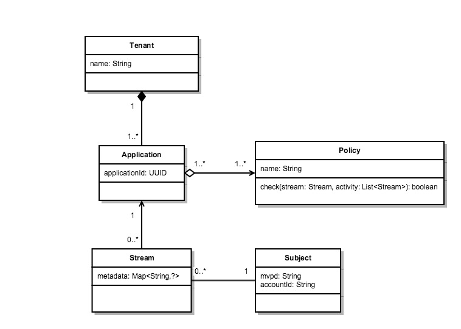
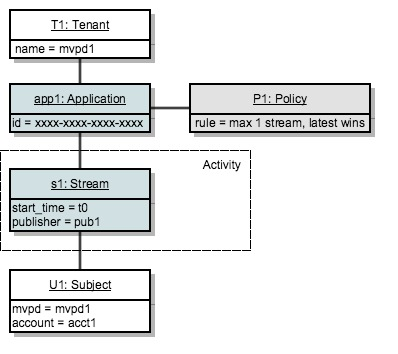
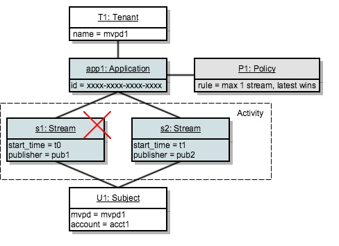
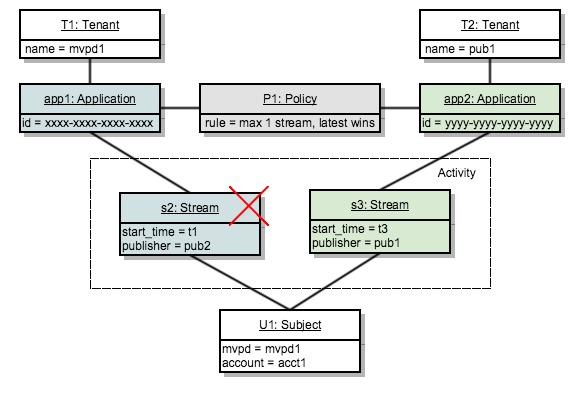
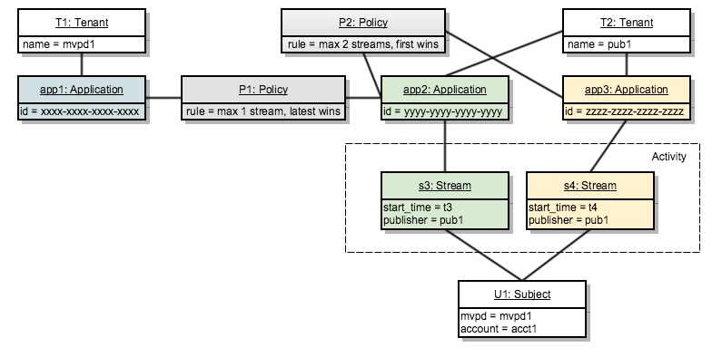
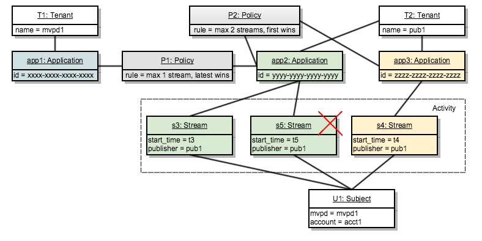
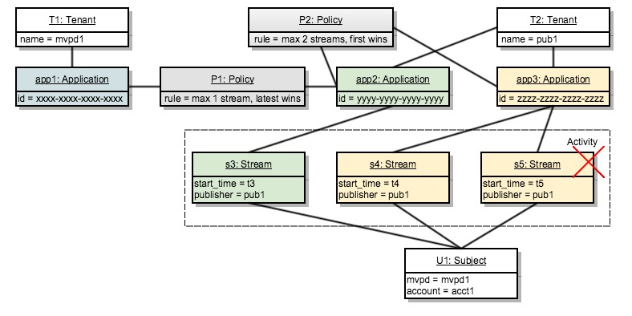
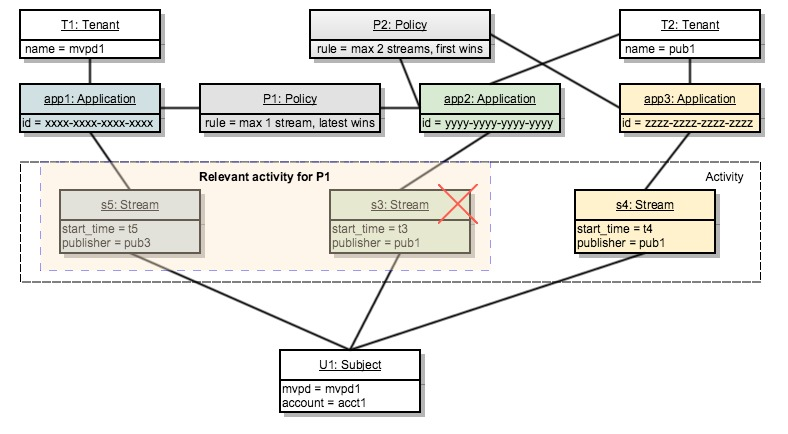

# ポリシーの決定ポイント {#policy-desc-pt}

## ドメインモデル {#domain-model}

このページは、ポリシーのさまざまなユースケースや実装の参考資料として使用することを目的としています。 用語の定義については、ドキュメントの[用語集](/help/concurrency-monitoring/cm-glossary.md)の部分も参照することをお勧めします。

**テナント**&#x200B;は、**ポリシー**&#x200B;を適用する&#x200B;**アプリケーション**&#x200B;を所有しています。 **クライアントアプリケーション**&#x200B;は、**アプリケーション ID**&#x200B;で設定する必要があります（Adobeから提供）。

その後、テナントは、各アプリケーションを、自分が作成したポリシーまたは他のユーザーが作成して共有したポリシーに1つ以上のポリシーに関連付けます。 複数のテナント間でポリシーをリンクできます。

**件名アクティビティ**&#x200B;は、特定の件名の同時視聴数モニタリングに報告されるすべてのストリーム（アプリケーションに関係なく）で構成されます。

ストリームが特定の件名に対して許可される場合、システムは最初にストリームを作成したアプリケーションに定義されたすべてのポリシーを確認します。

該当する各ポリシーについて、ルールに渡されるすべての&#x200B;**関連アクティビティ**&#x200B;を収集する必要があります。 ポリシーPの&#x200B;**関連アクティビティ**&#x200B;には、次の条件を満たす場合にのみストリーム Sが含まれます。

**ストリーム「S」は、ポリシーの中にポリシー「P」を含むアプリケーションによって開始されます。**

## ドライランの使用例 {#dry-run-use-cases}

以下のチュートリアルでは、いくつかのユースケースに対してモデルを検証することを目的としています。 基本的な設定から始めて、いろいろな方法で複雑さを加えて、徐々にそれを行っていきます。

### &#x200B;1. ひとつのテナント。 またいで申し込む。 ひとつのポリシーで。 1つのストリーム {#onetenant-oneapp-onepolicy-onestream}

まず、単一のテナント、1つのアプリケーション、1つのポリシーが関連付けられています。 このポリシーでは、どのユーザーにも最大1つのアクティブストリームが存在する可能性があると仮定します（最新のストリームの再生は許可されています）。

ストリームが開始されると、アクティビティはそのストリームのみで構成され、再生が許可されます。

### &#x200B;2. ひとつのテナント。 またいで申し込む。 ひとつのポリシーで。 2つのストリーム。 {#onetenant-oneapp-onepolicy-twostreams}

（同じアプリケーションを使用して同じサブジェクトで） 2番目のストリームが開始されると、検証に使用されるアクティビティは、**s1**&#x200B;と&#x200B;**s2**&#x200B;の両方で構成されます。

この制限を超えています。ポリシーでは、1つのストリームのみを再生することが許可されているため、最新のストリーム （**s2**）のみが再生を許可されます。

>[!NOTE]
>
>図は、ユーザーアクティビティのシステムビューを表します。 ストリームの初期化の試行の場合、アクセス決定は応答に含まれます。 アクティブなストリームの場合、ハートビート応答で決定が返されます。

### &#x200B;3. テナントが2人。 2つのアプリケーション。 ひとつのポリシーで。 2つのストリーム。 {#twotenant-twoapp-onepolicy-twostreams}

次に、新しいテナントがアプリケーションに同じポリシーを適用したいとします。

2つのテナントが同じポリシーでリンクされているため、ユースケース 2に記載されている状況はここで適用され、**s3**&#x200B;は最新のストリームとして再生できます。

### &#x200B;4. テナントが2人。 3つのアプリケーション。 2つのポリシー。 2つのストリーム。 {#twotenants-threeapps-twopolicies-twostreams}

次に、2番目のテナントが新しいアプリケーションをデプロイし、**app2**&#x200B;と&#x200B;**app3**&#x200B;の間で共有される新しいポリシーを定義したいとします。

現時点では、アクティブなストリーム **s3**&#x200B;と&#x200B;**s4**&#x200B;の両方が許可されています。 **s3**&#x200B;の場合、ポリシー&#x200B;**P1**&#x200B;が評価されると、システムは&#x200B;**s3**&#x200B;のみを&#x200B;**関連アクティビティ** （**s4**&#x200B;はポリシー&#x200B;**P1**）とカウントするため、違反はありません。

ポリシー&#x200B;**P2**&#x200B;は両方のストリームに適用され、関連するアクティビティとして&#x200B;**s3**&#x200B;と&#x200B;**s4**&#x200B;の両方が含まれます。 このアクティビティは2つのストリームの境界内にあるため、両方のストリームが許可されます。

### &#x200B;5. テナントが2人。 3つのアプリケーション。 2つのポリシー。 3つのストリーム。 {#twotenants-threeapps-twopolicies-threestreams}

次に、**app2**&#x200B;を使用して新しいストリームの初期化が実行されたと仮定します。

**s5**&#x200B;は&#x200B;**P1**&#x200B;までに開始することが許可されていますが（新しいストリームが引き継ぐことができます）、**P2**&#x200B;によって拒否されているため、開始されません。

app3でストリームの初期化が試みられた場合も同じことが起こります。同じポリシーP2がアクセスを拒否します。

次に、ユーザーがapp1を使用して新しいストリームを作成しようとすると、どうなるか見てみましょう。

アプリケーション app1はポリシー&#x200B;**P2**&#x200B;に関連していないため、新しいストリームの開始を許可し、古いストリームを拒否するポリシー&#x200B;**P1**&#x200B;のみを適用します（この場合は&#x200B;**s3**）。
