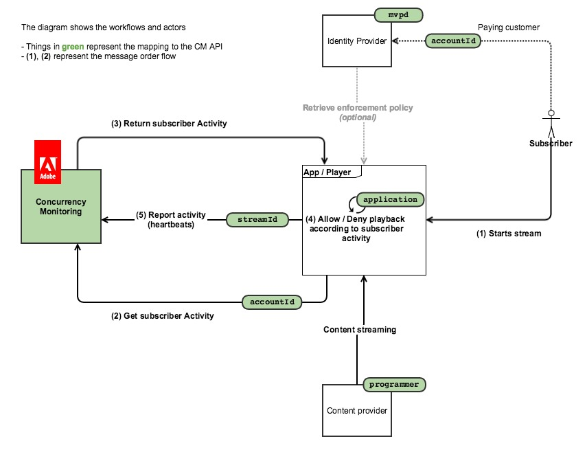
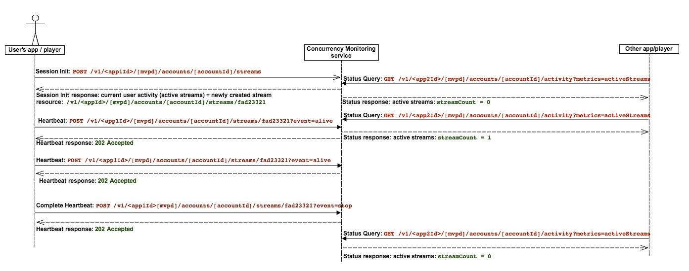

# ポリシー情報ポイント {#pip}

>[!NOTE]
>
>このページは、新しい統合では推奨されなくなった以前のバージョンのAPIに適用されるため、非推奨です

次の図は、お客様が&#x200B;**ポリシー情報ポイント**&#x200B;を選択した場合のフローを示しています。この場合、CMはアクティビティのクエリにのみ使用され、すべてのアクセスロジックがクライアントアプリケーションに埋め込まれます）。

次の図は、2つのデバイスからコンテンツを視聴するユーザーに対して、ストリーム数がどのように機能するかを示しています。

一言で言えば、通常のメッセージフローは次のとおりです。

1. 最初に、サービスを使用したことがないユーザーの場合は、Web ページが読み込まれるか、アプリケーションが開かれ、同時視聴数モニタリングサービスのインストルメント化されたアプリケーションがセッション初期化コールを行います。
1. 同時視聴数モニタリングサービスは、ハートビートの新しいストリームリソースと、現在のユーザーアクティビティを返します。
1. ビデオ再生中、インストルメント化されたアプリケーションは同時視聴数モニタリングサービスにハートビート呼び出しを行い、ユーザーがビデオを現在使用していることを示します。
1. 他の時点で、他のインストルメント化されたアプリケーションは、同時視聴数モニタリングサービスに対してステータスクエリ呼び出しを行うことができ、これにより現在のユーザーアクティビティが返されます。
1. ビデオの再生が終了すると、インストルメント化されたアプリケーションは「event=stop」でハートビート呼び出しを行い、ビデオが停止したことを示します。また、現在のストリームをアクティブストリームとしてカウントしないでください。
