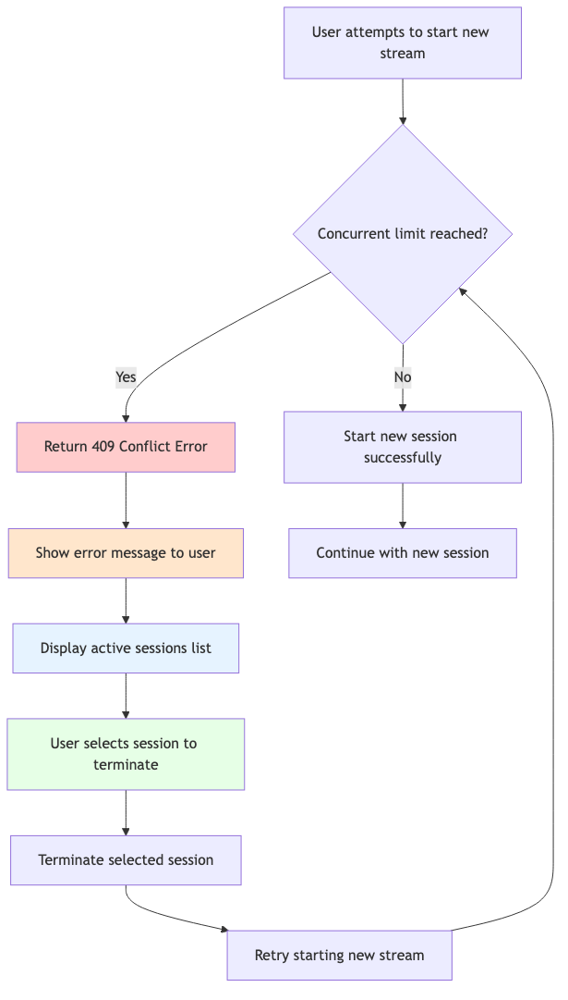
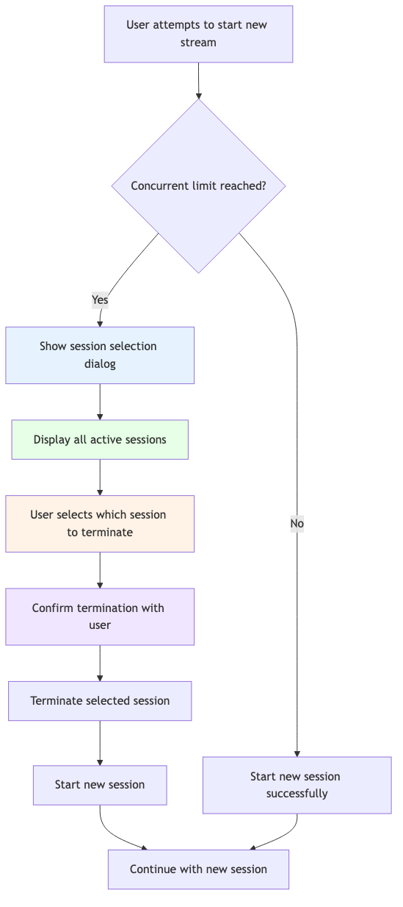

# LIFOとFIFO戦略 {#lifo-fifo-strategies}

同時視聴数モニタリングを実装する場合、使用制限に達した場合に競合を処理するための2つの基本的な戦略を選択する必要があります。**LIFO （Last In, First Out）**&#x200B;または&#x200B;**FIFO （First In, First Out）**。 これらの戦略を理解することは、適切なユーザーエクスペリエンスを設計し、適切なエラー処理を実装するために非常に重要です。

## 同時実行モニタリングセッション戦略 {#concurrency-monitoring-session-strategies}

LIFOとFIFOはどちらも、コンピューターサイエンスの&#x200B;**スタック理論**&#x200B;に基づいています。

### LIFO （後入れ先出し） – スタックの動作

同時視聴数モニタリングの場合：
- **古いセッションは新しいセッションから保護されています**
- **制限に達すると、新しいセッションがブロックされます**
- **新しいセッションを開始するには、ユーザーが既存のセッションを手動で終了する必要があります**

### FIFO （先入れ先出し） – キューの動作

同時視聴数モニタリングの場合：
- **新しいセッションは、制限に達すると古いセッション**&#x200B;を終了できます
- **最新のストリームは、古いストリームを「キックアウト」できます**
- **視聴中のコンテンツを置き換えることで、新しいコンテンツを開始できます**

## LIFO戦略 {#lifo-strategy}

### LIFOの仕組み

LIFO モードでは、ユーザーが新しいストリームを開始しようとし、同時制限に達すると、次のようになります。

1. **新しいセッションがブロックされています**。409 Conflict応答が返されます
2. **既存のセッションは変更されません**
3. 続行するには、**ユーザーが既存のセッションを手動で**&#x200B;終了する必要があります

### LIFO フロー図

*図：LIFO （Last In, First Out）戦略フロー – 制限に達すると新しいセッションがブロックされ、既存のセッションを手動で終了する必要があります。*

### LIFOを使用するタイミング

**次の場合にLIFOを使用：**
- **ユーザーは、現在のコンテンツが中断から保護されることを期待しています**
- **コンテンツの切り替えについて意識的な決定**&#x200B;を促したい
- **競合を解決するために、アプリケーションのUIの複雑さが**&#x200B;制限されています
- **ユーザーは通常、長期間コンテンツを視聴します**

**例：**
- 利用者が長編のコンテンツを視聴する動画ストリーミングサービス
- 中断が破壊的な場合、教育用コンテンツプラットフォーム
- シンプルなUIで、複雑なセッション選択に対応できないアプリケーション

## FIFO戦略 {#fifo-strategy}

### FIFOの仕組み

FIFO モードでは、ユーザーが新しいストリームを開始しようとし、同時制限に達すると、次のようになります。

1. **新しいセッションを開始できます**
2. **最も古いセッションは自動的に終了します** （またはユーザーが終了を選択します）
3. **ユーザーは新しいコンテンツを続行します**

### FIFO フロー図

*図：FIFO （先入れ先出し）戦略フロー – 新しいセッションは、ユーザー選択で既存のセッションを終了することで開始できます。*

### FIFOを使用するタイミング

**次の場合にFIFOを使用：**
- **ユーザーは頻繁にコンテンツを切り替えます** （チャネルサーフィン、ブラウジング）
- **ユーザーの現在の意図**&#x200B;を過去のアクティビティよりも優先する
- **競合が発生した場合、UIでセッション選択**&#x200B;を処理できます
- **制限に達した場合でも、ユーザーは新しいコンテンツを開始できることを期待しています**

**例：**
- ユーザーが頻繁にチャネルを切り替えるライブ TV アプリケーション
- コンテンツを閲覧およびプレビューできるコンテンツ発見アプリ
- 利用者が即座の反応を期待するモバイルアプリケーション

### FIFO ユーザーエクスペリエンス

FIFO モードで競合が発生した場合：

1. すべてのアクティブなセッションを含む&#x200B;**ダイアログを表示**
2. **終了するセッションをユーザーが**&#x200B;に選択することを許可します
3. **セッションの詳細を提供** （デバイス、コンテンツ、期間）
4. 続行する前に&#x200B;**アクション**&#x200B;を確認してください
5. 終了後、**新しいセッションを開始**

## 主な相違点の概要 {#key-differences-summary}

| 縦横 | FIFO | LIFO |
|-------------------------------|-----------------------------------------|-------------------------------|
| **競合の解決** | 最も古いセッションの自動終了 | 手動終了が必要です |
| **エラー処理** | 409件の回答を処理する必要はありません | 409件の回答を処理する必要があります |
| **ユーザーエクスペリエンス** | より複雑なUIでスムーズなフローを実現 | よりシンプルなUIでスムーズに |
| **実装の複雑さ** | より高い（セッション選択UI） | 下位（単純なエラーメッセージ） |
| **ユースケース** | コンテンツの切り替え，発見 | 拡張された表示、保護 |

## ベストプラクティス {#best-practices}

### Lifo実装向け

1. **制限を説明する明確なエラーメッセージを表示**
2. **セッション管理への簡単なアクセス**&#x200B;の提供
3. ユーザー参照用に&#x200B;**アクティブなセッション**&#x200B;を表示
4. アプリの設定に&#x200B;**セッション終了**&#x200B;を実装します
5. **競合が発生する前に、使用状況インジケーター**&#x200B;を表示することを検討する

### Fifo実装の場合

1. **競合が発生した場合は、常にセッション選択UI**&#x200B;を提供する
2. **意味のあるセッションの詳細を表示** （デバイス、コンテンツ、期間）
3. **誤って終了するのを防ぐため、確認ダイアログ**&#x200B;を実装する
4. **終了が失敗したエッジケース**&#x200B;を処理する
5. **何が起こっているかについて明確なフィードバック**&#x200B;を提供する

## 戦略の選択 {#choosing-your-strategy}

LIFOとFIFOのどちらを選択する場合も、次の要素を考慮する必要があります。

1. **ユーザーの行動パターン** – 通常、ユーザーはコンテンツとどのように操作しますか？
2. **コンテンツの種類** - ライブ テレビと映画と教育コンテンツの比較
3. **UIの複雑さ** – 高度なセッション選択をアプリで処理できますか？
4. **ユーザーの期待** - ユーザーはコンテンツを簡単に切り替えることができると期待しますか？
5. **ビジネス要件** – 特定の種類の視聴を保護する必要がありますか？
